# IdeaLab UI — bộ giao diện iOS (SwiftUI)

Bộ nền giao diện cho các app iOS sẽ làm ở repo **app-idea-lab**: một Swift package (`IdeaLabKit`), một app demo để xem mọi thứ chạy thật, và bản khảo sát "giao diện iOS đẹp nhất hiện nay" làm căn cứ cho từng quyết định thiết kế.

Mục tiêu giống web kit ở thư mục gốc: app mới **không phải dựng giao diện từ đầu**. Chép package vào, gọi `.labTheme(.ledger)`, thay dữ liệu mẫu bằng dữ liệu thật.

| Thư mục | Là gì |
| --- | --- |
| `IdeaLabKit/` | Swift package: `IdeaLabCore` (Foundation, test được cả trên Linux) + `IdeaLabUI` (SwiftUI, iOS 17+) + `IdeaLabPhotos` (PhotoKit và Vision cho app dọn ảnh) + `IdeaLabStore` (StoreKit 2) + `IdeaLabWidgets` (widget, cho widget extension) + `IdeaLabNotifications` (thông báo thuốc, dùng được trong extension) |
| `IdeaLabDemo/` | App gallery: mở từng thành phần, từng màn hình mẫu, đổi bảng màu, bật chế độ chữ lớn |
| `scripts/render-previews.sh` | Chụp mọi màn hình demo trên simulator (sáng, tối, chữ cực lớn) |

> Ảnh chụp thật từ simulator: xem mục [Ảnh chụp](#ảnh-chụp). Muốn chụp lại: gắn nhãn `ios-previews` vào PR, hoặc Actions → **iOS previews** → Run workflow.

---

## 1. Khảo sát: giao diện iOS đẹp nhất, 09/2026

Tóm tắt từ tài liệu chính thức của Apple, các app đoạt giải và các báo cáo ngành. Mỗi kết luận ở đây đều đi thẳng vào một quyết định trong kit (mục 2).

### 1.1 Ngôn ngữ thiết kế hiện tại: Liquid Glass, đã sang iOS 27

- **iOS 26 (WWDC25)** đưa vào **Liquid Glass**: thanh điều hướng, tab bar, toolbar, sheet thành lớp kính nổi trên nội dung. Build bằng SDK mới là các control chuẩn **tự đổi sang giao diện mới** ([Adopting Liquid Glass](https://developer.apple.com/documentation/technologyoverviews/adopting-liquid-glass)). API cho phần tự vẽ: `glassEffect(_:in:)`, `GlassEffectContainer`, `.buttonStyle(.glass)`, đều từ iOS 26 ([glassEffect](https://developer.apple.com/documentation/swiftui/view/glasseffect(_:in:))).
- **iOS 27 đã phát hành ngày 14/09/2026** ([Apple](https://developer.apple.com/news/releases/?id=09142026a)). WWDC26 chỉnh Liquid Glass: làm mờ nội dung phía sau mạnh hơn, viền tối hơn, và người dùng có thanh trượt từ "rất trong" tới "phủ màu hẳn" ([WWDC26](https://developer.apple.com/news/?id=yi8qj25k)).
  - Hệ quả: **độ trong của kính do người dùng quyết định**. Chữ đặt trên kính không thể giả định một mức tương phản cố định.
- **Không lùi lại được nữa**: khoá `UIDesignRequiresCompatibility` (giữ giao diện cũ) **bị bỏ qua khi build bằng SDK iOS 27** ([Apple](https://developer.apple.com/documentation/bundleresources/information-property-list/uidesignrequirescompatibility)). Từ 28/04/2026 bản nộp phải build bằng Xcode 26; từ **04/2027** phải dùng SDK iOS 27 ([yêu cầu sắp tới](https://developer.apple.com/news/upcoming-requirements/), [tin 2027](https://developer.apple.com/news/?id=k1mtkt1k)).
- **Nguyên tắc HIG**: kính dành cho **lớp điều khiển nổi phía trên** nội dung (thanh, nút nổi), **không** dùng cho chính nội dung.

**→ Trong kit:** `labGlass(in:)` dùng Liquid Glass trên iOS 26+ và material trên iOS 17–25; chỉ khay nút "Thu/Chi" và nút đóng paywall dùng kính. Thẻ nội dung, toast, bàn phím số đều **đặc** để chữ giữ đúng tương phản đã kiểm.

### 1.2 Apple Design Awards 2025–2026: app thắng giải giống nhau ở đâu

| Năm | Hạng mục | Thắng giải | Đáng học cho ta |
| --- | --- | --- | --- |
| 2026 | Interaction | **Moonlitt** | Apple khen "tích hợp Liquid Glass tốt nhất" |
| 2026 | Visuals & Graphics | **Tide Guide** | Dữ liệu biểu đồ đẹp mà vẫn đọc nhanh, cũng dùng Liquid Glass |
| 2026 | Inclusivity | **Guitar Wiz** (chung kết: **Structured**, Hearing Buddy) | Tiếp cận là một hạng mục giải riêng, không phải phần phụ |
| 2025 | Inclusivity | **Speechify** | Dựng quanh người đọc khó khăn |
| 2025 | Delight & Fun | **CapWords** | Một tương tác chính, làm thật kỹ |
| 2025 | Social Impact | **Watch Duty** | Thông tin khẩn cấp phải rõ trong một cái liếc |

Nguồn: [ADA 2026](https://developer.apple.com/design/awards/), [ADA 2025](https://developer.apple.com/design/awards/2025/). Hai năm này **không có app tài chính** nào. Tham chiếu tài chính tốt nhất là **Copilot Money** (chung kết ADA 2024): hoàn toàn native, biểu đồ dòng tiền vẽ bằng Swift Charts ([Apple](https://developer.apple.com/articles/copilot-money)).

**Điểm chung:**
- Dùng component hệ thống làm nền, chỉ tự vẽ đúng một hai chỗ tạo dấu ấn.
- Mỗi màn hình có **một** việc chính.
- Tiếp cận (chữ lớn, VoiceOver, giảm chuyển động) được làm từ đầu, không phải vá sau.

### 1.3 Tham chiếu cho từng app trong app-idea-lab

**A. Sổ thu chi 10 giây** (ý tưởng #1, đang có template đầy đủ)

- **Đối thủ trực tiếp: [Sổ Thu Chi MISA](https://sothuchi.misa.vn/)**. Đã có ghi bằng giọng nói, chat, AI đọc hoá đơn, liên kết ngân hàng.
  - Muốn thắng thì không thể thêm tính năng. Phải **đơn giản hơn hẳn**: hai nút to, một bàn phím, xong.
- **Money Lover** do Finsify làm tại Hà Nội ([Vietcetera](https://vietcetera.com/en/money-lover-a-vietnamese-built-fintech-mobile-app-going-global)). **Toshl** nổi tiếng ghi một khoản trong 4 chạm.
  - **Cashew** mã nguồn mở nhưng giấy phép **GPL-3.0**: chỉ nên xem để học, **không chép mã** ([GitHub](https://github.com/jameskokoska/Cashew)).
- Loa báo chuyển khoản của **MoMo/ZaloPay** đọc to số tiền nhận được ([MoMo](https://www.momo.vn/loa-thong-bao-chuyen-khoan)). Người bán hàng đã quen "nghe lại số tiền".
  - Kit làm theo: lưu xong thì đọc "Đã ghi thu bốn trăm năm mươi nghìn đồng".
  - **Số tiền được đọc bằng chữ**, theo quy tắc đọc số tiếng Việt của Unicode CLDR mà `NumberFormatter` (kiểu `.spellOut`) của Foundation có sẵn ([CLDR](https://github.com/unicode-org/cldr/blob/main/common/rbnf/vi.xml)): "mốt" và "tư" sau "mươi" ("hai mươi mốt", "hai mươi tư"), "lăm" sau hàng chục ("mười lăm"), "lẻ" khi hàng chục là 0 ("một trăm lẻ năm", "một nghìn không trăm lẻ năm"). Đưa chữ cho giọng đọc thì nó không phải đoán dấu chấm trong "450.000" nghĩa là gì.
- **Xuất sổ**: ý tưởng hứa "xuất file Excel/PDF" để gửi kế toán hay giữ lại khi kê khai.
  - **Excel là file .xlsx, không phải CSV.** Excel mở CSV bằng dấu phân cách danh sách của Windows, và máy dùng dấu phẩy làm dấu thập phân, như máy đặt vùng Việt Nam, thì dấu đó là dấu chấm phẩy ([Microsoft](https://learn.microsoft.com/en-us/office/troubleshoot/excel/formula-errors)): file ngăn bằng dấu phẩy mở ra dồn vào một cột. Excel cũng chỉ mở thẳng CSV UTF-8 khi file có BOM ([Microsoft](https://support.microsoft.com/en-us/office/opening-csv-utf-8-files-correctly-in-excel-8a935af5-3416-4edd-ba7e-3dfd2bc4a032)). File .xlsx nói rõ từng ô là gì: ngày là ngày, tiền là số, chữ là Unicode, trong Excel, Numbers hay Google Sheets đều vậy.
  - **PDF do SwiftUI vẽ**, bằng `ImageRenderer` vào một PDF context: chữ, đường kẻ và mảng màu vẫn là vector ([Apple](https://developer.apple.com/documentation/swiftui/imagerenderer)), nên in ra nét, và tìm, chép được chữ.
  - **Sổ thường, chưa phải mẫu sổ theo quy định.** Mẫu sổ của hộ kinh doanh do văn bản thuế quy định và có thể đổi, nên phải đối chiếu văn bản mới nhất trước khi làm, như ý tưởng đã ghi. Cả hai file đều ghi "Lập ngày … lúc …", để người nhận biết sổ xuất giữa tháng là chưa đủ tháng; bản PDF có thêm dòng "không tư vấn thuế".
  - **Không làm phiền**: app đặt audio session loại `.ambient` một lần lúc mở. Apple dành loại này cho app "vẫn dùng được khi tắt tiếng": nhạc của app khác vẫn phát dưới giọng đọc, còn nút im lặng hay khoá màn hình thì tắt tiếng đọc ([Apple](https://developer.apple.com/documentation/avfaudio/avaudiosession/category-swift.struct/ambient)).
    - Kit không tự đổi audio session, vì app có thể đang ghi âm hay phát âm thanh theo cách riêng.
    - Để mặc định (`.soloAmbient`) thì nút im lặng vẫn tắt tiếng đọc, nhưng nhạc của app khác sẽ bị dừng ([Apple](https://developer.apple.com/documentation/avfaudio/avaudiosession/category-swift.struct/soloambient)).
  - Khi **VoiceOver** bật thì không đọc: VoiceOver đã đọc thông báo của toast ("Đã lưu khoản thu 450.000 đồng"), hai giọng sẽ nói chồng lên nhau. VoiceOver bật lên giữa câu thì giọng đọc dừng ngay.

- **Ghi nhanh từ ngoài app**: "10 giây" tính cả lúc mở app, nên một nút trên màn hình khoá đáng giá hơn một màn nhập nhanh hơn.
  - **Nút điều khiển** (control, iOS 18) nằm ở Trung tâm điều khiển, trên màn hình khoá hay nút Tác vụ, do người dùng tự thêm. Nó là một `ControlWidgetButton` trong **widget extension**. Muốn mở app tới một màn cụ thể thì hành động của nó là một App Intent theo `OpenIntent`, và file của intent phải thuộc **cả app lẫn extension** ([Apple](https://developer.apple.com/documentation/widgetkit/creating-controls-to-perform-actions-across-the-system)).
  - **App Shortcuts** (iOS 16) làm intent có sẵn trong Spotlight, ứng dụng Phím tắt và Siri, không cần cài đặt; câu gọi phải có tên app ([Apple](https://developer.apple.com/documentation/appintents/app-shortcuts)). Siri nghe câu gọi tiếng Việt từ iOS 26.1, khi Siri có tiếng Việt ([VnExpress](https://e.vnexpress.net/news/tech/tech-news/vietnamese-siri-goes-live-on-iphone-supports-ride-hailing-money-transfer-4868566.html)). Trên iOS cũ hơn, các phím tắt vẫn có trong Spotlight và ứng dụng Phím tắt.
  - `openAppWhenRun` bị bỏ từ iOS 26 (thay bằng `supportedModes`), còn cách đưa intent thẳng tới một scene (`TargetContentProvidingIntent`, `onAppIntentExecution`) chỉ có từ iOS 26 ([Apple](https://developer.apple.com/documentation/appintents/directing-app-intents-to-your-apps-scenes)). App chạy từ iOS 17 thì cho `perform()` của intent báo cho giao diện của app.

**→ Trong kit:** nút Thu/Chi cao 84–96 pt luôn nằm dưới ngón cái. Bàn phím có phím "000" (gõ 450.000 = `4` `5` `0` `000`). Ô ghi chú hiểu "bán 3 thùng nước 450k". Biểu đồ phân kỳ (thu lên, chi xuống). Báo cáo theo **quý**, vì hộ kinh doanh kê khai theo quý. Ghi chú rõ "không tư vấn thuế". Lưu xong, app đọc to khoản vừa ghi (`LedgerEntry.readback`, `LabSpeaker`); nút loa trên thanh công cụ bật hay tắt việc này. Báo cáo xuất ra PDF khổ A4 và file Excel để gửi đi (`LedgerExportFile`, `LabShareSheet`). Ghi từ ngoài app: nút điều khiển "Ghi khoản chi", "Ghi khoản thu", Siri hay phím tắt mở thẳng màn nhập của đúng loại khoản (`QuickEntryRouter`); đang ghi dở một khoản khác thì khoản đó được giữ, màn mới mở sau khi nó đóng.

**B. Nhắc thuốc cho cha mẹ** (có template)

- **Apple Health › Thuốc** (iOS 16+): cho chọn hình dạng và màu viên thuốc ([TidBITS](https://tidbits.com/2022/10/07/an-apple-a-day-ios-16-medications-feature-provides-alerts-logging-and-peace-of-mind/)), nhắc lại nếu 30 phút sau chưa ghi nhận, và cho bật Critical Alerts cho từng thuốc: lời nhắc vẫn hiện và kêu khi máy đang tắt tiếng hay bật Tập trung ([Apple](https://support.apple.com/guide/iphone/track-your-medications-iph811670c81/ios)).
- **Medisafe "Medfriend"**: người thân nhận thông báo khoảng 30 phút sau liều bị lỡ.
- **Mức ngắt quãng của thông báo** (iOS 15+, [HIG](https://developer.apple.com/design/human-interface-guidelines/managing-notifications)):
  - **Time Sensitive** ("Nhạy cảm thời gian"): thông tin cần người nhận chú ý ngay. Người dùng có thể cho loại này đi xuyên chế độ Tập trung và bản tóm tắt theo lịch.
  - Apple chỉ cho dùng mức này khi việc đang xảy ra hoặc sẽ xảy ra trong vòng một giờ, và **không bao giờ** cho quảng cáo. Lần đầu nhận, iOS giải thích và cho người dùng tắt; về sau iOS còn định kỳ hỏi lại.
  - App cần bật capability Time Sensitive Notifications ([WWDC21](https://developer.apple.com/videos/play/wwdc2021/10091/)).
  - **Critical** (kêu cả khi máy tắt tiếng) cần entitlement riêng xin từ Apple ([Apple](https://developer.apple.com/documentation/bundleresources/entitlements/com.apple.developer.usernotifications.critical-alerts)). HIG gọi loại này là "cực hiếm", thường đến từ cơ quan nhà nước hay app giúp quản lý sức khoẻ, nhà cửa.
  - Mỗi app chỉ hẹn trước được **64** thông báo cùng lúc (kỹ sư Apple trả lời trên [diễn đàn](https://developer.apple.com/forums/thread/811171)).
- **Người lớn tuổi**:
  - Nghiên cứu trên 40 người cao tuổi thấy nút **14–17,5 mm** dễ bấm nhất ([Leitão & Silva 2012](http://shura.shu.ac.uk/7446/)), tức khoảng 84–105 pt trên iPhone.
  - Mức tương phản 4,5:1 của WCAG được tính cho thị lực ~20/40, "thị lực điển hình của người ~80 tuổi" ([W3C](https://www.w3.org/WAI/WCAG22/Understanding/contrast-minimum.html)).
- **Assistive Access** (chế độ giản lược của iOS, cho người khuyết tật nhận thức):
  - Từ iOS 17: khai `UISupportsFullScreenInAssistiveAccess` để giao diện thường của app chạy toàn màn hình trong chế độ này ([Apple](https://developer.apple.com/documentation/bundleresources/information-property-list/uisupportsfullscreeninassistiveaccess)).
  - Từ iOS 26: khai `UISupportsAssistiveAccess` ([Apple](https://developer.apple.com/documentation/bundleresources/information-property-list/uisupportsassistiveaccess)) và thêm scene `AssistiveAccess` để dựng giao diện riêng cho chế độ này ([Apple](https://developer.apple.com/documentation/swiftui/assistiveaccess)).
    - Trong scene đó, control SwiftUI chuẩn (nút, danh sách, tiêu đề) tự đổi sang kiểu to, rõ của chế độ, theo bố cục lưới hay hàng người dùng chọn.
    - Nút Quay lại của hệ thống đi ngược theo navigation stack của app.
    - `assistiveAccessNavigationIcon` đặt một icon cạnh tiêu đề.

    Nguồn: [WWDC25, "Customize your app for Assistive Access"](https://developer.apple.com/videos/play/wwdc2025/238/).
  - Nguyên tắc Apple nêu trong phiên đó:
    - chỉ giữ một hai chức năng chính, và ít lựa chọn mỗi lúc;
    - control hiện rõ, không cử chỉ ẩn;
    - **không có gì tự đổi hay biến mất sau một khoảng thời gian**;
    - đi từng bước;
    - chữ đi kèm hình;
    - hỏi lại trước việc khó hoàn tác.
  - Từ iOS 18: `accessibilityAssistiveAccessEnabled` cho biết chế độ đang bật ([Apple](https://developer.apple.com/documentation/swiftui/environmentvalues/accessibilityassistiveaccessenabled)).
- **Widget** (WidgetKit), theo [HIG](https://developer.apple.com/design/human-interface-guidelines/widgets):
  - Widget đưa thông tin liếc là hiểu, không chỉ là một lối mở app. Chạm vào thì mở **đúng chỗ** liên quan trong app, không bắt người dùng tự tìm.
  - Màn hình khoá có ba dạng: một dòng chữ trên đồng hồ, một hình tròn và một hình chữ nhật dưới đồng hồ. Ở đó widget chỉ có một màu (chế độ vibrant). Màn hình chính cũng có thể phủ một màu (tinted) hay trong suốt (clear). Vì vậy **màu không được nói thay chữ**: dùng chữ và biểu tượng.
  - Nền của widget đặt trong `containerBackground(for: .widget)` (iOS 17), để hệ thống tự bỏ nền ở những nơi cần bỏ, như màn hình khoá hay StandBy ([Apple](https://developer.apple.com/documentation/widgetkit/displaying-the-right-widget-background)).
  - Widget không tự chạy code theo giờ. App đưa trước một **timeline**: các thời điểm, và widget hiện gì ở mỗi thời điểm. Mỗi widget có ngân sách tải lại, thường 40–70 lần mỗi ngày với widget hay được xem. Lần tải lại khi app đang mở thì không tính. Các mốc nên cách nhau ít nhất khoảng 5 phút ([Apple](https://developer.apple.com/documentation/widgetkit/keeping-a-widget-up-to-date)).
  - Widget hỗ trợ cỡ chữ từ Large tới AX5 ([HIG](https://developer.apple.com/design/human-interface-guidelines/widgets)), mà khung thì cố định: bố cục phải tự gọn lại khi chữ to.
  - Phần riêng tư đánh dấu bằng `privacySensitive()`. Ai tắt quyền xem dữ liệu của widget màn hình khoá khi máy khoá (Cài đặt › Face ID & Mật mã) thì thấy phần đó bị che cho tới khi mở khoá ([Apple](https://developer.apple.com/documentation/widgetkit/creating-a-widget-extension)).
  - Widget chạy trong extension, không phải trong app: hai bên dùng chung dữ liệu qua một **App Group**, mã bắt đầu bằng `group.` và được đăng ký cho team ([Apple](https://developer.apple.com/documentation/xcode/configuring-app-groups)).
  - **Nút trên widget** (iOS 17): `Button(intent:)` chạy một App Intent mà không mở app. Theo [Apple](https://developer.apple.com/documentation/widgetkit/adding-interactivity-to-widgets-and-live-activities):
    - Intent chạy trong tiến trình của extension, trừ vài loại (Live Activity, phát âm thanh…) chạy trong app. File của intent thuộc cả app lẫn extension.
    - Xong `perform()`, WidgetKit luôn tải lại timeline của widget: dữ liệu phải ghi xong trước khi trả về.
    - Máy đang khoá thì nút không chạy cho tới khi mở khoá.
  - HIG: nút trên widget phải đủ to, bấm chắc tay, không để lỡ tay làm việc không định làm ([HIG](https://developer.apple.com/design/human-interface-guidelines/widgets)).
  - **Cập nhật từ server** (iOS 26): server của app gửi một thông báo đẩy loại `widgets` qua APNs, và WidgetKit tải lại timeline như khi app gọi `reloadAllTimelines()`. Widget nhận mã đẩy qua `WidgetPushHandler`, gắn vào cấu hình bằng `pushHandler(_:)`. Thông báo này cũng tính vào ngân sách và đến khi hệ thống cho phép, nên chỉ thêm vào chứ không thay timeline ([Apple](https://developer.apple.com/documentation/widgetkit/updating-widgets-with-widgetkit-push-notifications)).
- **Siri** (App Intents, App Shortcuts), theo HIG ([App Shortcuts](https://developer.apple.com/design/human-interface-guidelines/app-shortcuts), [Siri](https://developer.apple.com/design/human-interface-guidelines/siri)):
  - Mỗi app có tối đa 10 App Shortcuts, sẵn sàng ngay khi cài. Câu gọi phải có tên app, nên ngắn và dễ nhớ. Siri nghe tiếng Việt từ iOS 26.1 (mục 1.3-A).
  - Câu trả lời (`IntentDialog`) phải đủ ý khi chỉ nghe mà không nhìn, như qua AirPods hay HomePod. Không nhắc tên app, vì hệ thống đã ghi.
  - Siri có thể nói to, và người đứng gần nghe được.
  - Intent chạy được cả khi máy khoá, trừ khi đòi `requiresAuthentication`: máy phải mở khoá trước, hay yêu cầu đến từ một máy đã mở khoá như Apple Watch ([Apple](https://developer.apple.com/documentation/appintents/intentauthenticationpolicy/requiresauthentication)).
  - Người dùng nhớ câu gọi khi app cho họ biết nó có: `SiriTipView` hiện câu gọi của một App Shortcut ngay trong app ([Apple](https://developer.apple.com/documentation/appintents/siritipview)).

**→ Trong kit:**
- `LabDensity.senior`: nút chính cao 96 pt, nút thường 60 pt, và giữ cỡ chữ tối thiểu `xLarge` dù máy để chữ nhỏ.
- Màn hình của cha mẹ (`MedsTodayScreen`): **một** liều mỗi lúc, vẽ đúng hình và màu viên thuốc, một nút "ĐÃ UỐNG" thật to. Nút "Không uống liều này" chỉ là chữ, không nền, đặt tách dưới nút chính để khỏi bấm nhầm (vùng bấm vẫn rộng, cho tay run). Hoàn tác thuộc về app (demo dùng toast "Hoàn tác"), ghi bằng `DoseLog.undo(_:at:)`. Bấm xong, thẻ hiện "Đã uống …" **2 giây** rồi mới tới thuốc kế tiếp: tay run bấm đúp cũng không đánh dấu nhầm một viên chưa uống.
- Màn hình của người con (`CaregiverScreen`): trả lời "mẹ uống thuốc chưa?" trong một cái liếc. Chỉ khi có liều trễ quá 30 phút màn hình mới chuyển vàng và hiện nút "Gọi Mẹ".
- Thông báo (`DoseAlerts` lập kế hoạch, `DoseNotifications` hẹn với iOS ở mức Time Sensitive):
  - Máy cha mẹ nhắc lúc đến giờ, rồi "Nhắc lại" khi hết 30 phút mà chưa bấm ĐÃ UỐNG, như Apple Health.
  - Máy người nhà nhận "Mẹ chưa xác nhận thuốc lúc 07:00" đúng lúc màn hình của người con chuyển vàng. Loại này mới thật cần đi xuyên Tập trung (khi người con cho phép): đang họp vẫn biết.
  - Hai viên cùng giờ chỉ reo một lần. Trả lời ở máy nào thì thông báo về liều đó cũng rời màn hình khoá, khi app lập lại kế hoạch.
  - Máy người nhà chỉ biết những gì máy cha mẹ đã gửi, nên báo nói "chưa xác nhận" chứ không nói "chưa uống", và kèm "Máy của Mẹ cập nhật lần cuối lúc 06:58". Máy mẹ mất mạng thì người con thấy ngay tin đã cũ.
  - Kit chưa dùng Critical Alerts vì cần Apple cấp riêng. App thật có thể xin thêm cho lời nhắc của cha mẹ, như Apple Health.
- Người con biết khi máy mình sẽ **không** báo. `CaregiverScreen` có một thẻ cho từng trường hợp, kèm nút bật hay mở Cài đặt:
  - "Nhận báo khi Mẹ quên thuốc": chưa hỏi quyền.
  - "Thông báo đang tắt".
  - "Báo quên thuốc có thể đến muộn": thông báo được giao lặng lẽ, biểu ngữ đang tắt, hay "Nhạy cảm thời gian" đang tắt hoặc không có (app thiếu capability), nên Tập trung có thể giữ báo lại.

  Trước khi iOS hỏi quyền, `PermissionPrimerScreen` cho xem **chính thông báo** sẽ nhận (`DoseAlertBanner`, chữ lấy từ `DoseAlerts`).
- Màn của cha mẹ trong Assistive Access (`MedsAssistiveScreen`, cho scene `AssistiveAccess`) đi **mỗi lúc một bước**:
  - Trước hết là viên thuốc, tên, giờ uống, và một nút ĐÃ UỐNG.
  - Bấm xong thì màn hình hiện "Đã uống …" và **đứng yên** tới khi người dùng bấm "Thuốc tiếp theo" hay rời app. Màn thường thì tự chuyển sau 2 giây; chế độ này không cho gì tự đổi theo thời gian.
  - Không có "Không uống liều này" hay hoàn tác, cho bớt một lựa chọn. Liều không uống thì cứ để đó, người nhà vẫn thấy.
  - "Thuốc tiếp theo" nằm trong thẻ, không ở chỗ nút ĐÃ UỐNG vừa đứng: bấm đúp không trả lời nhầm viên sau.
  - Nút là nút của kit (cao 96 pt, có hình và chữ). Kiểu riêng của chế độ này chỉ áp cho control mặc định, còn nút của kit vốn đã đủ to và rõ ở mọi nơi.
- Màn thêm thuốc (`AddMedicationScreen`), cho người con thiết lập: tên cả nhà vẫn gọi, liều và cách uống (chạm một lần: "1 viên", "Sau ăn"...), **hình và màu viên** như trên vỉ thuốc (viên nang hai màu), giờ uống bật/tắt nhanh "Sáng / Trưa / Chiều / Tối" hoặc chọn giờ khác trên bánh xe (như đặt báo thức trong app Đồng hồ: danh sách chỉ đổi khi bấm "Xong", không nhảy chỗ khi đang xoay), và "Lâu dài" hay "Số ngày" (ghi rõ "Uống đến hết Thứ Năm, 8/10, tính cả hôm nay"). Viên thuốc được vẽ ngay ở đầu màn, đúng như cha mẹ sẽ thấy. Nút Lưu nói rõ còn thiếu gì thay vì chỉ mờ đi.
- Sửa thuốc đang dùng (cùng màn đó, `AddMedicationScreen(editing:in:)`, mở từ "Thuốc của Mẹ" ở cuối màn của người con):
  - Đổi giờ, liều hay cách uống thì **áp dụng từ ngày mai**, và màn hình nói rõ trước khi lưu: "Giờ, liều và cách uống mới áp dụng từ Thứ Bảy, 26/9. Hôm nay vẫn uống như cũ."
  - Thuốc chưa tới ngày bắt đầu thì **giữ ngày bắt đầu đã hẹn**, không bắt đầu sớm hơn: "Giờ, liều và cách uống mới áp dụng từ Thứ Năm, 1/10, ngày thuốc bắt đầu." Số ngày uống của thuốc đó tính từ ngày bắt đầu: "Uống từ Thứ Năm, 1/10 đến hết Thứ Bảy, 3/10."
  - Hôm nay và những ngày trước giữ nguyên lịch và câu trả lời. Đổi ngay giữa ngày thì phải đoán liều sáng nay ứng với giờ mới nào, và có thể nhắc uống thêm một viên đã uống rồi.
  - Đổi tên, hình viên hay số ngày thì sửa ngay, kể cả khi đổi cùng lúc với giờ hay liều. Đợt thuốc giữ ngày cuối dù form mở qua nửa đêm.
  - Đợt thuốc hết hôm nay thì giờ, liều hay cách uống mới không còn ngày nào để áp dụng. Nút Lưu nói rõ điều đó và chờ đợt thuốc được kéo dài, chứ không lưu phần còn lại rồi bỏ thay đổi đó đi.
  - Form để mở qua nửa đêm mà ngày cuối đã qua thì nút Lưu nói rõ lý do không lưu được, chứ không nói "Chưa có gì thay đổi": thuốc đã hết đợt, hoặc ngày cuối đã chọn đã qua và cần chọn lại số ngày.
  - "Ngừng thuốc" (có hỏi lại) dừng từ bây giờ: không nhắc thêm, kể cả liều đang chờ. Liều đó tính là không uống. Thuốc đã hết đợt thì không còn gì để ngừng: nút mờ đi, và không có lần ngừng nào được ghi.
- Widget của cha mẹ (`DoseWidgetView`), trên màn hình chính (nhỏ, vừa) và màn hình khoá (một dòng, tròn, chữ nhật), từ iOS 17:
  - Chỉ nói **một** điều: liều đang chờ ("Đến giờ uống thuốc", thành "Chưa uống thuốc" sau 30 phút), nếu không thì liều tiếp theo, hết liều thì hôm nay uống được mấy liều và liều đầu tiên ngày mai. Giờ uống in to; viên thuốc vẽ đúng hình, màu như trong app. Cỡ vừa có thêm "Hôm nay 1/3 liều", số liều khác đang chờ, và tới ba liều sau đó trong ngày.
  - Chữ nói đủ ý, kèm biểu tượng (chuông, chấm than, đồng hồ, dấu tích), vì màn hình khoá chỉ vẽ một màu. VoiceOver đọc cả widget thành câu: "Chưa uống thuốc, 07:00: Thuốc huyết áp, 1 viên. Hôm nay đã uống 0 trong 3 liều."
  - Tiêu đề và giờ luôn hiện đủ; tên thuốc được hai dòng khi còn chỗ. Ở cỡ chữ trợ năng, widget nhỏ chỉ còn chữ và giờ, widget vừa ghi tên thuốc ở cột bên, và widget màn hình khoá bỏ dòng đếm liều.
  - Tên thuốc đánh dấu riêng tư. Dòng trên đồng hồ không có tên thuốc: "Chưa uống thuốc 07:00".
  - Chạm vào widget là mở thẳng màn của cha mẹ, có nút ĐÃ UỐNG.
  - **Widget vừa có nút ĐÃ UỐNG** cho liều đang chờ, to và riêng một góc. Bấm xong, widget hiện "Đã uống" với viên thuốc đó trong 5 phút, kèm "Hoàn tác" ở góc trên, không ở chỗ nút vừa đứng. Nhờ vậy bấm đúp không hoàn tác, cũng không trả lời nhầm liều kế tiếp: cùng ý với 2 giây "Đã uống …" trong app. Widget nhỏ và màn hình khoá không có nút: widget nhỏ chỉ có một chỗ chạm, còn nút trên màn hình khoá phải mở khoá mới chạy.
  - Câu trả lời trên widget được ghi vào App Group, và widget hiện nó ngay. App gộp nó vào log mỗi khi trở lại, rồi gửi cho người nhà như câu trả lời bấm trong app. Nên người nhà chỉ biết khi app của cha mẹ chạy lại, hay khi app thật đồng bộ ngay trong intent.
  - Lời nhắc của cha mẹ được lập lại ngay trong intent (`DoseNotifications`, dùng được trong extension), nên không còn "Nhắc lại" cho liều đã trả lời trên widget.
  - Widget tự đổi đúng lúc mà không tốn lượt tải lại: app tính trước mọi thời điểm widget đổi, tới hết ngày mai (`DoseWidgetTimeline`). App chỉ xin tải lại khi có câu trả lời hay thuốc đổi.
- Widget của người con (`CaregiverWidgetView`), trên màn hình khoá (một dòng, tròn, chữ nhật) và màn hình chính (nhỏ), từ iOS 17:
  - Nói như màn của người con: "Đã uống 1/3 liều" (các liều đến giờ tới lúc đó, tính cả liều tối qua còn chờ), hay "07:00 chưa xác nhận" khi có liều trễ quá 30 phút.
  - Kèm "Cập nhật 07:05": lúc máy của cha mẹ gửi tin lần cuối, có ngày nếu là hôm khác, để tin cũ không trông như tin mới.
  - Màn hình khoá không ghi tên thuốc, vì ai đứng gần cũng đọc được; VoiceOver ở đó cũng không đọc: "Mẹ chưa xác nhận liều 07:00." Widget nhỏ trên màn hình chính ghi tên liều trễ, đánh dấu riêng tư, và VoiceOver đọc đủ: "Mẹ chưa xác nhận Thuốc huyết áp lúc 07:00. Đã uống 0 trong 1 liều đến giờ. Cập nhật lúc 07:05."
  - Hình tròn là vòng đầy dần theo số liều đã uống ("1/3"); có liều trễ thì là dấu cảnh báo và giờ của liều đó.
  - Ở cỡ chữ trợ năng, hình chữ nhật còn hai dòng, thu nhỏ cho vừa, không biểu tượng, không tên: "07:00 chưa xác nhận", rồi "Cập nhật 09:41". Dòng trên đồng hồ đã có tên; thêm tên thì một dòng không vừa kể cả khi thu còn một nửa (chữ thường ở cỡ AX-L cao 33 điểm), còn hai dòng thì bị cắt chứ không thu nhỏ.
  - Chạm vào widget là mở màn của người con, nơi có "Gọi" và "Nhắc lại".
  - Widget tự đổi khi một liều đến giờ, thành trễ, hết chờ, và lúc nửa đêm (`CaregiverWidgetTimeline`). App chỉ xin tải lại khi có tin mới từ máy của cha mẹ.
- Siri, phím tắt và nút Tác vụ (App Intents, App Shortcuts), đọc đúng dữ liệu mà widget đọc, nên không bao giờ nói khác widget:
  - Người con hỏi "Mẹ uống thuốc chưa?". Siri trả lời như widget của họ, bằng câu VoiceOver đọc trên màn hình khoá: "Mẹ chưa xác nhận liều 07:00. Đã uống 1 trong 3 liều đến giờ. Cập nhật lúc 07:05." Siri không gọi tên thuốc, vì có thể nói to và trả lời cả khi máy khoá. Chưa có tin thì nói "Chưa có tin từ máy của Mẹ."
  - Cha mẹ nói "Tôi uống thuốc rồi". Liều đang chờ được ghi như bấm ĐÃ UỐNG trên widget, **mỗi lần một liều**, và Siri gọi tên liều đó: "Đã uống Thuốc huyết áp, 1 viên, liều 07:00. Còn 1 liều khác chưa uống. Hôm nay đã uống 1 trong 3 liều." Có hai viên cùng giờ thì nói hai lần: nhờ tên, cha mẹ biết viên nào đã được ghi. Nói lại thì ghi liều kế tiếp, nên câu trả lời luôn nói rõ vừa ghi viên nào. Ghi nhầm thì bấm Hoàn tác trên widget cỡ vừa: nó hiện liều vừa ghi trong 5 phút, như sau khi bấm ĐÃ UỐNG trên widget. Không có liều nào đang chờ thì không ghi gì, và Siri nói liều tiếp theo.
  - Việc ghi đòi máy đã mở khoá (`requiresAuthentication`), vì Siri gọi tên thuốc, và một câu trả lời quyết định người nhà có được báo quên thuốc hay không. Câu hỏi của người con thì không đòi.
  - Câu gọi có tên app, như App Shortcuts yêu cầu: "‹Tên app› ơi, tôi uống thuốc rồi", "Hỏi ‹tên app› mẹ uống thuốc chưa". Cha mẹ nói "tôi" chứ không nói "mẹ", để hai câu không nghe giống nhau. Gắn "Đã uống thuốc" vào nút Tác vụ thì một lần bấm là ghi xong.
  - Màn widget của app demo có `SiriTipView` với câu gọi, và câu Siri sẽ nói lúc đó. Ảnh chụp không có thẻ gợi ý: trên simulator của CI, thẻ chỉ vẽ một thanh xám ở chỗ câu gọi, vì câu gọi do hệ thống đưa, không do app.
- Quy tắc 30 phút giống Apple Health: `DoseSchedule.grace`.

**C. Dọn ảnh bằng AI, mua một lần** (có template)

- **Slidebox**: vuốt từng ảnh, rồi **xem lại trước khi xoá vĩnh viễn** — bước an toàn nên chép.
- **Cleanup** và nhiều app "cleaner" khác bị chê vì dùng thử 7 ngày rồi tự chuyển sang **gói tuần ~9,99 USD** ([phân tích](https://connortumbleson.com/2025/01/13/predatory-ios-cleanup-applications/)).
  - Chính là khoảng trống của ý tưởng C: **mua đứt, riêng tư**.
- iOS giữ ảnh đã xoá trong **Đã xoá gần đây 30 ngày**; dung lượng chỉ trở lại khi album đó được dọn. App nào không nói điều này sẽ nhận đánh giá "xoá rồi mà không thấy trống thêm".
- Ý tưởng dễ bị xem là **4.3 (spam)** nếu giống các app cleaner khác, nên phải khác biệt rõ ở cách trình bày.

**→ Trong kit:**
- Trang chủ (`CleanerHomeScreen`) **không doạ**: không "máy bạn đang gặp nguy", chỉ có số thật. Vòng dung lượng đánh dấu phần dọn được, mỗi nhóm ảnh có số ảnh, dung lượng và thanh tỉ lệ, cùng một dòng "ảnh không rời khỏi máy".
- Bộ thẻ vuốt (`SwipeDeck`): vuốt trái xoá, phải giữ, **luôn có nút bấm** Xoá / Hoàn tác / Giữ. VoiceOver có hành động riêng, bàn phím dùng ← → ⌘Z.
- **Không xoá gì khi vuốt.** Bước xem lại (`CleanupReviewScreen`) là lưới ảnh, chạm để giữ lại. Nút ghi rõ số ảnh và dung lượng: "Xoá 21 ảnh · 23,9 MB" ở bản đầy đủ, hoặc "Xoá 12 ảnh đầu tiên · 14 MB" khi lượt miễn phí chỉ còn 12 (như trong demo).
- **Miễn phí 100 lượt xoá đầu** (`FreeAllowance`), mỗi ảnh hay video một lượt, chỉ tính khi xoá thật. Khi số ảnh chọn vượt phần miễn phí, màn xem lại đưa **cả hai lựa chọn**: xoá phần miễn phí ngay, hoặc mở khoá, thay vì chặn bằng paywall vào phút chót.
- Ảnh yêu thích **không bao giờ** được đề xuất xoá.
- **Video lớn**: một nhóm riêng, video lớn nhất trước, vì video thường chiếm nhiều chỗ nhất trong thư viện. Vuốt, xem lại và xoá như ảnh.
  - Thẻ và lưới xem lại ghi thời lượng ngay trên hình, như ứng dụng Ảnh ("▶ 2:36"). VoiceOver đọc "Video lớn, quay ngày 13/01/2025, dài 2 phút 36 giây, 872 MB".
  - Câu chữ gọi đúng tên thứ đang dọn: "Xoá 3 video · 2,5 GB", "Chạm vào video để giữ lại", "Đã dọn 3 video". Mỗi video tính một lượt miễn phí, như một ảnh.
  - Mới có mẫu giao diện và dữ liệu mẫu. Phần quét video thật bằng PhotoKit nằm ở mục 5.
- **Ảnh gần giống nhau** (`SimilarPhotosScreen`): mỗi khoảnh khắc chụp nhiều lần là một thẻ, **hiện đủ mọi tấm** và không làm mờ tấm nào, để còn so với nhau. Tấm nét nhất và ảnh yêu thích được giữ sẵn, các tấm còn lại được đánh dấu xoá. Chạm để giữ hay bỏ, hoặc "Giữ cả nhóm". Mỗi nhóm luôn giữ lại ít nhất một tấm.
- **Không xoá ảnh người dùng chưa thấy.** Dấu xoá ở màn ảnh gần giống là gợi ý của máy, nên nút xoá chỉ lấy những tấm **đã hiện trên màn hình** ("Xoá 4 ảnh đã xem · 11,1 MB"). Thanh xoá nhắc "Cuộn để xem nốt 12 ảnh sẽ xoá", nên nhóm chưa cuộn tới thì chưa bị xoá.
  - Một tấm tính là đã thấy khi **phần giữa** của nó nằm trong vùng không bị che (dưới thanh điều hướng, trên thanh xoá) **ít nhất 0,3 giây liền**, giống cách tính quảng cáo "đã được xem".
  - "Đã vẽ" thì chưa đủ: danh sách lười vẽ sẵn cả những tấm nằm sau thanh xoá và quá mép màn hình một chút.
  - Hiện lên một khoảnh khắc cũng chưa đủ: một lượt dàn trang có thể đưa tấm ảnh vào khung trong một khung hình, và vuốt mạnh thì ảnh lướt qua nhanh hơn mắt kịp nhìn.
- Màn hình xong việc (`CleanupDoneScreen`) nói rõ chuyện "Đã xoá gần đây", kèm nút mở ứng dụng Ảnh.

**Đo ảnh ngay trên máy (PhotoKit + Vision)**:
- **Ảnh gần giống**: `VNGenerateImageFeaturePrintRequest` cho mỗi ảnh một "dấu vân" (feature print).
  - Từ revision 2 (iOS 17, [Apple](https://developer.apple.com/documentation/vision/vngenerateimagefeatureprintrequestrevision2)), mỗi dấu vân là 768 số và có độ dài 1, nên hai dấu vân cách nhau từ 0 (cùng một ảnh) tới 2 ([MWM](https://medium.com/@MWM.io/apples-vision-framework-exploring-advanced-image-similarity-techniques-f7bb7d008763)).
  - Ngưỡng "cùng một khoảnh khắc" là **0,35**. ShutterSlim, một app dọn ảnh, có con số này sau khi gắn nhãn vài trăm cặp ảnh ([ShutterSlim, 2026](https://shutterslim.com/blog/2026/01/18/vision-framework-image-similarity/)). MWM thì thấy ranh giới nằm đâu đó trong khoảng 0,4–0,6.
  - Kit lấy mức chặt hơn: nhận nhầm hai ảnh khác nhau là cùng một khoảnh khắc thì một tấm sẽ bị đề nghị xoá.
- **Độ nét**: phương sai của Laplacian trên bản xám 1024 px. Đây là cách đo lấy nét kinh điển (Pech-Pacheco và cộng sự, 2000), cũng là cách hay dùng với OpenCV để tìm ảnh mờ.
  - Con số phụ thuộc cả cảnh chụp: ảnh bầu trời nét vẫn thấp điểm hơn ảnh bãi cỏ mờ. Vì vậy nó chỉ dùng để so các tấm trong cùng một nhóm.
- **Dung lượng**: trước iOS 27, PhotoKit không có API công khai nào trả về dung lượng ảnh. iOS 27 mới có `PHAssetResource.dataSize` ([Apple](https://developer.apple.com/documentation/photos/phassetresource/datasize-5lxva)).
  - Đọc `fileSize` qua KVC là dựa vào chi tiết nội bộ. Kỹ sư Apple khuyên không làm vì có thể bị chặn lúc duyệt app, và nên đếm số byte của dữ liệu ảnh thay vào đó ([Apple Developer Forums](https://developer.apple.com/forums/thread/771861)).
  - Kit đếm đúng như vậy, và chỉ đếm phần có trên máy. Với "Tối ưu hoá dung lượng iPhone", máy chỉ giữ bản nhỏ còn bản gốc nằm trên iCloud, nên xoá ảnh không trả lại dung lượng bằng bản gốc. Không có gì được tải từ iCloud về.
- Simulator thiếu phần cứng mà model của Vision cần ("Failed to create espresso context", [Apple Developer Forums](https://developer.apple.com/forums/thread/773992)). Vì vậy trên simulator, kit chạy Vision bằng CPU.
- **Mã QR**: `VNDetectBarcodesRequest` chỉ tìm mã QR (`symbologies = [.qr]`), revision 4 của iOS 17.
  - Phải đặt revision trước, vì Apple ghi: "Setting a revision on the request resets the symbologies to all symbologies for the specified revision" ([Apple](https://developer.apple.com/documentation/vision/vndetectbarcodesrequest/symbologies)).
  - Trên simulator của CI, revision 3 và 4 (dùng học máy) không tìm thấy mã nào, kể cả chạy bằng CPU. Revision 1 và 2 thì đọc đúng mã. Vì vậy trên simulator kit dùng revision 2.
- **Hoá đơn, giấy tờ**: `VNClassifyImageRequest` (revision 2) gắn cho ảnh các nhãn trong bảng phân loại của Apple. Kit coi là giấy tờ các nhãn `document`, `receipt`, `printed_page`, `handwriting`, `whiteboard`, `sticky_note`, `ticket`.
  - Nhãn phải đủ chắc: kit dùng bộ lọc "độ chính xác cao" `hasMinimumRecall(0.01, forPrecision: 0.9)`, đúng như mẫu của Apple dành cho app "không chấp nhận được kết quả sai" ([Apple](https://developer.apple.com/documentation/vision/classifying-images-for-categorization-and-search)).
  - Nhận nhầm một ảnh kỷ niệm thành giấy tờ thì ảnh đó sẽ bị đề nghị xoá.
  - Trên simulator, bộ phân loại trả **cùng một bộ nhãn cho mọi ảnh**: ở CI, thẻ Wi-Fi và hoá đơn đều ra "outdoor 0,493 · night_sky 0,491 · sky 0,491".
  - Vì vậy kit không tìm giấy tờ trên simulator. Phần này chỉ kiểm chứng được trên máy thật.
- **Ảnh mờ, rung**: độ nét Laplacian phụ thuộc cảnh chụp (xem trên), nên không dùng để tìm ảnh mờ trong cả thư viện được. Kit dùng điểm thẩm mỹ của Vision, `VNCalculateImageAestheticsScoresRequest` (iOS 18).
  - `overallScore` nằm trong khoảng −1 (kém nhất) tới 1, và "gộp điểm thẩm mỹ, điểm lỗi và nhãn ảnh tiện dụng" ([Apple](https://developer.apple.com/documentation/vision/vnimageaestheticsscoresobservation/overallscore)). Theo WWDC24, điểm xét cả độ mờ lẫn độ phơi sáng, và một ảnh "không có điểm lấy nét rõ, như chụp nhầm" thì điểm thấp ([Apple, WWDC24](https://developer.apple.com/videos/play/wwdc2024/10163/)).
  - `isUtility` đánh dấu ảnh "không hẳn kém chất lượng, nhưng nội dung không đáng nhớ", như ảnh chụp màn hình hay hoá đơn ([Apple](https://developer.apple.com/documentation/vision/vnimageaestheticsscoresobservation/isutility)). Điểm của những ảnh này thấp vì nội dung, nên kit không bao giờ xếp chúng vào mục ảnh mờ.
  - Apple không đưa ngưỡng nào. Kit lấy **−0,5**, giữa nửa dưới của thang điểm, làm điểm xuất phát, và app đổi được (`blurryBelow`). Cần chỉnh trên máy thật, với chính những tấm chụp hỏng trong thư viện.
  - Request này không chạy trên simulator: kỹ sư Apple trả lời rằng simulator "không có khả năng chạy request này" ([Apple Developer Forums](https://developer.apple.com/forums/thread/757286)). Vì vậy trên simulator, và trước iOS 18, kit không chấm điểm, và mục ảnh mờ trống. Phần này chỉ kiểm chứng được trên máy thật.
- **Lưu số đo**: đo lại hàng chục nghìn ảnh mỗi lần mở app thì quá lâu, nên kit giữ số đo trong thư mục `Library/Caches`. Apple dành thư mục này cho dữ liệu tạo lại được: iCloud Backup bỏ qua nó, và hệ thống có thể dọn nó khi cần chỗ ([Apple](https://developer.apple.com/documentation/foundation/optimizing-your-app-s-data-for-icloud-backup)). Bị dọn thì ảnh chỉ được đo lại, và bản sao lưu của người dùng không to thêm vì số đo.

**D. Paywall (dùng chung)**

- **Số liệu ngành** ([RevenueCat 2026](https://www.revenuecat.com/blog/growth/subscription-app-trends-benchmarks-2026), [Adapty 2026](https://adapty.io/blog/mobile-app-monetization-2026/)):
  - 89,4% lượt dùng thử bắt đầu ngay **ngày đầu tiên**, nên paywall trong onboarding quan trọng nhất.
  - Gói năm còn giữ ~28% người dùng sau một năm, gói tuần chỉ ~3%.
  - Tỉ trọng mua một lần đang tăng: 6,4% (2023) → 10,3% (2025).
- **Quy định của Apple** ([Guideline 3.1.2](https://developer.apple.com/app-store/review/guidelines/), [trang đăng ký gói](https://developer.apple.com/app-store/subscriptions/)):
  - Giá **thực trả** phải là giá nổi bật nhất trên màn hình.
  - Phải ghi rõ thời hạn và giá sau dùng thử.
  - Phải có Khôi phục mua hàng, Điều khoản và Quyền riêng tư.
  - Phải có cách khôi phục mọi giao dịch khôi phục được (Guideline 3.1.1).
  - Người dùng không được vô tình đăng ký hai biến thể của cùng một thứ (3.1.2(b)): mọi gói đăng ký của một app nằm chung một nhóm gói, và StoreKit coi đổi gói trong nhóm là nâng hay hạ cấp.
  - Trong một nhóm, mỗi gói có một cấp; cấp 1 cho nhiều nhất ([App Store Connect](https://developer.apple.com/help/app-store-connect/manage-subscriptions/offer-auto-renewable-subscriptions)). Mua gói cấp cao hơn là **nâng cấp**: đổi ngay, và App Store hoàn lại phần chưa dùng của gói cũ. Gói cấp thấp hơn là **hạ cấp**: gói cũ dùng đến hết kỳ đã trả, rồi gia hạn thành gói mới. Gói cùng cấp đổi ngay nếu cùng độ dài, khác độ dài thì đợi hết kỳ ([Apple](https://developer.apple.com/app-store/subscriptions/)).
  - Apple khuyên cho người đăng ký xem gói đang dùng ngay trong app, cùng các lựa chọn nâng, hạ cấp, và cách quản lý hay tắt gia hạn ([Apple](https://developer.apple.com/app-store/subscriptions/)).
  - **Gia hạn không thành công** (thẻ hết hạn, hết tiền): App Store thử thu lại tới 60 ngày (billing retry). Trong thời gian đó gói không cho dùng, trừ khi app bật thời gian ân hạn (Billing Grace Period) trong App Store Connect: 3 hoặc 6 ngày với gói tuần, 3, 16 hoặc 28 ngày với gói tháng trở lên, và khi ân hạn thì phải cho dùng đủ. Thu được trong lúc ân hạn thì kỳ gói giữ nguyên; thu được sau đó thì kỳ mới tính từ ngày thu được. App nên báo người dùng và mở trang phương thức thanh toán `https://apps.apple.com/account/billing` (chỉ iOS và macOS) ([Apple](https://developer.apple.com/documentation/storekit/reducing-involuntary-subscriber-churn)).
  - Từ iOS 16.4, App Store tự hiện một bảng báo lỗi thanh toán khi app mở, cho sửa ngay trong app (`Message`, lý do `billingIssue`). App nghe `Message.messages` mà không cho hiện thì bảng bị chặn, nên chỉ nghe khi cần hoãn nó, chẳng hạn giữa lúc onboarding ([Apple](https://developer.apple.com/documentation/storekit/message/reason-swift.struct/billingissue), [Apple](https://developer.apple.com/documentation/storekit/message)).
  - Cũng vậy với mọi bảng thông báo của App Store: xin đồng ý tăng giá (`priceIncreaseConsent`), lỗi thanh toán, mời quay lại (`winBackOffer`, iOS 18). App muốn hoãn thì nghe `Message.messages` ngay khi mở, rồi tự hiện bằng `displayStoreKitMessage` (SwiftUI) hay `display(in:)` lúc sẵn sàng. StoreKit chỉ hiện thông báo còn cần, và mỗi thông báo một lần ([Apple](https://developer.apple.com/documentation/storekit/message), [Apple](https://developer.apple.com/documentation/storekit/displaymessageaction)).
  - **Ưu đãi quay lại** (win-back, iOS 18): giá rẻ hơn, hay miễn phí, trong một thời gian cho người đã thôi đăng ký, tức gói đã hết hạn và không tự gia hạn. App đặt ưu đãi và điều kiện hưởng trong App Store Connect: đã trả bao lâu, đã thôi bao lâu, bao lâu giữa hai lần hưởng. Ai được hưởng thì App Store quyết (`RenewalInfo.eligibleWinBackOfferIDs`, ưu đãi tốt nhất đứng đầu); gói đang ân hạn hay đang thử thu lại không được hưởng. Chi tiết ưu đãi nằm trong `Product.SubscriptionInfo.winBackOffers`, và khi mua thì truyền `.winBackOffer(_:)` ([Apple](https://developer.apple.com/documentation/storekit/supporting-win-back-offers-in-your-app), [Apple](https://developer.apple.com/documentation/storekit/merchandising-win-back-offers-in-your-app)).
  - Mặc định App Store tự hiện bảng mời quay lại khi app mở (`Message`, lý do `winBackOffer`). Ưu đãi nhận ngoài app (link trực tiếp, App Store, trang quản lý gói) đến app như một giao dịch đã xong qua `Transaction.updates`, khi Streamlined Purchasing bật (mặc định) ([Apple](https://developer.apple.com/documentation/storekit/supporting-win-back-offers-in-your-app)).
  - **Mã ưu đãi** (offer code): mã chữ và số cho mua trong app với giá giảm hay miễn phí trong một thời gian, với mọi loại sản phẩm (gói đăng ký từ iOS 14.2; hàng tiêu hao, mua một lần và gói không tự gia hạn từ iOS 16.3). App tạo mã trong App Store Connect: mã dùng một lần, hay mã tự đặt như `TET2027`. Người dùng đổi mã trong App Store, qua link đổi mã, hay ngay trong app; mã tự đặt thì không đổi được trong App Store, nên app phải nói cách đổi. Trong app chỉ được đổi mã qua bảng của App Store (`offerCodeRedemption(isPresented:onCompletion:)` từ iOS 16; từ iOS 27 là `offerCodeRedemption(options:isPresented:onCompletion:)`), không được tự làm ô nhập mã; bảng tự báo mã sai, hết hạn, hay mã làm hạ cấp gói. Mã đổi xong đến app như một giao dịch (`Transaction.updates`; người đổi trước khi mở app thì giao dịch chờ sẵn lúc mở), có `Transaction.offer?.type == .code` ([Apple](https://developer.apple.com/documentation/storekit/supporting-offer-codes-in-your-app)).
  - Apple gợi ý đặt nút đổi mã ở paywall, màn giới thiệu hay Cài đặt, và chào mừng người dùng ngay khi mã mở khoá, kể cả người đổi mã trước khi mở app lần đầu ([HIG](https://developer.apple.com/design/human-interface-guidelines/apple-in-app-purchase)).
  - **Trợ giúp mua hàng và hoàn tiền** ([HIG, "Providing help"](https://developer.apple.com/design/human-interface-guidelines/apple-in-app-purchase)): app có thể có màn riêng giúp người mua không như ý: giao dịch chưa về, câu hỏi thường gặp, cách góp ý hay liên hệ, và lối vào bảng yêu cầu hoàn tiền của App Store. Nút ghi đơn giản ("Request a Refund"): bảng của App Store đã nói rõ là xin Apple hoàn tiền. Mỗi giao dịch gần đây ghi tên, mô tả và ngày mua, để người dùng tìm đúng giao dịch. App có thể đưa cách khác (giao ngay món chưa nhận được), nhưng phải cho thấy vẫn yêu cầu hoàn tiền được, và phần trợ giúp không được cản đường: không bắt cuộn hay mở màn khác mới thấy nút. Không bàn hay đoán về chính sách hoàn tiền của Apple, không đoán người dùng có được hoàn không; có thể dẫn tới trang của Apple ([HT204084](https://support.apple.com/vi-vn/HT204084)).
  - Bảng yêu cầu hoàn tiền: `refundRequestSheet(for:isPresented:onDismiss:)` (SwiftUI) hay `Transaction.beginRefundRequest(in:)`, gọi từ phần cài đặt tài khoản hay menu trợ giúp; App Store mất tối đa 48 giờ để duyệt hay từ chối ([Apple](https://developer.apple.com/documentation/storekit/transaction/beginrefundrequest(for:in:)-65tph)). Giao dịch đã có yêu cầu (đang chờ, đã từ chối hay đã hoàn) thì StoreKit báo `duplicateRequest`; iOS 27 thêm `ineligible` ([Apple](https://developer.apple.com/documentation/storekit/transaction/refundrequesterror)). Được hoàn thì app nhận lại giao dịch, có `revocationDate` ([Apple](https://developer.apple.com/documentation/storekit/testing-refund-requests)).
  - `Transaction.all` có mọi giao dịch của app: mọi lần gia hạn, mua một lần, hàng tiêu hao chưa hoàn tất hay đã hoàn tiền, và cả gói người trong gia đình chia sẻ ([Apple](https://developer.apple.com/documentation/storekit/transaction/all)). Hàng tiêu hao đã hoàn tất chỉ có khi Info.plist của app đặt `SKIncludeConsumableInAppPurchaseHistory` là `true` (iOS 18), và Apple dặn khi đó phải tự đối chiếu giao dịch trên server để không giao hàng hai lần ([Apple](https://developer.apple.com/documentation/bundleresources/information-property-list/skincludeconsumableinapppurchasehistory)). `price` và `currency` là số tiền đã trả, sau ưu đãi ([Apple](https://developer.apple.com/documentation/storekit/transaction/price)).
- **Mua bằng StoreKit 2**, theo tài liệu của Apple:
  - Nghe `Transaction.updates` ngay khi app mở. Giao dịch chưa hoàn tất được gửi lại một lần ngay sau lúc mở; giao dịch xảy ra ngoài app (Ask to Buy được duyệt, mua trên máy khác, mua trong App Store) cũng đến qua đây ([Apple](https://developer.apple.com/documentation/storekit/transaction/updates)).
  - Quyền dùng đọc từ `Transaction.currentEntitlements`: gói đã hoàn tiền hay bị thu hồi không có trong đó ([Apple](https://developer.apple.com/documentation/storekit/transaction/currententitlements)).
  - `AppStore.sync()` chỉ gọi khi người dùng bấm Khôi phục, vì nó bắt đăng nhập App Store. Bình thường không cần: StoreKit tự giữ giao dịch trên mọi máy, kể cả sau khi cài lại app ([Apple](https://developer.apple.com/documentation/storekit/appstore/sync())).
  - App SwiftUI mua qua `PurchaseAction` lấy từ environment, để hộp thoại xác nhận của App Store hiện đúng cửa sổ ([Apple](https://developer.apple.com/documentation/storekit/purchaseaction)).
  - Chỉ hứa dùng thử với người còn được hưởng. `isEligibleForIntroOffer` cho biết điều đó theo cả nhóm gói, nhưng có thể là `true` cả khi sản phẩm không có ưu đãi nào, nên phải xem thêm `introductoryOffer` ([Apple](https://developer.apple.com/documentation/storekit/product/subscriptioninfo/iseligibleforintrooffer)).
  - Gói đang dùng, gói sẽ gia hạn thành, và ngày hết kỳ đọc từ `Product.SubscriptionInfo.status(for:)`: `RenewalInfo` có `currentProductID`, `autoRenewPreference`, `willAutoRenew` và `renewalDate` ([Apple](https://developer.apple.com/documentation/storekit/product/subscriptioninfo/renewalinfo)). Tắt gia hạn hay hẹn đổi gói không sinh giao dịch nào, nên phải nghe thêm `Product.SubscriptionInfo.Status.updates`.
  - Trạng thái `inGracePeriod` còn quyền dùng, tới ngày `gracePeriodExpirationDate`; `inBillingRetryPeriod` thì không. Gói đang thử thu lại không có trong `Transaction.currentEntitlements`, nên chỉ đọc được qua trạng thái ([Apple](https://developer.apple.com/documentation/storekit/product/subscriptioninfo/renewalstate)).

**→ Trong kit:** `PaywallScreen` làm đúng các điều trên. Giá theo tháng quy đổi chỉ là dòng phụ, chữ nhỏ. Nút đóng luôn hiện, không trì hoãn. Giá lấy từ StoreKit, kit không tự định dạng. `LabStore` (thư viện `IdeaLabStore`) làm phần mua theo đúng tài liệu trên, và `PaywallCatalog` dựng gói từ sản phẩm của App Store: dùng thử chỉ hiện với người còn được hưởng, "Tiết kiệm 36%", giá quy ra tháng. Với người đã có gói, mỗi gói nói nó đứng đâu so với gói của họ: gói của họ ghi "Đang dùng" và ngày gia hạn, gói cao hơn là nâng cấp (đổi ngay), gói thấp hơn bắt đầu từ ngày hết kỳ, và mua trọn đời thì nhắc rằng gói đăng ký không tự huỷ. Gói App Store chưa thu được tiền gia hạn ghi "Chưa gia hạn được" hay "Tạm dừng" bằng màu hổ phách, nút của nó mở trang phương thức thanh toán, và Cài đặt có thẻ báo (`BillingIssueBanner`). Ngày hết kỳ hay hết ân hạn trong điều khoản ghi kèm giờ ("đến 09:41 ngày 11/10/2026"), vì kỳ hết vào đúng giờ nó bắt đầu chứ không phải cuối ngày: ghi "đến hết ngày" là hứa nhiều hơn App Store cho. Người đã thôi đăng ký mà App Store mời quay lại thì gói có ưu đãi ghi "Ưu đãi quay lại" và được chọn sẵn; dòng giá nói giá ưu đãi trong bao lâu rồi giá thường, và mua thì áp ưu đãi đó (iOS 18). Bảng thông báo của App Store chờ trong lúc người dùng ở màn cần tập trung (`LabMessages`, `holdsStoreMessages()`): cha mẹ đang bấm ĐÃ UỐNG, hay đang ghi một khoản trong 10 giây; rời màn thì bảng hiện. Với `onRedeemOfferCode`, paywall và Cài đặt có nút "Nhập mã ưu đãi" mở bảng đổi mã của App Store; `LabStore.redemption` báo mã vừa đổi, để app chào mừng ("Đã áp dụng mã ưu đãi: Gói năm. Chào mừng bạn!"). Với `onPurchaseHelp`, Cài đặt có dòng "Trợ giúp mua hàng", mở `PurchaseHelpScreen`: các khoản đã trả, mới nhất trước, mỗi khoản có nút "Yêu cầu hoàn tiền" mở bảng của App Store, đứng đầu màn; rồi khôi phục, quản lý gói, câu hỏi thường gặp và liên hệ.

**E. Xin đánh giá trên App Store (dùng chung)**

- **Khi nào hỏi** ([HIG](https://developer.apple.com/design/human-interface-guidelines/ratings-and-reviews)):
  - Chỉ hỏi khi người dùng đã thật sự dùng app, chẳng hạn vừa làm xong một việc đáng kể. Không hỏi lần mở đầu tiên hay trong màn giới thiệu: họ chưa kịp hiểu app, và dễ chấm điểm thấp hơn.
  - Không cắt ngang lúc người dùng đang làm: hỏi ở chỗ nghỉ tự nhiên.
  - Không hỏi dồn: cách nhau ít nhất một, hai tuần, và chỉ hỏi lại khi người dùng đã dùng thêm.
  - Dùng bảng của hệ thống. Hệ thống tự xem người dùng đã đánh giá chưa, và mỗi app chỉ được hiện nhiều nhất ba lần trong 365 ngày; người dùng tắt được bảng này cho mọi app.
- **Cách hỏi** ([Apple](https://developer.apple.com/documentation/storekit/requesting-app-store-reviews), [Apple](https://developer.apple.com/documentation/storekit/requestreviewaction)):
  - Gọi `RequestReviewAction`, lấy từ `@Environment(\.requestReview)`, ở cuối một chuỗi việc người dùng vừa làm xong. Không bao giờ hỏi ngay lúc mở app, kể cả khi không phải lần đầu.
  - Không hỏi vì người dùng vừa bấm gì: bảng có thể không hiện, và cái nút thành nút chết.
  - Ví dụ của Apple chỉ hỏi khi chưa hỏi lần nào cho phiên bản đang chạy, sau ít nhất bốn lần làm xong việc, và sau khi người dùng dừng ở màn "đã xong" hai giây, để bảng không chặn đường họ đang sang việc khác.
  - Người đã đánh giá trên máy đó chỉ được hỏi lại khi có phiên bản mới và đã quá 365 ngày.
  - Bản chạy từ Xcode hiện bảng mỗi lần hỏi, để thử; bản TestFlight thì không bao giờ.
  - Nên để trong Cài đặt một liên kết cố định tới trang của app trên App Store: thêm `action=write-review` vào URL thì App Store mở sẵn chỗ viết đánh giá.
- **Quy định** ([Guideline 5.6.1](https://developer.apple.com/app-store/review/guidelines/#5.6.1)): phải hỏi bằng API của Apple; bảng xin đánh giá tự làm không được duyệt.

**→ Trong kit:** `ReviewPrompt` (lõi) quyết khi nào được hỏi: đã làm xong ít nhất 4 việc, trong ít nhất 2 ngày khác nhau, việc đầu tiên đã cách đây ít nhất 3 ngày, lần hỏi trước đã cách ít nhất 14 ngày, và chưa hỏi cho phiên bản này. Mỗi lần hỏi thì đếm lại từ đầu. `requestsReview(_:when:)` (thư viện `IdeaLabStore`) hỏi bằng bảng của StoreKit khi màn hình đang nghỉ sau một việc vừa xong, người dùng đã dừng ở đó 2 giây, và app vẫn ở trên màn hình suốt 2 giây đó. Có `reviewURL` (`StoreLinks.writeReview(appID:)`) thì `SettingsScreen` có dòng "Đánh giá trên App Store". App demo chỉ đếm một khoản khi nó không còn hoàn tác được, và hỏi sau khi ghi xong một khoản, lúc toast "Hoàn tác" đã tắt, hay khi quay về trang chủ sau khi dọn ảnh. Phía cha mẹ của app nhắc thuốc không bao giờ hỏi: màn đó chỉ để trả lời liều thuốc.

### 1.4 Xem giao diện thật ở đâu

| Nguồn | Có gì | Miễn phí? |
| --- | --- | --- |
| [Mobbin](https://mobbin.com) | Kho lớn nhất: màn hình và luồng thật của iOS/Android/web; có MCP server cho AI (05/2026) | Có gói free giới hạn |
| [Refero](https://refero.design) | Web + iOS, tìm theo từ khoá/thành phần, có MCP | Có bản free; Pro ~20 USD/tháng |
| [ScreensDesign](https://screensdesign.com) | Chỉ iOS: video onboarding, **paywall**, ước tính doanh thu. Đã mua lại UI Sources, Design Vault; Scrnshts cũng chuyển về đây | Trả phí |
| [Page Flows](https://pageflows.com) | Video từng luồng (đăng ký, thanh toán...) | ~99 USD/năm |
| [Apple Design Resources](https://developer.apple.com/design/resources/) | **UI Kit iOS 27** cho Figma/Sketch, mẫu icon, SF Symbols (7.000+ biểu tượng) | **Miễn phí** |

### 1.5 Thư viện SwiftUI mã nguồn mở đáng dùng

Kit **không phụ thuộc thư viện ngoài nào**. Khi app cần thêm, đây là những thư viện còn được duy trì, giấy phép thoáng (kiểm tra 09/2026):

| Thư viện | Dùng khi | License | Bản mới nhất |
| --- | --- | --- | --- |
| [Pow](https://github.com/EmergeTools/Pow) (EmergeTools) | Hiệu ứng chuyển cảnh, "khen thưởng" khi xong việc | MIT | 1.0.6 (02/2026) |
| [Vortex](https://github.com/twostraws/Vortex) | Pháo hoa, confetti, hạt | MIT | 1.0.4 |
| [ConfettiSwiftUI](https://github.com/simibac/ConfettiSwiftUI) | Confetti đơn giản | MIT | 3.0.0 (01/2026) |
| [Lottie](https://github.com/airbnb/lottie-ios) | Animation từ After Effects | Apache-2.0 | 4.6.1 |
| [RevenueCat](https://github.com/RevenueCat/purchases-ios) (+ RevenueCatUI) | Quản lý gói, paywall từ xa; miễn phí tới 2.500 USD doanh thu/tháng | MIT | 5.91.0 (09/2026) |
| [swift-snapshot-testing](https://github.com/pointfreeco/swift-snapshot-testing) | Test ảnh chụp giao diện | MIT | 1.19.6 (09/2026) |
| [PopupView](https://github.com/exyte/PopupView) | Popup, toast phức tạp | MIT | 5.0.6 (iOS 17+) |

**Tránh** (ngừng cập nhật từ 2023–2024), đã có cách native thay thế:

| Thư viện | Dùng thay |
| --- | --- |
| SwiftUI-Shimmer | `.redacted(reason: .placeholder)` |
| FluidGradient | `MeshGradient` (iOS 18) |
| Drops | Toast trong kit |
| CardStackView | `SwipeDeck` trong kit |

**Native trước, thư viện sau:**
- Paywall: `SubscriptionStoreView` / `ProductView` (StoreKit, iOS 17+) ([Apple](https://developer.apple.com/documentation/storekit/subscriptionstoreview)).
- Haptic: `sensoryFeedback`. Mẹo gợi ý: TipKit.
- Biểu đồ: Swift Charts.

---

## 2. Bộ kit: `IdeaLabKit`

### 2.1 Màu: một bảng, ba app, có kiểm chứng

Component **không bao giờ tự chọn mã màu**. Nó hỏi một *vai trò* (`label`, `positive`, `accent`...), còn `LabPalette` trả lời. Ba bảng dựng sẵn dùng chung nền trung tính, chỉ khác màu thương hiệu:

| Bảng | Màu thương hiệu | Vì sao |
| --- | --- | --- |
| `.ledger` | Xanh dương `#0B5FD0` | Cảm giác ngân hàng; nhường **xanh lá = thu, đỏ = chi** |
| `.meds` | Xanh ngọc `#00756D` | Sức khoẻ, bình tĩnh; không mượn màu đỏ "nguy hiểm" |
| `.cleaner` | Tím `#6236D8` | Cảm giác "AI thông minh" |

**Lời hứa của bảng màu** (test `PaletteContrastTests` kiểm cho cả ba bảng × sáng/tối × Increase Contrast; ai chỉnh màu làm vỡ là CI đỏ):
- Mọi màu chữ ≥ **4,5:1** trên mọi nền; chữ chính ≥ **7:1** (AAA).
- Chữ trên mảng màu (nút) ≥ 4,5:1.
- Chế độ Increase Contrast **không bao giờ** làm tương phản tệ đi.

Ba chỗ cố ý khác mặc định của iOS:

1. **`secondaryLabel` đậm hơn của hệ thống.** Màu chữ phụ của iOS chỉ đạt ~3,4:1 trên nền trắng. Đọc lướt thì được, nhưng người dùng của các app này lớn tuổi.
2. **Tách `accent` (mảng nút) khỏi `accentText` (chữ, link).** Ở dark mode, **không màu nào làm được cả hai việc**: đủ sáng để đọc trên nền `#1C1C1E` thì lại quá sáng để mang chữ trắng (tính ra: cần độ chói ≤ 0,18 và ≥ 0,23 cùng lúc). Vì thế `.tint` của hệ thống dùng `accentText`, còn nút đặc dùng `.buttonStyle(.labFilled)` thay cho `.borderedProminent`.
3. **Màu nhạt `tonal(...)` là màu đặc, không phải lớp phủ trong suốt.** Lớp phủ 12% đổi tương phản theo thứ nằm dưới nó: trên nền xám, chữ xanh ledger chỉ còn 4,44:1.

### 2.2 Mật độ: `.regular` và `.senior`

| | Nút thường | Nút chính (hero) | Cỡ chữ tối thiểu |
| --- | --- | --- | --- |
| `.regular` | 50 pt | 84 pt | theo máy |
| `.senior` | 60 pt | 96 pt | `xLarge`, kể cả khi máy để chữ nhỏ |

`LabTheme.meds` mặc định `.senior`. App nào cũng có thể bật qua công tắc "Chữ và nút lớn" (có sẵn trong `SettingsScreen`).

### 2.3 Thành phần

| Thành phần | Ghi chú |
| --- | --- |
| `BigActionButton` | Nút vuông to có icon, haptic mỗi lần bấm |
| `.labFilled`, `.labTonal` | Hai kiểu nút, tự co theo mật độ, tôn trọng Reduce Motion |
| `AmountText`, `AmountDisplay` | Số tiền: có dấu `+`/`−` thật (không chỉ màu); VoiceOver đọc "Thu 450.000 đồng"; số cuộn khi đổi |
| `AmountKeypad` | Bàn phím đồng: 1–9, **000**, 0, xoá; giữ nút xoá (hoặc thao tác VoiceOver "Xoá hết") để xoá hết; rung báo lỗi khi bấm thừa |
| `KindPicker` | Công tắc Thu/Chi, bên đang chọn có màu **và** dấu +/− |
| `LedgerRow`, `StatTile` | Ở cỡ chữ trợ năng, tự xếp dọc thay vì cắt chữ |
| `CashFlowChart` + `CashFlowLegend` | Biểu đồ phân kỳ: thu lên trên, chi xuống dưới. Trả lời ngay "hôm nào lỗ?" |
| (ngày giờ) | `LedgerRow`, `CashFlowChart` và các màn hình mẫu nhận `calendar`: gom cột và in giờ theo **lịch của sổ**, không theo múi giờ của máy. Simulator CI chạy giờ UTC từng làm mọi cột lệch một ngày |
| `.labToast` | Có Hoàn tác. Khi VoiceOver bật, toast **được đọc và không tự biến mất** (WCAG 2.2.1). VoiceOver đọc `announcement` nếu có, để nghe "450.000 đồng" thay cho "450.000 ₫" (VoiceOver đọc "₫" lúc được lúc không). Toast nằm **phía trên** các nút màn hình ghim ở đáy, không bao giờ che chúng: mọi thanh nút ghim ở đáy trong kit (Thu/Chi, Lưu, ĐÃ UỐNG ở cỡ chữ lớn, nút xoá ảnh, paywall...) đều gọi `labBottomBar()`, và màn hình tự làm nên làm theo. `LabToastMessage(_:)` nhận thông báo mua hàng (`StoreMessage` của `StoreCopy`) kèm biểu tượng theo kết quả |
| `LabSpeaker` | Đọc to một câu xác nhận bằng giọng tiếng Việt: `say(_:)`, `stop()`. Đi qua audio session của app, đúng như app đặt và không bao giờ tự đổi. App không phát âm thanh gì khác thì đặt `.ambient` lúc mở: nút im lặng tắt được tiếng, và nhạc của app khác vẫn phát. Không đọc khi VoiceOver bật (VoiceOver đã đọc toast), và dừng ngay nếu VoiceOver bật lên giữa câu; không đọc khi máy không có giọng tiếng Việt. Câu mới cắt ngang câu đang đọc, nên lưu liên tiếp không bị dồn hàng |
| `LabShareSheet` | Bảng chia sẻ của hệ thống cho file: Lưu vào Tệp, AirDrop, Mail, Zalo, In. Mở bằng `.sheet(item:)` sau khi đã ghi file; `onComplete` chạy khi người dùng đã chia sẻ, hay đóng bảng mà không chia sẻ: xoá item ở đó để sheet đóng theo |
| `labGlass`, `labCard`, `LabSectionHeader`, `SettingsIcon` | Bề mặt và tiêu đề |
| `BillingIssueBanner` | Thẻ hổ phách báo App Store chưa thu được tiền gia hạn, chữ từ `StoreCopy.billingNotice(for:plans:)`: gói nào, còn dùng được đến ngày nào, và một nút tối trên nền hổ phách như thẻ liều trễ. "Cập nhật thanh toán" mở trang phương thức thanh toán của Apple (`StoreLinks.billing`); người đã mua trọn đời thì thấy "Quản lý gói đăng ký", để huỷ gói không còn cần. Thẻ ở lại tới khi sửa xong, còn bảng của App Store chỉ hiện lúc mở app. Paywall cũng hiện thẻ này, trên phần lợi ích, khi không thẻ gói nào nói việc đó (`PaywallCopy.billingBanner`): gói cũ không còn bán không có thẻ, nhưng vẫn cần trả tiền |
| `PillView` | Viên thuốc vẽ đúng hình (tròn có vạch bẻ, bầu dục, dài, viên nang hai màu) và màu, có viền để viên trắng vẫn hiện trên nền trắng; VoiceOver đọc "viên nang cam và kem" |
| `DoseStatusBadge`, `DoseRow` | Trạng thái liều bằng chữ + màu + icon: "Đã uống 07:12", "Đến giờ uống", "Trễ 2 giờ 41 phút" (nền hổ phách, chữ tối), "12:00" |
| `DoseAlertBanner` | Một thông báo thuốc vẽ như trên điện thoại (icon app, tiêu đề đậm, nội dung), chữ lấy từ `DoseAlerts`: ví dụ cho màn xin quyền |
| `StorageRing`, `StorageLegend` | Vòng bộ nhớ: đã dùng, phần dọn được (màu nhấn, nét dày hơn để lát mỏng vẫn thấy), còn trống; giữa vòng là số GB dọn được. Chú thích nói lại mọi màu bằng chữ |
| `CleanupCategoryRow` | Một nhóm: icon, tên, "1.284 ảnh · 1,7 GB" hay "24 video · 11,5 GB", thanh tỉ lệ so với tổng dọn được |
| `SwipeDeck` | Thẻ vuốt giữ/xoá có hai thẻ ló phía sau; dấu "XOÁ"/"GIỮ" hiện dần theo tay kéo; thẻ bay theo hướng đã chọn (chỉ mờ đi khi bật Reduce Motion); Hoàn tác đưa thẻ về từ đúng phía nó đi. Nút bấm, hành động VoiceOver và phím tắt làm đúng những việc như cử chỉ |
| `ReviewTile` | Ô ảnh trong bước xem lại: dấu check đỏ là sẽ xoá; chạm để "Giữ lại" (mờ đi, có nhãn), chạm lần nữa để chọn lại |
| `PhotoThumbnail` (`IdeaLabPhotos`) | Ảnh thật cho các màn dọn ảnh: bản có trên máy, đúng cỡ khung tính theo pixel. Ảnh chỉ có trên iCloud thì hiện ô trơn, không tải về. VoiceOver bỏ qua ảnh, vì màn hình đã đọc ảnh là gì và chụp lúc nào |

**`IdeaLabPhotos`** là thư viện riêng, để app không dọn ảnh khỏi phải link PhotoKit, Vision và khai báo quyền xem ảnh:

| Kiểu | Ghi chú |
| --- | --- |
| `PhotoLibrary` | Quyền (`access`, `requestAccess()`, `openSettings()`, có phân biệt "chưa hỏi", "bị từ chối", "bị giới hạn bởi Thời gian sử dụng", "một số ảnh" và "tất cả"). `photos()` liệt kê ảnh của thư viện chính, bỏ ảnh ẩn và ảnh đồng bộ từ máy tính (chỉ máy tính đó xoá được). Với ảnh chụp liên tiếp (burst), nó lấy đủ mọi tấm chứ không chỉ tấm đại diện như PhotoKit mặc định; tấm người dùng đã chọn giữ trong ứng dụng Ảnh được giữ như ảnh yêu thích. `delete(_:asListed:)`: iOS hỏi xác nhận, và **không bao giờ xoá ảnh yêu thích**, kể cả ảnh vừa được đánh dấu yêu thích trong ứng dụng Ảnh sau lần quét (xem lại ngay lúc xoá). Truyền `LibraryFindings.modificationDates` thì nó cũng không xoá ảnh đã sửa từ lúc được liệt kê: ảnh đó có thể không còn giống nhóm của nó nữa. Trả về ảnh không còn trong thư viện, ảnh yêu thích và ảnh đã sửa để màn hình bỏ ra, và số ảnh vừa xoá để ghi vào lượt miễn phí. `localBytes(of:)`: dung lượng xoá xong sẽ trả lại trên máy |
| `PhotoLibraryScan` | Liệt kê, đo, nhóm, rồi tính dung lượng những gì màn hình hiện. Mọi ảnh (trừ ảnh chụp màn hình) được xét một lần: có mã QR không, có phải giấy tờ không, và (từ iOS 18, trên máy thật) chụp tốt tới đâu; ảnh có thể vào nhóm được đo thêm dấu vân. Lần quét đầu vì thế xét cả thư viện, vài phút với hàng chục nghìn ảnh. Có `progress` cho `CleanerHomeScreen` và `findings` cho các màn dọn ảnh; các ngưỡng của `LibraryFindings` (`window`, `threshold`, `blurryBelow`) truyền vào lúc tạo. `findings` chỉ đổi khi một lần quét xong hẳn, cả dung lượng, nên màn hình mở từ đó không bao giờ giữ con số chưa tính. `run()` trả về khi `findings` là của một lượt quét liệt kê ảnh sau lời gọi, nên ảnh vừa thêm, vừa xoá hay vừa sửa không bị bỏ sót. Gọi khi đang có lượt quét khác thì chờ lượt đó xong rồi quét lượt mới; lượt đang chạy bị huỷ thì lời gọi đang chờ quét thay. Nhớ những gì đã đo theo ảnh và lần sửa cuối của ảnh, nên lần chạy sau chỉ đo ảnh mới hoặc vừa sửa. Số đo được **lưu xuống máy** (`MeasurementStore`, mặc định `MeasurementStore.photoLibrary` trong thư mục Caches của app), nên lần mở app sau cũng vậy: lượt đầu đọc lại tệp, bỏ số đo của ảnh đã xoá hay đã sửa, rồi chỉ đo phần còn lại. Lượt quét dài thì cứ khoảng một phút lưu một lần, nên iOS có đóng app giữa chừng cũng không mất bao nhiêu; lưu không được (máy đầy chẳng hạn) thì thử lại sau. Các scan dùng chung một tệp thì dùng chung số đo trong bộ nhớ và quét lần lượt, nên lần lưu nào cũng ghi đủ những gì tất cả đã đo, và lượt liệt kê ảnh trước không xoá mất số đo của lượt sau. Không còn quyền xem ảnh thì mọi `PhotoLibraryScan` của app quên hết: số đo trong bộ nhớ, `findings`, và mọi tệp mà các scan đã dùng; lượt quét đang dở cũng không giữ lại gì nữa. Số lần quên được ghi vào UserDefaults của app và vào cách đo của mọi tệp lưu sau đó, nên tệp lưu trước một lần quên luôn bị coi là trống, kể cả khi xoá nó không được, kể cả ở lần mở app sau. Dung lượng thì đọc lại mỗi lần chạy: với "Tối ưu hoá dung lượng", iOS có thể xoá bản gốc khỏi máy hay tải nó về mà ảnh không đổi gì |
| `StorageStatus.device()` | Dung lượng máy như Cài đặt tính: tổng, và phần còn trống cho những gì người dùng cần (`volumeAvailableCapacityForImportantUsage`) |

**`IdeaLabStore`** là thư viện riêng cho phần mua trong app và xin đánh giá (StoreKit 2):

| Kiểu | Ghi chú |
| --- | --- |
| `LabStore` | Tạo một lần lúc app mở và giữ suốt đời app, đưa xuống các view bằng `.environment`. Từ lúc tạo, nó nghe `Transaction.updates`, đọc lại quyền dùng, và hoàn tất giao dịch đã được App Store ký của các sản phẩm nó bán. Giao dịch của sản phẩm khác (hàng tiêu hao do phần code khác bán, chẳng hạn) được để nguyên cho phần code đó: đã hoàn tất thì App Store coi như đã giao hàng, và giao dịch không quay lại nữa. `loadProducts()` tải gói (`plans`) với giá của App Store, theo tiền tệ của người mua; `loadState` cho biết chưa tải, đang tải, đã tải hay lỗi, để paywall nói đang tải hay mời thử lại. Sau mỗi lần mua, khôi phục, hay giao dịch đến từ ngoài app, nó dựng lại gói và hỏi lại App Store xem người dùng còn được dùng thử không: mua một gói trong nhóm là hết dùng thử của cả nhóm, nên paywall không còn hứa dùng thử sai. `purchase(_:with:)` mua bằng `PurchaseAction` của view và trả về `PurchaseOutcome`: đã mua, đang chờ duyệt (Ask to Buy, ngân hàng), đã huỷ, chưa được App Store ký, không có gói, hay lỗi. `restore()` gọi `AppStore.sync()` và trả về `RestoreOutcome`. `entitled` và `owns(anyOf:)` cho biết người dùng đang có gì. `subscriptions` là gói đăng ký họ đang dùng trong từng nhóm (`Product.SubscriptionInfo.status(for:)`): gói nào, sẽ gia hạn thành gói nào, đến ngày nào, và có phải do người trong gia đình chia sẻ không (gói của chính họ được ưu tiên). Gói App Store đang thử thu lại tiền gia hạn cũng được đọc, dù không cho dùng: `billingIssue` cho biết đang trong thời gian ân hạn (tới ngày nào) hay đang tạm dừng. Cách đọc từng trạng thái nằm ở `StoreSubscription(groupID:state:…)` trong lõi. `customer` gom những gì người dùng có, cho `StoreCopy.billingNotice(for:plans:)`; gói đăng ký chỉ đọc được sau `loadProducts()`, vì nhóm gói lấy từ sản phẩm, nên app muốn báo ở Cài đặt thì tải sản phẩm lúc mở. Nhóm nào lần này không đọc được thì giữ điều đã biết, để người đang đăng ký không bị coi là khách mới. Store nghe cả `Status.updates`, vì tắt gia hạn hay hẹn đổi gói trong trang quản lý của App Store không sinh giao dịch. Các lần đọc lại chạy lần lượt (`SerialRefresh`), để lượt đọc cũ xong sau không đè lên lượt mới. Mua một gói chỉ bắt đầu khi hết kỳ (hạ cấp) thì `purchase` trả về `.scheduled` với ngày bắt đầu, để toast không báo "Đã mua" sai. Ưu đãi quay lại (iOS 18): store đọc `eligibleWinBackOfferIDs` của gói đã hết của chính người dùng (`winBackOffers`), và `purchase` áp ưu đãi của gói (`.winBackOffer`); ưu đãi không còn thì báo lỗi, không mua với giá khác. `purchase(_:using:)` (UIKit, test) nhận thêm các lựa chọn mua để truyền cho `purchase(options:)`. Mã ưu đãi vừa đổi, cho sản phẩm store bán, nằm ở `redemption` (`StoreRedemption`), sau khi quyền dùng đã được đọc lại: giao dịch do chính người dùng mua bằng mã và vẫn cho dùng sản phẩm, không phải lần gia hạn với giá của mã, cũng không phải giao dịch App Store gửi lại khi hoàn tiền hay thu hồi. Mã đổi trước khi mở app đến lúc mở, như giao dịch chưa hoàn tất. `redemption` chờ tới khi app chào mừng rồi gọi `welcomed(_:)`, và được giữ qua các lần mở app (`StoreRedemptionInbox`); nó chỉ được đưa ra khi sản phẩm còn trong quyền dùng, đọc lại mỗi lần, và bị bỏ khi không còn (hoàn tiền, hết thời hạn của mã, tài khoản Apple khác). Store tải các gói trước khi đưa nó ra, để lời chào gọi được tên gói. Giao dịch đến từ ngoài app chỉ được hoàn tất sau khi quyền dùng đã được đọc lại và lời chào đã được giữ: app có đóng giữa chừng thì App Store vẫn gửi lại giao dịch. Cho trợ giúp mua hàng, `loadPurchases()` đọc các khoản người dùng đã trả cho sản phẩm store bán (`purchases`, từ `Transaction.all`, sau khi tải sản phẩm để gọi tên và viết giá như App Store; chưa có sản phẩm nào, vì chưa tải hay lần tải trước không được, thì tải lại), rồi đọc lại mỗi khi có giao dịch mới, như khi được hoàn tiền. `refundRequestEnded(_:for:)` giữ yêu cầu hoàn tiền đã gửi hay App Store đã có (`refundRequests`, qua các lần mở app) |
| `LabMessages` | Bảng thông báo của App Store: lỗi thanh toán, xin đồng ý tăng giá, mời quay lại. Tạo một lần lúc app mở, cùng `LabStore`, vì StoreKit gửi thông báo ngay khi app mở. Nó nghe `Message.messages`, và hiện bảng bằng `displayStoreKitMessage` khi không màn nào giữ (`StoreMessageQueue`). Gốc của app gọi `showsStoreMessages(_:)`: bảng hiện ở cửa sổ đang ở trên màn hình, trên iPad có nhiều cửa sổ thì ở cửa sổ được mở lên sau cùng, và chờ khi không cửa sổ nào ở trên màn hình. Màn cần tập trung gọi `holdsStoreMessages()`, và bảng chờ tới khi rời màn. Bảng StoreKit không hiện được thì chờ, và thử lại khi một cửa sổ trở lại màn hình. `suppressing:` bỏ hẳn lý do app tự nói theo cách của mình, như `.winBackOffer` khi paywall đã mời quay lại. Cảnh không gọi `showsStoreMessages` (như cảnh Assistive Access của app demo) không hiện bảng nào |
| `requestsReview(_:when:)` | Xin đánh giá bằng bảng của StoreKit (`RequestReviewAction`). `when` là `true` trên màn cho thấy một việc vừa xong (kết quả dọn ảnh), hay trong lúc một màn nghỉ ngay sau việc đó: khoản vừa lưu, toast "Hoàn tác" đã tắt, không sheet nào mở. App đặt lại `false` khi việc kế tiếp bắt đầu. Nó hỏi khi người dùng đã dừng ở màn 2 giây (`pause`) mà app không rời màn hình, và chỉ khi `ReviewPromptStore.askIfDue` cho phép; nó ghi là đã hỏi ngay trong bước đó, vì app không biết bảng có hiện hay không. Đừng đặt nó trên màn hiện ra lúc app mở, hay để hỏi ngay khi người dùng bấm: Apple khuyên không làm vậy |

**`IdeaLabWidgets`** là thư viện riêng cho widget extension. Extension không được dùng `UIApplication.shared` hay mở bảng của App Store, mà `IdeaLabUI` có cả hai, nên phần vẽ widget nằm ở đây và chỉ cần `IdeaLabCore`:

| Kiểu | Ghi chú |
| --- | --- |
| `DoseWidgetView` | Widget nhắc thuốc (`DoseWidgetEntry`) ở năm cỡ (`DoseWidgetLayout`): nhỏ và vừa trên màn hình chính; một dòng, tròn, chữ nhật trên màn hình khoá. `DoseWidgetLayout(family)` đổi từ `WidgetFamily`, `DoseWidgetLayout.families` là danh sách cho `supportedFamilies`. Nền `DoseWidgetBackground` đặt trong `containerBackground(for: .widget)`. Truyền `answerButton` thì widget vừa có nút cho `entry.answer` |
| `DoseWidgetAnswerLabel` | Chữ và dáng của nút trên widget, cho `Button(intent:)` của app: "ĐÃ UỐNG" tô màu của app nhắc thuốc, rộng hết cột, cao 44 pt; "Hoàn tác" nhỏ, viền. Màn hình chính phủ màu hay trong suốt thì "ĐÃ UỐNG" chỉ có viền, để chữ không chìm vào nền |
| `CaregiverWidgetView` | Widget của người con (`CaregiverWidgetEntry`): nhỏ trên màn hình chính; một dòng, tròn, chữ nhật trên màn hình khoá (`CaregiverWidgetView.families`). Nền là `DoseWidgetBackground` |

**`IdeaLabNotifications`** là thư viện riêng cho thông báo thuốc (`DoseNotifications`, `DoseAlertAccess`: lập lịch với iOS, đọc và xin quyền). Nó chỉ dùng UserNotifications nên chạy được trong extension: nút ĐÃ UỐNG trên widget lập lại lời nhắc ngay khi được bấm. Mở Cài đặt (`DoseNotifications.openSettings()`) thì chỉ app làm được, nên hàm đó nằm ở `IdeaLabUI`.

### 2.4 Màn hình mẫu

| Màn hình | Ghi chú |
| --- | --- |
| `LedgerHomeScreen` | Lãi/lỗ hôm nay, biểu đồ tháng, 5 khoản gần nhất; khay Thu/Chi trên kính. Truyền `readsBack` thì có nút loa trên thanh công cụ để bật/tắt việc đọc lại số tiền |
| `QuickEntryScreen` | Sheet nhập trong 10 giây: bàn phím số, gợi ý ghi chú một chạm, chọn ngày (ghi bù hôm qua), hiểu cả câu "bán 3 thùng nước 450k". Đã bấm bàn phím thì **bàn phím quyết định**: sửa ghi chú không bao giờ lặng lẽ đổi số đã bấm, số khác trong ghi chú chỉ hiện thành nút "Dùng … trong ghi chú". Nút Lưu chỉ bấm được **một lần**: chạm hai lần, hay chạm lúc sheet đang đóng, không tạo hai khoản |
| `LedgerReportScreen` | Tháng này / tháng trước / quý này. Nút PDF và Excel gọi `onExport(format, interval)`: app ghi file bằng `LedgerExportFile` rồi mở `LabShareSheet` |
| `LedgerReportPDF` | Báo cáo in khổ A4. Trang đầu có tiêu đề, kỳ, lúc lập, và tổng thu, tổng chi, chênh lệch. Mọi trang có bảng Ngày, Giờ, Diễn giải, Thu (đồng), Chi (đồng), khoản cũ trước, dòng kẻ xen màu cho dễ dò; bảng kết thúc bằng dòng Cộng; chân trang có "Trang 1/3" và dòng không tư vấn thuế. Cỡ chữ và màu cố định, giấy luôn trắng, kể cả khi máy đang ở chế độ tối hay chữ lớn. Diễn giải dài quá một dòng bị cắt bằng "…"; file Excel giữ đủ |
| `LedgerExportFile` | `write(_:entries:in:calendar:)`: ghi PDF hay Excel của một kỳ vào thư mục tạm của app (iOS tự dọn khi cần chỗ) và trả về URL. Tên file không dấu, như `So-thu-chi-thang-9-2026.pdf`, để app nào, máy chủ mail nào cũng nhận; xuất lại cùng kỳ thì ghi đè |
| `MedsAssistiveScreen` | Nhắc thuốc, phía cha mẹ trong Assistive Access (scene `AssistiveAccess`, iOS 26). Mỗi lúc một bước, không có gì đổi theo thời gian, mọi nút có hình và chữ, tiêu đề có icon (`assistiveAccessNavigationIcon`). Nút ĐÃ UỐNG ghim ở đáy; sau khi bấm, đáy để trống và nút "Thuốc tiếp theo" nằm trong thẻ |
| `MedsTodayScreen` | Nhắc thuốc, phía cha mẹ: lời chào theo buổi, liều đang chờ (to, có hình viên thuốc), nút "ĐÃ UỐNG", danh sách thuốc hôm nay. Liều 21:00 chưa trả lời vẫn được hỏi sau nửa đêm ("21:00 hôm qua"). Hết liều chờ thì nói rõ "Chưa đến giờ" và liều kế tiếp, không để màn hình trống; "Chúc ngủ ngon" chỉ khi đã tối. Ở cỡ chữ trợ năng, nút "ĐÃ UỐNG" được ghim ở đáy màn hình dưới tên thuốc nó trả lời, nên không bao giờ bị thẻ thuốc đẩy khuất; lời chào khi đó chỉ còn cho VoiceOver, và thẻ thuốc có sẵn hai thao tác trả lời cho VoiceOver |
| `CaregiverScreen` | Nhắc thuốc, phía người con: "Đã uống 1/3 liều đến giờ", "Cập nhật 07:00" theo lúc dữ liệu từ máy cha mẹ về thật (không theo đồng hồ), thẻ cảnh báo cho từng liều trễ (Gọi / Nhắc lại — nhắc xong nút thành "Đã nhắc lúc 08:42" trong 10 phút, bấm đúp không reo máy cha mẹ hai lần; app giữ `remindedAt`, nên đóng rồi mở lại màn hình cũng không reo lại), dòng thời gian hôm nay, vòng tuân thủ 7 ngày. Có `onAdd` / `onEdit` thì cuối màn có "Thuốc của Mẹ": các thuốc đang dùng, kèm "Thay đổi từ Thứ Bảy, 26/9", "Bắt đầu từ …" hay "Đến hết Thứ Năm, 1/10", chạm để sửa. Nhận `alerts` (`DoseNotifications.access()`): khi máy này chưa bật thông báo, đã tắt, hay để Tập trung giữ báo lại, một thẻ dưới các liều trễ nói rõ và có nút bật hay mở Cài đặt (không màu hổ phách: màu đó chỉ dành cho liều trễ) |
| `AddMedicationScreen` | Nhắc thuốc, thêm thuốc: xem trước viên thuốc, tên, liều + cách uống (có gợi ý một chạm), hình dáng và màu (viên nang hai màu), giờ uống (gợi ý bật/tắt + bánh xe trong sheet, xác nhận bằng "Xong"; giờ đã có thì không xác nhận được và được nói rõ), "Lâu dài" hay "Số ngày" kèm ngày cuối. Thuốc bắt đầu tính từ lúc lưu; lưu đúng một lần. `init(editing:in:)` là "Sửa thuốc": trả về danh sách thuốc đã đổi theo `MedicationChanges`, nói trước thay đổi áp dụng từ khi nào, có "Ngừng thuốc" |
| `CleanerHomeScreen` | Dọn ảnh: vòng dung lượng, "Nên dọn trước: Video lớn · 11,5 GB" (nhóm lớn nhất) + nút Bắt đầu, số lượt xoá miễn phí còn lại ("Còn 12 lượt xoá miễn phí": video cũng dùng chung lượt), danh sách nhóm ảnh, dòng quyền riêng tư. Có trạng thái đang quét (hiện dần những gì đã tìm thấy) và trạng thái "đã gọn gàng" |
| `CleanupSwipeScreen` | Tiến độ "12/48", số ảnh và dung lượng sẽ xoá, bộ thẻ vuốt; hết thẻ thì mời "Xem lại trước khi xoá". Thẻ video có thời lượng trên hình, và mọi con số nói "video" (`CleanupSession.noun`) |
| `CleanupReviewScreen` | Lưới ảnh sẽ xoá, chạm để giữ lại; nút xoá ghi rõ số ảnh và dung lượng; khi số ảnh chọn vượt số lượt miễn phí còn lại thì tách hai lựa chọn: xoá những ảnh đầu tiên trong lưới mà lượt miễn phí còn đủ ("Xoá 12 ảnh đầu tiên · 14 MB"), hoặc mở khoá. `onDelete` (async) gọi PhotoKit, iOS tự hỏi xác nhận, ghi số ảnh vừa xoá vào lượt miễn phí, rồi trả về id các ảnh rời khỏi phiên: ảnh không còn trong thư viện, và ảnh không được xoá vì vừa thành ảnh yêu thích; các nút khoá tới khi nó trả về nên bấm đúp không hỏi hai lần. Ở cỡ chữ trợ năng, lưới còn hai cột, để nhãn "Giữ lại" và thời lượng video không bị cắt |
| `SimilarPhotosScreen` | Ảnh gần giống: mỗi khoảnh khắc là một thẻ ("5 ảnh · Thứ Tư, 23/9 · 19:12", giờ viết theo ngôn ngữ của máy: "7:12 PM" bằng tiếng Anh), đủ mọi tấm trong lưới. Tấm nét nhất có biểu tượng ✦ ở góc (dòng đầu màn hình giải thích biểu tượng này, VoiceOver đọc là "nét nhất"); tấm giữ có viền xanh và chữ "Giữ"; tấm sẽ xoá có dấu đỏ như lưới xem lại. Ở cỡ chữ trợ năng, lưới còn hai cột và ghi chú về việc xoá nằm sau các nhóm, để ảnh hiện ra sớm. Chạm để giữ hay bỏ; "Giữ cả nhóm", và "Gợi ý lại" khi gợi ý có bỏ tấm nào. Chạm vào ảnh yêu thích, hay tấm giữ cuối cùng của nhóm, thì màn hình nói lý do ngay dưới nhóm, kèm rung và lời đọc cho VoiceOver; gợi ý VoiceOver của hai tấm đó cũng nói trước lý do. Nút xoá **chỉ lấy ảnh đã hiện trên màn hình** ("Xoá 4 ảnh đã xem · 11,1 MB"), kèm dòng "Cuộn để xem nốt 12 ảnh sẽ xoá"; lượt miễn phí và `onDelete` giống `CleanupReviewScreen`. Các nhóm được vẽ dần khi cuộn tới, nên hàng nghìn nhóm vẫn mượt |
| `CleanupDoneScreen` | "Đã dọn 21 ảnh" ("Đã dọn 3 video" với `noun`), số dung lượng lớn, lời giải thích về Đã xoá gần đây và nút mở ứng dụng Ảnh |
| (ảnh thật) | Màn "Ảnh thật trên máy" của app demo nối mọi màn dọn ảnh với `IdeaLabPhotos` trên thư viện của máy: xin quyền, quét, vuốt từng mục (ảnh chụp màn hình, mã QR, giấy tờ, ảnh mờ), xem ảnh gần giống, và xoá thật. Simulator gần như không có ảnh, nên nút "Thêm ảnh mẫu" vẽ và thêm vào thư viện năm khoảnh khắc chụp nhiều lần, hai ảnh đứng lẻ, một tấm thẻ Wi-Fi có mã QR, một hoá đơn, một tấm chụp nhầm (tối, rung, cũng đứng lẻ), và hai ảnh chat mang dấu "Screenshot" trong EXIF như ảnh chụp màn hình của iOS. Màn "Đo thật trên ảnh mẫu" đo chính các ảnh đó ngay trong bộ nhớ, bằng Vision và `Sharpness` thật, rồi nhóm bằng `LibraryFindings`; màn "Nhận ra trên ảnh mẫu" cho trang chủ của chúng, với mục mã QR (trên simulator không có mục giấy tờ và ảnh mờ, xem phần nghiên cứu). Hai màn này không cần quyền xem ảnh, nên chạy được cả ở simulator của CI |
| `OnboardingScreen` | 3–4 trang, luôn có "Bỏ qua" |
| `PermissionPrimerScreen` | Giải thích **trước** khi iOS hỏi quyền; hộp thoại hệ thống chỉ hiện được một lần. Có chỗ cho một ví dụ (`example:`), như thông báo thật sẽ nhận |
| `PaywallScreen` | Đúng quy định 3.1.2, xem mục 1.3-D. Dòng giá (sau dùng thử trả bao nhiêu) luôn ghim ngay trên nút, kể cả ở cỡ chữ lớn nhất. Gói lấy từ `LabStore.plans`, không bao giờ bịa giá: chưa có gói thì hiện "Đang tải các gói từ App Store…" (`isLoadingPlans`), hay "Chưa tải được…" kèm nút Thử lại (`onReloadPlans`). `onPurchase` và `onRestore` gọi `LabStore`, nút mua bận cho tới khi có kết quả. Gói có ưu đãi quay lại ghi "Ưu đãi quay lại" và được chọn sẵn. Có `onRedeemOfferCode` thì dưới các gói có nút "Nhập mã ưu đãi", mở bảng đổi mã của App Store; nút nằm trong phần cuộn chứ không ở hàng liên kết, vì hàng đó sẽ không còn vừa một dòng. Bảng dùng `offerCodeRedemption(isPresented:onCompletion:)` của iOS 16, vẫn chạy trên iOS 27: bản mới của iOS 27 cần Xcode 27, mà CI còn build bằng Xcode 26.6 |
| `SettingsScreen` | Gói & khôi phục, chữ lớn, xuất dữ liệu, hỗ trợ/pháp lý, **xoá tài khoản** (5.1.1(v)): dòng này chỉ hiện khi app truyền `onDeleteAccount`, để không bao giờ có nút xoá mà không xoá gì. `isPro` lấy từ `LabStore.owns(anyOf:)`. Có `billingNotice` thì thẻ `BillingIssueBanner` đứng đầu màn hình, và gói đang tạm dừng ghi "Gói Pro · Tạm dừng" (mở paywall) thay vì mời nâng cấp. Có `onRedeemOfferCode` thì có dòng "Nhập mã ưu đãi"; có `onPurchaseHelp` thì có dòng "Trợ giúp mua hàng"; có `reviewURL` thì có dòng "Đánh giá trên App Store", mở trang của app trên App Store ở chỗ viết đánh giá |
| `PurchaseHelpScreen` | Trợ giúp mua hàng, theo HIG (mục 1.3-D). Đứng đầu là các khoản đã trả, mới nhất trước, như sao kê ngân hàng: tên gói, "Mua ngày 12/09/2026 · 299.000 ₫" hay "Gia hạn ngày …", và nút "Yêu cầu hoàn tiền" mở bảng của App Store (`refundRequestSheet`), không phải cuộn hay mở màn khác. Khoản đã có yêu cầu ghi "Đã gửi yêu cầu hoàn tiền", khoản đã hoàn ghi "Đã hoàn tiền ngày …", thay cho nút. Ba khoản mới nhất hiện trước, các khoản cũ hơn sau một lần bấm. Dưới đó: trang của Apple về hoàn tiền, "Khôi phục mua hàng" và "Quản lý gói đăng ký" (vẫn nhắc là yêu cầu hoàn tiền được), câu hỏi thường gặp (`Question.standard`, hay của app), và "Liên hệ hỗ trợ". Màn không bao giờ đoán Apple có hoàn tiền không |
| (gói) | `PaywallScreen` tự chọn lại gói mỗi khi danh sách gói đổi: gói người dùng đã chạm (nếu còn), rồi gói của họ mà App Store chưa thu được tiền gia hạn, rồi gói chọn sẵn, rồi gói đầu tiên. Gói từ StoreKit thường về **sau** khi màn hình đã hiện |
| (gói đang dùng) | Với người đã có gói (`PaywallPlan.standing`, `PaywallCopy`): gói của họ ghi "Đang dùng" và ngày gia hạn (hay ngày hết hạn, hay "rồi chuyển sang Gói tháng"), nút của nó mở trang quản lý gói đăng ký của App Store thay vì mua lại. Gói cao hơn: "Nâng cấp · 299.000 ₫/năm", điều khoản nói đổi ngay và được hoàn phần chưa dùng. Gói thấp hơn: "Chuyển từ 13/10/2026 · …", gói cũ dùng đến hết kỳ. Người đã mua trọn đời không được mời mua gói đăng ký hay gói trọn đời nào khác nữa; người đang đăng ký mà mua trọn đời được nhắc huỷ gói đăng ký, cả sau khi mua ("Đã mua; Gói tháng vẫn tự gia hạn"). Gói có nhờ Chia sẻ trong gia đình, đăng ký hay trọn đời, ghi "Gia đình chia sẻ": người khác trả tiền, nên không áp luật nâng, hạ cấp và không có nút quản lý; người đó thôi chia sẻ thì mất, nên gói trọn đời được chia sẻ không làm các gói khác biến mất như gói tự mua. Ai đang trả tiền cho một gói đăng ký của nhóm, kể cả gói cũ không còn bán trên paywall, thấy thêm "Quản lý gói" ở hàng liên kết. Gói App Store chưa thu được tiền gia hạn: nhãn hổ phách "Chưa gia hạn được" (còn dùng tới ngày hết ân hạn) hay "Tạm dừng" (không dùng được), nút "Cập nhật thanh toán"; các gói khác của nhóm chỉ ghi "Đổi gói", không hứa ngày bắt đầu hay khoản hoàn tiền, vì kỳ của gói cũ đã hết. Nếu lần gia hạn không thành công là gia hạn thành gói khác mà khách đã chọn (hạ cấp chẳng hạn), thì chữ và giá trên thẻ là của gói đó, vì App Store đang thu tiền gói đó: "Gia hạn thành Gói tháng; vẫn dùng đến …", "39.000 ₫/tháng" (`PaywallCopy.cardPrice`). Người đã mua trọn đời thì được bảo huỷ gói đó, không phải trả tiền. Gói cũ không còn bán thì không có thẻ, nên paywall hiện thẻ báo hổ phách trên phần lợi ích, với nút "Cập nhật thanh toán" (`billingNotice`). Người đã thôi đăng ký mà App Store mời quay lại (`PaywallPlan.winBackOffer`, iOS 18): giá lớn trên thẻ là giá trả trước tiên, tức giá ưu đãi ("19.000 ₫/tháng"), dòng dưới tên gói "3 tháng đầu, sau đó 39.000 ₫/tháng"; ưu đãi miễn phí thì chưa trả gì, nên giá lớn là giá sau ưu đãi, như dùng thử. Dòng giá "19.000 ₫/tháng trong 3 tháng đầu, sau đó 39.000 ₫/tháng", nút "Đăng ký lại · 19.000 ₫/tháng", và điều khoản nói giá sau ưu đãi |

### 2.5 Lõi `IdeaLabCore`: phần dễ sai nhất, đã có test

**Tiền Việt Nam** — `VND.string(450_000)` → `450.000 ₫`:
- Luôn theo kiểu Việt Nam dù máy đặt vùng nào: dấu chấm ngăn nghìn, ký hiệu đứng sau.
- Dùng khoảng trắng không ngắt (NBSP), nên số và ký hiệu không bao giờ rớt dòng.
- Dấu âm là U+2212, rộng bằng dấu `+`.
- Dạng gọn cho trục biểu đồ: `12,5k`, `1,2tr`, `1,5 tỷ`. Số tròn lên đủ 1.000 đơn vị thì nhảy sang đơn vị kế: 999.999 → `1tr`, không phải `1.000k`.
- Dạng chữ cho giọng đọc (`.words`): `bốn trăm năm mươi nghìn đồng`, `một nghìn không trăm lẻ năm đồng`, `hai mươi mốt nghìn đồng`; số âm thì `âm …`, và không có dấu `+` trong `signedString`.

**Ghi từ ngoài app** — `QuickEntryRouter`:
- App Intent (nút điều khiển, Siri, phím tắt) gọi `ask(_:)` với loại khoản; màn chủ của sổ lấy yêu cầu bằng `take(showing:)`, khi hiện ra, khi yêu cầu đổi, và khi sheet của nó đóng.
- Chưa có sheet nào: mở sheet cho loại đó, một lần. Sheet đang mở đúng loại đó: không làm gì thêm. Đang mở loại kia: khoản ghi dở được giữ, yêu cầu chờ tới khi sheet đóng rồi mới mở.
- Yêu cầu mới hơn thay yêu cầu chưa được lấy.

**Bàn phím** — `AmountInput`:
- Tối đa 999.999.999.999 ₫.
- Bấm thừa thì bị **từ chối và báo lại**, không âm thầm bỏ qua: keypad rung báo lỗi.

**Đọc số tiền trong câu** — `AmountParser`:

| Gõ / nói | Hiểu là |
| --- | --- |
| `450k`, `450 nghìn`, `450 ngàn`, `450.000đ` | 450.000 |
| `1tr2`, `1 triệu 2`, `1 triệu 200 nghìn`, `1,2 triệu` | 1.200.000 |
| `2 triệu rưỡi` | 2.500.000 |
| `1 triệu 2 trăm`, `2 trăm 50 nghìn` | 1.200.000 / 250.000 |
| `bán 3 thùng nước 450k` | 450.000, ghi chú "bán 3 thùng nước" (số 3 là số lượng) |
| `chi 1 triệu 2 thùng sơn`, `thuê xe 1 triệu 2 ngày` | 1.000.000 — số 2 đứng trước danh từ đếm/thời gian nên là số lượng |
| `bán 1 triệu 2 rồi` | 1.200.000 — "rồi", "nữa", "nhé"... chỉ kết câu |
| `450k 25/9`, `450k 12:30`, `450k 25 %`, `450k 25-9`, `450k 25 . 9` | 450.000, ghi chú giữ `25/9`, `12:30`, `25 %`, `25-9`, `25. 9` — số theo sau là "/", ":", "%" (có dấu cách hay không), gạch dính vào một bên (`25-9`, `25 -9`), hay dấu chấm/phẩy có dấu cách phía trước (`25 . 9`, `25 , 9`) rồi đến số là ngày, giờ, phần trăm, số thập phân, không phải đuôi của số tiền |
| `bán được 1 triệu 2 hôm qua` | **không đọc** — 1,2 triệu hay 1 triệu và 2 thứ gì đó? |
| `1 triệu 2, 3 người`, `chi 1 triệu 2. 3 ngày nữa trả`, `1 triệu 2 - 3 người`, `450k 25 - 9` | **không đọc** — dấu phẩy/chấm dính vào đuôi rồi cách ra, hay gạch có dấu cách hai bên, có thể kết một vế câu mà cũng có thể nối hai số: 1,2 triệu và 3 người, hay 1 triệu và 2, 3 người? Đuôi dính vào đơn vị thì vẫn là đuôi: `1tr2, 3 người` → 1.200.000 |
| `5kg đường 100k`, `2 trà sữa 60k` | 100.000 / 60.000 — "k" trong "kg", "tr" trong "trà" không phải đơn vị |
| `150k một thùng, tổng 450k`, `tiền hàng 1tr, ship 25k`, `450k, tổng 500000`, `450000 + 500000`, `450k+500000`, `450k, 1 500 000` | **không đọc** — hai số tiền trong một câu thì không đoán; người dùng bấm số tiền trên bàn phím. Số trần từ 1.000 trở lên đứng riêng ở **bất kỳ đâu** cũng tính là một số tiền (kể cả viết cách nhóm ba số như `1 500 000`, cách bằng khoảng trắng nào cũng vậy, hay dính sau dấu `+`, `=`, `-`, `,`, `;`, `/` như `450k+500000`, `450k =500000`), trừ khi theo sau là danh từ đếm (`1500 cái`) hay tiền nước khác. Dấu gạch, phẩy, gạch chéo nằm giữa hai chữ số thì vẫn là một số hay một ngày (`25-9-2025`, `0912-345678`), còn `+84912345678` là số điện thoại. Số đứng sau dấu như vậy chỉ được đếm, không được đọc riêng (`tổng=450000` không đọc). Số trần nhỏ như `450k bán 3` (3 thứ gì đó) thì không |
| `450000 bán 3`, `tiền nhà 3500000 tháng 9`, `thu 1 500 000`, `gọi 84912345678` | **không đọc** — số trần chỉ được lấy làm số tiền khi đứng cuối câu và có tối đa 9 chữ số (10 chữ số trở lên là số tài khoản, số điện thoại; tiền tỷ thì viết `3.500.000.000` hay `3,5 tỷ`); số viết cách nhóm thì không bao giờ được lấy (`bán 3 450` có thể là 3 thứ gì đó) |
| `tiền nhà tháng 9 3.500.000`, `450.000 bán 3`, `bán 1.500 cái`, `chi 1.500 đô` | 3.500.000 / 450.000 / **không đọc** / **không đọc** — số có dấu chấm ngàn đọc được ở bất kỳ đâu, nhưng dấu chấm thôi chưa đủ là tiền: sau nó là danh từ đếm hay tiền nước khác thì không phải (`#12.345` cũng không) |
| `150k một thùng`, `150k năm mươi cái`, `trứng 30k một chục` | 150.000 / 30.000 — số viết bằng chữ mà theo sau là danh từ (hoặc "chục") thì là số lượng |
| `450k in 2 nghìn tờ rơi`, `150k cho 1 triệu cây` | 450.000 / 150.000 — "nghìn/triệu" + danh từ đếm là **số lượng**. Riêng "k", "tr" vẫn là giá (`trà sữa 30k ly`) |
| `chi 2 nghìn đô` | **không đọc** — đô la, không phải đồng |
| `5 nghìn 500 đồng` | 5.500 |
| `thu 450` | 450.000 kèm cờ `assumedThousands`, để giao diện hỏi lại "Hiểu là 450.000 ₫?" |
| `tip 10%`, `ngày 25/9`, `hẹn 7:30` | **không đọc** — số trần phải đứng riêng mới được coi là tiền |
| `450k, mã đơn hàng 12345`, `450k, SĐT 912.345.678`, `450k, SĐT 0912345678`, `đóng học phí năm học 2025 hết 5tr` | 450.000 / 450.000 / 450.000 / 5.000.000 — số có số 0 đứng đầu, số đứng sau nhãn mã ("mã đơn (hàng)", "số điện thoại", "số tài khoản", "số lượng", "SĐT", "STK"...; nhãn nhiều chữ, có thể kèm ":", "=", gạch nối hay "là": `mã đơn: 12345`, `mã đơn=12345`, `SĐT=+84912345678`), hay năm (`năm 2025`, `năm học 2025`, `năm tài chính 2025`, `tháng 9 năm 2025`, `quý 2 năm 2025`; còn `phí mỗi năm 2000`, `phí hai năm 2000`, `phí 2 năm 2000`, `chi phí năm nay 2000` là phí) là **mã/số điện thoại/năm**, không phải số tiền — kể cả khi có dấu chấm (`912.345.678`) hay đơn vị (`số lượng 2 nghìn`). Phần sau của một số điện thoại/mã viết cách cũng vậy, kể cả lẫn dấu chấm, dấu phẩy, gạch nối (cả các loại gạch trong văn bản đã định dạng: –, ‑, —, −): `0912 345 678`, `0912.345 678`, `0912-345 678`, `(024) 3825 2509`, `(024)-3825 2509`, `hotline 1900 - 1234` (gạch có dấu cách chỉ nối các nhóm ngắn 1–4 chữ số của một số điện thoại — có số 0 hay "+" đứng đầu, hay sau nhãn "SĐT", "hotline", "số điện thoại" — nên `SĐT 0912345678 - 450000`, `SĐT 0912345678 - 2500` vẫn đọc số tiền, và `mã đơn 12345 - 2500` đọc 2.500; sau chữ chỉ *có thể* là nhãn như "zalo", "điện thoại" thì phần nối bằng gạch có dấu cách vẫn có thể là số điện thoại nên không đọc: `zalo 912 - 345 - 678`), `+84 912.345.678`, `hotline 1900 1234`. Đứng một mình (`gọi 0912345678`, `mã đơn hàng 12345`, `năm 2025`) thì không đọc |
| `phòng 1204`, `số 12`, `đơn hàng 12345`, `điện thoại 912345678`, `code 12.345` | **không đọc** — có thể là mã (sau "phòng", "số", "đơn (hàng)", "điện thoại", "tài khoản", "code", "id"...), dù có dấu chấm ngàn. Nhưng vẫn **tính là một số tiền** khi đếm, vì cũng có thể là tiền: `đơn 450000, ship 30k` không đọc. Có "tiền", "giá", "phí", "thuê", "cọc", "tổng", "mua", "bán", "nạp", "thanh toán", "chốt", "hóa" đứng trước thì là số tiền: `tiền phòng 3.500.000` → 3.500.000, `chốt đơn 450000` → 450.000, `mua điện thoại 4500000` → 4.500.000. Có đơn vị thì luôn là tiền: `mua code 50k`, `phòng 450k` |
| `chi 1 triệu hai`, `1 triệu 2500`, `1 triệu 2 rưỡi` | **không đọc** (`nil`). Cụm số tiền đi tiếp theo cách không hiểu được thì bỏ cả câu, thay vì lưu thiếu "1 triệu" |
| `1 triệu 2500 đồng`, `1 triệu 2 đồng` | **không đọc** — trước chữ "đồng", phần đuôi có thể là đồng lẻ (1.000.002) hoặc nhóm tiếp theo (1.200.000) |
| `năm trăm nghìn`, `hai chục nghìn`, `hai muoi nghin` | **không đọc** — số tiền viết toàn bằng chữ (có dấu hay không); bỏ qua nó thì số tiền còn lại trong câu trông như số duy nhất và bị lấy nhầm |
| `3 x 150k`, `ba thùng x 150k`, `nam chai x 150k`, `150k/cái x 3`, `150k × 3`, `x2 450000` | **không đọc** — đơn giá nhân số lượng (dấu nhân ở bất kỳ đâu trong mệnh đề, số lượng ở bên nào của chữ x cũng được, có dấu hay không dấu); lưu 150.000 sẽ sai tổng. Chữ "X" hoa trong tên máy (`ốp iPhone X 150k`, `ốp Galaxy X2 150k`) vẫn đọc 150.000 |
| `ăn với 3 đồng nghiệp 450k`, `khám ba triệu chứng 150k`, `450k mua 3 đồng tiền cổ` | 450.000 / 150.000 / 450.000 — "đồng nghiệp", "triệu chứng", "đồng tiền", "tỷ lệ"... là danh từ, không phải tiền |
| `.5 triệu` | **không đọc** — thiếu số 0 đầu; đọc từ số 5 sẽ ra gấp mười |

**Sổ** — `LedgerMath`:
- `LedgerEntry.readback` là câu đọc lại sau khi lưu: "Đã ghi thu bốn trăm năm mươi nghìn đồng", "Đã ghi chi hai mươi lăm nghìn đồng".
- `LedgerSpreadsheet.xlsx(...)` viết sổ thành file Excel, không cần thư viện ngoài. Một trang tính: ngày (dd/mm/yyyy), giờ, diễn giải, thu, chi, rồi dòng Cộng và Chênh lệch.
  - Tổng là công thức (`SUM`), nên người nhận thêm dòng thì tổng vẫn tự cộng. Mỗi công thức kèm sẵn kết quả, để trình xem nào không tự tính công thức vẫn hiện đúng số.
  - Ngày giờ viết theo đồng hồ của lịch sổ. Tiêu đề cột đứng yên khi cuộn.
  - Chữ được thoát ký tự XML; ký tự XML không chứa được bị bỏ; chữ dài cắt ở 32.767 ký tự, giới hạn của một ô.
  - File là một ZIP không nén (`StoredZip`, có CRC-32). Test đọc lại nó như trình giải nén: từ bản ghi cuối, qua danh mục, tới từng file và CRC của nó.
- `LedgerExport` là phần chung của PDF và Excel, nên hai file của một kỳ luôn khớp nhau:
  - Khoản nào được liệt kê: trong kỳ, không gồm điểm cuối, cũ trước; các khoản cùng thời điểm thì theo id, nên xuất lần nào cũng một thứ tự.
  - Tiêu đề: "Sổ thu chi tháng 9/2026", "Sổ thu chi quý 3/2026", hay "Sổ thu chi 01/09/2026 – 15/09/2026". Tên file tương ứng không dấu.
  - Dòng "Từ 01/09/2026 đến 30/09/2026 · Lập ngày 25/09/2026 lúc 09:41", và cách chia trang của bản in.
  - Khoản không có ghi chú thì ghi "Khoản thu" / "Khoản chi", như danh sách trong app.
- Mỗi khoản nằm trong 1…999.999.999.999 ₫, giống giới hạn của bàn phím. Dữ liệu đọc từ bộ nhớ ngoài khoảng đó bị coi là hỏng; sửa số tiền phải qua `setAmount(_:)`, hàm này từ chối số ngoài khoảng. Nhờ vậy phép cộng không bao giờ tràn số.
- Cộng theo ngày, tháng, quý **theo lịch được truyền vào**. Ví dụ 00:30 ngày 25/09 giờ Việt Nam vẫn là 24/09 giờ UTC.
- Khoảng thời gian gồm điểm đầu, **không gồm** điểm cuối, nên không đếm trùng.
- Quý tính từ tháng, không dựa vào `dateInterval(of: .quarter)` của Foundation.

**Thuốc** — `Medication`, `MedicationDraft`, `MedicationChanges`, `DoseSchedule`, `DoseLog`:
- Chỉ lưu **điều đã xảy ra** (đã uống / bỏ qua / hoàn tác, lúc nào). Sắp tới / đến giờ / trễ đều suy ra từ đồng hồ, nên không có trạng thái nào bị "kẹt".
- Đến giờ rồi thì 30 phút sau thành **trễ**: đó là lúc báo cho người nhà.
- Một liều chờ trả lời tới khi **liều kế tiếp của cùng thuốc** đến giờ, lâu nhất 12 tiếng; sau đó là **không xác nhận** (tính là không uống) và màn hình chuyển sang liều mới: "ĐÃ UỐNG" lúc 12:00 là cho viên trưa, không phải viên sáng. Liều 21:00 chưa trả lời vẫn được hỏi sau nửa đêm (`DoseSchedule.waiting`).
- Mọi máy trong nhà dùng **lịch của cha mẹ** (`calendar`): người con ở nước ngoài vẫn thấy 07:00 của mẹ là 07:00, đúng ngày của mẹ. Ngày đổi giờ mùa hè, giờ bị nhảy qua thì dời tới ngay sau bước nhảy (không bao giờ sang ngày khác, hay mất hẳn nếu bước nhảy kết thúc ngày), và hai giờ uống rơi vào cùng một thời điểm thì chỉ còn một liều.
- Thuốc có `startDate` / `endDate`: thêm thuốc lúc 09:41 thì liều 07:00 sáng nay không bị tính là bỏ lỡ; đợt kháng sinh 7 ngày hết đợt là thôi.
- Ghi lại cùng một liều thì câu trả lời **mới nhất** thắng, kể cả khi bản ghi cũ đồng bộ về muộn. So theo **giây** (mỗi nơi lưu một độ chính xác, ít nhất tới giây); cùng một giây thì đã uống > bỏ qua > hoàn tác, nên máy nào cũng ra cùng kết quả. Trên cùng một máy, câu trả lời mới luôn thay câu cũ: được đóng dấu sau nó **ít nhất một giây**, kể cả khi đồng hồ đứng yên hay lùi, nên nơi lưu cắt hay làm tròn giây cũng không đảo thứ tự. Bản ghi có ngày không phải số hay vô cực (ở liều hoặc lúc ghi) thì bị bỏ, như nhau trên mọi máy; mọi ngày khác được tính như một đồng hồ sai (đặt năm 2099, hay xa hơn nữa), và trả lời trên máy vẫn thay được nó.
- **Hoàn tác được lưu như một câu trả lời** (`.cleared`): nó đồng bộ sang máy khác, và bản ghi cũ về muộn không làm liều "sống lại". Lưu và đồng bộ `log.records`, gồm cả hoàn tác.
- Tỉ lệ tuân thủ chỉ tính những liều đã "chốt" (đã trả lời hoặc hết 30 phút); buổi sáng chưa tới liều nào thì là "chưa có", không phải 0%.
- Giờ uống (`TimeOfDay`) được kiểm khi đọc từ bộ nhớ: 25:00 là dữ liệu hỏng, không phải giờ.
- Form thêm thuốc (`MedicationDraft`): tên và liều được cắt khoảng trắng, giờ uống luôn được sắp xếp và không trùng (đổi một giờ sang giờ đã có thì không đổi gì), thuốc bắt đầu tính từ lúc lưu. Đợt "N ngày" tính hôm nay là ngày thứ nhất và kết thúc ở cuối ngày thứ N theo lịch của cha mẹ, kể cả ngày đổi giờ mùa hè dài 25 tiếng.
- Sửa thuốc (`MedicationChanges`): mỗi `Medication` là một phiên bản của thuốc, các phiên bản cùng `seriesID`.
  - Đổi giờ, liều hay cách uống: phiên bản đang dùng kết thúc cuối hôm nay, phiên bản mới bắt đầu đầu ngày mai theo lịch của cha mẹ. Phiên bản chờ ngày mai của một lần sửa trước bị thay. Tên và hình viên đổi cùng lúc thì vẫn đổi ngay trên phiên bản đang dùng; phiên bản đã qua giữ tên cũ.
  - Thuốc chưa bắt đầu thì phiên bản mới giữ ngày bắt đầu đã hẹn (`Effect.fromPlannedStart`), không bao giờ sớm hơn. Số ngày của đợt thuốc tính từ `courseStart`: hôm nay khi thuốc đang dùng, hoặc ngày bắt đầu khi thuốc chưa bắt đầu. Vì vậy chọn "3 ngày" cho một thuốc hẹn tuần sau không làm đợt thuốc hết trước khi nó bắt đầu.
  - Đợt thuốc hết trước ngày phiên bản mới bắt đầu (với thuốc đang dùng là hết hôm nay) thì không còn ngày cho nó: không lưu gì (`Effect.noDayLeft`), kể cả tên hay hình đổi cùng lúc, để thay đổi không bị bỏ đi mà không ai biết.
  - Đổi tên, hình hay số ngày: sửa tại chỗ các phiên bản đang dùng hoặc sắp dùng, không đụng phiên bản đã qua.
  - Một liều chờ trả lời tới liều kế tiếp **của cùng thuốc**, dù liều đó thuộc phiên bản nào: viên 21:00 tối nay chờ tới viên sáng mai của phiên bản mới, không bị hỏi song song với nó.
  - `stopping` ghi `stoppedAt`: từ lúc đó không còn liều nào và không hỏi liều nào. Liều đang chờ thành không uống, lịch sử trước đó giữ nguyên. Mọi phiên bản đã bắt đầu đều ghi lúc ngừng, kể cả phiên bản vừa kết thúc đêm qua mà viên 21:00 còn đang chờ. Thuốc không còn dùng (`isInUse` sai: đã hết đợt hoặc đã ngừng) thì `stopping` trả lại danh sách như cũ, nên ngừng lần nữa không dời lúc ngừng.

**Thông báo thuốc** — `DoseAlerts`, `DoseAlertPlan`:
- Máy cha mẹ (`.parent`): một thông báo lúc đến giờ, và "Nhắc lại" lúc hết 30 phút (`DoseSchedule.grace`) mà chưa trả lời. Máy người nhà (`.family`): chỉ lúc đó, khi liều thành **trễ**, không bao giờ lúc đến giờ.
- Các liều cùng thời điểm chung **một** thông báo, kể cả liều vừa đến giờ và liều khác vừa trễ: "Đến giờ uống thuốc" kèm dòng "Nhắc lại thuốc lúc 07:00: …".
- Chỉ liều **chưa trả lời** mới có thông báo. Liều hết chờ trước khi kịp trễ (liều kế tiếp của cùng thuốc đến trước, hay thuốc bị ngừng) thì không có lời nhắc lại và không báo người nhà, đúng như màn hình của người con không chuyển vàng vì nó.
- Kế hoạch có hai phần:
  - `upcoming`: những thông báo cần hẹn, sớm nhất trước. Tối đa `limit` cái, mặc định 64 như giới hạn của iOS, và xa nhất tới 30 ngày sau hôm nay.
  - `current`: những thông báo đã tới giờ hiện mà vẫn đúng, với lời lẽ đúng lúc này. Trên máy cha mẹ là thông báo về liều còn chờ. Trên máy người nhà là báo về liều đã trễ mà chưa ai trả lời, từ hôm qua tới nay: tin đó ở lại cả khi màn hình của cha mẹ đã chuyển sang liều sau. Thông báo đã hiện mà không còn đúng (liều đã được trả lời ở một máy nào đó, hay lời nhắc của cha mẹ đã hết chờ) thì rời màn hình khoá.

  Thông báo tới giờ đúng lúc lập kế hoạch vẫn nằm trong `current`, nên không bị huỷ ngay trước khi hiện. Nếu một liều trong nó vừa được trả lời, `DoseNotifications` thay nó bằng lời lẽ mới, để nó không nhắc một viên đã uống. Thông báo đã hiện mà một liều trong đó vừa được trả lời, hay thuốc vừa đổi tên, cũng hiện lại với lời lẽ mới, nhưng lặng lẽ (mức `passive`: không kêu, không sáng màn hình), vì đó là tin cập nhật chứ không phải tin mới. Riêng dòng "cập nhật lần cuối" của người nhà đổi thì không tính (`DoseAlert.gist`): dòng đó đổi mỗi lần đồng bộ.
- Id cố định theo thời điểm: lập lại kế hoạch thì **thay** thông báo cũ chứ không thêm cái thứ hai. Mọi id bắt đầu bằng một `prefix` riêng cho vai trò và `scope` (ví dụ id của người được theo dõi). Vì vậy áp dụng kế hoạch của Mẹ không đụng thông báo của Bố, hay thông báo khác của app.
- Ngày giờ ghi trong thông báo theo **lịch của cha mẹ**, còn lúc thông báo hiện là một thời điểm tuyệt đối: người con ở nước ngoài vẫn nhận đúng lúc 07:30 của mẹ. `DoseNotifications` hẹn bằng khoảng thời gian chứ không bằng giờ đồng hồ, vì lịch hẹn theo giờ đồng hồ trôi theo múi giờ của máy.
- Máy người nhà chỉ biết những gì máy cha mẹ đã gửi. Báo ghi "chưa xác nhận", và khi có `updatedAt` thì thêm "Máy của Mẹ cập nhật lần cuối lúc 06:58". Tin cũ hơn thì ghi "21:03 hôm qua" hay "21:03 ngày 22/9".

**Widget thuốc** — `DoseWidgetTimeline`, `DoseWidgetSnapshot`, `DoseWidgetStore`, `DoseWidgetCopy`:
- Mỗi lúc widget nói một trong sáu điều (`DoseWidgetEntry.Headline`). Năm điều khi đã có dữ liệu của app: liều đến giờ (trong 30 phút), liều trễ, liều tiếp theo, hết liều hôm nay (kèm liều đầu tiên ngày mai), hay chưa có thuốc nào. Điều thứ sáu khi app chưa chia gì cho widget, hay dữ liệu không đọc được: widget ghi "Mở ứng dụng để xem thuốc" (`.openApp`) thay vì đoán là chưa có thuốc; chạm vào thì app mở và chia dữ liệu. Liều đang chờ tính cả liều hôm qua còn chờ, như màn của cha mẹ: lúc 00:30, viên 21:00 vẫn được hỏi, và widget ghi "21:00 hôm qua".
- Thuốc đã ngừng hay đã hết đợt vẫn là thuốc: widget ghi "Hôm nay không có liều nào", không ghi "Chưa có thuốc nào".
- `entries(from:…)` tính trước từ bây giờ tới hết ngày mai, theo lịch của cha mẹ. Có một mốc ở mỗi lúc một liều đến giờ, thành trễ hay thôi chờ (`waitsUntil`), và lúc nửa đêm, khi số liều trong ngày tính lại. Lúc nào widget không đổi gì thì không có mốc.
- Sau mốc cuối, widget không đổi gì tới hết ngày mai (`end(from:calendar:)`): lúc đó WidgetKit mới cần timeline mới (`.after`). Không để `.atEnd`, vì mốc cuối có thể chính là bây giờ, và WidgetKit sẽ xin lại ngay. Không ai mở app thì widget chỉ tốn một lượt tải lại mỗi ngày.
- `DoseWidgetSnapshot` là thứ app chia cho widget: thuốc, múi giờ của cha mẹ, và câu trả lời từ hôm qua trở đi. Log chỉ lớn dần, mà widget đọc lại mỗi lần tải, nên câu trả lời cũ hơn bị bỏ.
- `DoseWidgetStore` cất snapshot trong `UserDefaults` của App Group. `save` trả `false` khi không có gì đổi, để app khỏi xin tải lại vô ích. Hai snapshot được so sau khi đọc lại, không so từng byte, vì JSON không giữ thứ tự khoá.
- Câu trả lời trên widget (`DoseWidgetAnswer`: `.take` là ĐÃ UỐNG, `.undo` là Hoàn tác) nằm riêng trong `DoseWidgetStore.answers`:
  - `record(_:at:)` ghi câu trả lời mà nút mang theo (`DoseWidgetAnswer.action`, `DoseWidgetAction`: một chuỗi, vừa một tham số của App Intent). Nó đóng dấu thời gian sau câu trả lời đang có của liều đó, như `DoseLog.record`, và trả về log để lập lại lời nhắc.
  - Nút chỉ tác dụng khi log vẫn giữ cho liều đúng như lúc widget được vẽ. App đã trả lời liều đó mà widget chưa kịp tải lại, thì bấm nút cũ không đè lên câu trả lời của app. Bấm lần thứ hai trước khi widget tải lại cũng không ghi thêm.
  - Widget đọc snapshot của app gộp với `answers` (`entries(from:)`), nên hiện câu trả lời ngay, không chờ app.
  - Mỗi bên chỉ ghi phần của mình. App không bao giờ xoá `answers`, vì widget có thể đang ghi thêm. Gộp hai lần cũng không đổi gì, vì `DoseLog.merge` giữ câu trả lời mới nhất của mỗi liều. Widget tự bỏ câu trả lời cũ hơn hôm qua.
- `DoseWidgetEntry.answered`: liều vừa bấm ĐÃ UỐNG trên widget, hiện trong `DoseWidgetTimeline.answeredFor` (5 phút, WidgetKit muốn các mốc cách nhau chừng đó), khi nó vẫn là câu trả lời của liều đó. 5 phút tính từ lúc bấm theo đồng hồ của máy (`DoseWidgetTap`), không theo dấu thời gian của câu trả lời: dấu đó có thể nằm sau lúc bấm rất xa, khi câu trả lời trước của liều đến từ một máy chạy đồng hồ nhanh. Trả lời lại trong app, hay Hoàn tác, thì thôi hiện. Trong lúc đó, liều khác đang chờ vẫn được đếm: "+1 liều khác chưa uống". `DoseWidgetEntry.answer` là nút nên có: Hoàn tác cho liều vừa bấm, ĐÃ UỐNG cho liều đang chờ, không nút cho liều chưa tới giờ.
- Chữ (`DoseWidgetCopy`): "Đến giờ uống thuốc", "Chưa uống thuốc", "Liều tiếp theo", "Đã uống đủ hôm nay", "Hôm nay đã uống 2/3 liều". Giờ: "07:00", "21:00 hôm qua", "Mai 07:00". Dòng trên đồng hồ ngắn và không có tên thuốc: "Chưa uống thuốc 07:00", "Thuốc lúc 12:00".

**Widget của người con** — `CaregiverWidgetTimeline`, `CaregiverWidgetSnapshot`, `CaregiverWidgetStore`, `CaregiverWidgetCopy`:
- Đếm như `CaregiverScreen`: các liều đến giờ tới lúc đó và số liều đã uống, tính cả liều tối qua còn chờ sau nửa đêm; các liều trễ (quá `DoseSchedule.grace`), sớm nhất trước.
- `entries(from:…)` tính trước tới hết ngày mai: mỗi lúc một liều đến giờ, thành trễ hay hết chờ, và mỗi nửa đêm. Mốc nào hiện y như mốc trước thì bỏ, trừ khi khác ngày: cùng một tin, hôm sau đọc khác ("21:00 hôm qua", "Cập nhật 24/9 21:00").
- `CaregiverWidgetSnapshot`: tên gọi cha mẹ, thuốc, câu trả lời từ hôm qua trở đi, lúc máy cha mẹ gửi tin, và múi giờ của cha mẹ. `CaregiverWidgetStore` cất nó trong App Group; chỉ app ghi, widget chỉ đọc; `save` trả `false` khi không có gì đổi.
- Chữ (`CaregiverWidgetCopy`): "07:00 chưa xác nhận" ("20:00 hôm qua chưa xác nhận"), "+1 liều trễ khác", "Đã uống 1/3 liều", "Chưa đến giờ uống thuốc", "Chưa có thuốc nào", "Chưa có tin" (`CaregiverWidgetEntry.awaitingNews`: app chưa chia gì, hay dữ liệu không đọc được, nên widget không đoán là chưa có thuốc), "Cập nhật 07:05" hay "Cập nhật 24/9 21:00". Dòng trên đồng hồ: "Mẹ: 07:00 chưa xác nhận", "Mẹ đã uống 1/3 liều". Câu cho VoiceOver (`spoken`) chỉ gọi tên thuốc khi `namingMedicines`: widget trên màn hình khoá thì không.

**Siri cho nhắc thuốc** — `TookMedicineReply`, `DoseWidgetStore.recordTaken(at:)`, `CaregiverWidgetStore.siriAnswer(at:personName:)`, `CaregiverWidgetCopy.siri(for:calendar:)`:
- `TookMedicineReply(at:medications:log:calendar:)`: liều mà nút ĐÃ UỐNG trên widget sẽ trả lời (liều chờ sớm nhất, tính cả liều tối qua), và câu Siri nói sau khi ghi. Đó đúng là câu VoiceOver đọc widget sau khi bấm nút.
  - Không có liều nào đang chờ: không ghi gì, "Không có liều nào đang chờ." rồi câu của widget ("Liều tiếp theo, 12:00: …").
  - Chưa có thuốc: "Chưa có thuốc nào."
- `recordTaken(at:)` ghi liều đó vào chỗ các câu trả lời trên widget (`answers`). Widget hiện nó ngay, kèm Hoàn tác, và app gộp nó vào log khi trở lại, như mọi câu trả lời trên widget. Chưa có snapshot hay không có App Group thì không ghi gì, và Siri nói "Mở ứng dụng để xem thuốc."
- `siriAnswer(at:personName:)`: câu của widget người con lúc đó, từ chính snapshot mà widget đọc. `siri(for:calendar:)` là `spoken` không gọi tên thuốc. Chưa có tin: "Chưa có tin từ máy của Mẹ."

**Dọn ảnh** — `CleanupSession`, `SimilarGrouping`, `SimilarReview`, `SeenOnScreen`, `FreeAllowance`, `StorageStatus`, `ByteSize`, `VideoDuration`, `Sharpness`, `FeaturePrint`, `PhotoContent`, `LibraryFindings`, `MeasurementStore`:
- **Video** là một nhóm như các nhóm ảnh (`CleanupCategory.largeVideos`, "Video lớn"), với thời lượng của mỗi video (`CleanupItem.duration`, `nil` với ảnh). Thời lượng không phải số hữu hạn thì coi như không biết, âm thì coi là 0.
  - `VideoDuration.string`: "0:07", "1:05", "12:34", "1:02:03", làm tròn tới giây gần nhất, như ứng dụng Ảnh ghi trên hình. `spoken`: "1 phút 5 giây" cho VoiceOver.
  - Một phiên toàn video thì gọi mọi thứ là "video" (`CleanupSession.noun`), giữ nguyên cả khi mọi video đã bị xoá, để thẻ cuối vẫn nói "Đã xoá 3 video".
- Phiên vuốt chỉ **ghi lại quyết định**; ảnh chỉ bị xoá khi app gọi PhotoKit sau bước xem lại. Hoàn tác trả thẻ về đúng chỗ, và xoá luôn lựa chọn "giữ lại" của thẻ đó ở bước xem lại.
- Ảnh được giữ lại ở bước xem lại **vẫn nằm trong lưới**, để chọn lại được.
- Ảnh yêu thích và id trùng không bao giờ vào bộ thẻ (một id có bản ghi nào là yêu thích thì bỏ cả id đó).
- Ảnh đã xoá thật **rời khỏi phiên** (`remove(_:)`): không còn trong lưới, số đếm hay hoàn tác, nên không bị đề nghị xoá lần nữa. Tiến độ vẫn tính chúng (`seenCount` / `totalCount`): "12/48" không lùi thành "4/40", và thẻ cuối nói "Đã xoá 21 ảnh" thay vì "Bạn giữ lại tất cả".
- Lượt miễn phí chỉ tính **ảnh đã xoá thật**, không tính ảnh vuốt thử. `onDelete` ghi số ảnh vừa xoá vào lượt miễn phí **trước khi trả về**: chỉ app phân biệt được ảnh vừa xoá với ảnh đã mất từ trước, và màn xem lại đọc lại lượt còn lại ngay khi nó trả về, nên không bao giờ xoá quá số lượt còn lại.
- Đọc lượt miễn phí từ bộ nhớ: chỉ nhận đúng thứ app đã ghi (số nguyên không âm). Mọi thứ khác (số âm, số lẻ, số quá lớn, NaN, thiếu, `null`, sai kiểu) là dữ liệu hỏng: **coi như đã hết lượt**, không bao giờ cấp lại 100 lượt hay thành không giới hạn, và không làm app dừng. Không đọc được cả khối dữ liệu thì cũng vậy: `FreeAllowance(used: .max)`.
- **Ảnh gần giống** (`SimilarGrouping.groups`), xét theo thứ tự chụp: một ảnh vào nhóm khi chụp cách ảnh mới nhất của nhóm không quá 2 phút (tuỳ chỉnh) **và giống mọi ảnh trong nhóm**. "Giống nhau" do app đo trên máy, ví dụ khoảng cách giữa hai `VNFeaturePrintObservation` nhỏ hơn một ngưỡng.
  - Phải giống mọi ảnh, không chỉ ảnh cuối: nếu chỉ so với ảnh cuối, một lượt lia máy chậm sẽ nối những ảnh chẳng giống nhau vào một nhóm, và tấm được giữ không đại diện được cho tấm nào.
  - Chụp xen kẽ hai đối tượng vẫn ra hai nhóm. Mỗi ảnh được thử với tối đa 16 nhóm gần nhất (`openGroupLimit`): ảnh nhập cùng lúc có thể trùng giờ chụp cả nghìn tấm, và thử hết mọi nhóm thì thời gian tăng theo bình phương số ảnh. Nhóm chỉ có một ảnh thì bỏ qua.
  - Dữ liệu hỏng không làm sai nhóm: ngày chụp không phải số hữu hạn được coi là `Date.distantPast`, độ nét NaN được coi là mờ nhất.
- **Gợi ý giữ** (`SimilarGroup.suggestedKeep`): **tấm nét nhất và mọi ảnh yêu thích**. Độ nét do app đo, thang nào cũng được, miễn là cao hơn thì nét hơn. Bằng nhau thì chọn file lớn hơn, rồi tấm chụp trước. Nếu ảnh yêu thích mờ hơn, cả hai đều được giữ, nên gợi ý không bao giờ xoá tấm đẹp nhất.
- **`SimilarReview`**: ảnh yêu thích luôn được giữ, và **mỗi nhóm luôn giữ ít nhất một tấm**. Ảnh đã xoá thật rời khỏi nhóm; nhóm chỉ còn một tấm thì coi như xong. Nếu tấm đang giữ bị xoá ở nơi khác, nhóm quay về gợi ý mới thay vì đề nghị xoá hết phần còn lại.
  - Một ảnh có trong nhiều nhóm thì ở lại nhóm đầu tiên được giữ, và là ảnh yêu thích nếu bản ghi nào của nó là yêu thích, dù bản ghi đó nằm ở nhóm sau. Nhóm còn dưới hai tấm thì bị bỏ, và không lấy mất ảnh của các nhóm sau.
- **`SeenOnScreen`**: những mục đã hiện trên màn hình, tức là phần giữa đã nằm trong vùng không bị che đủ lâu (`dwell`, mặc định 0,3 giây). Rời khung thì tính lại từ đầu.
  - Khung của từng mục và vùng nhìn thấy đến theo thứ tự nào cũng được: khi vùng nhìn thấy đổi, các khung đã báo được xét lại.
  - Màn hình đứng yên thì không có khung mới nào báo về, nên `nextSettle` cho biết lúc nào cần gọi `settle(at:)`.
  - Khung chỉ được báo khi đổi, nên một mục không có khung mới từ lúc vào vùng nhìn là đã nằm yên ở đó. Khi nó rời đi, bị thanh xoá che, hay bị danh sách bỏ ra, thời gian nó đã nằm đủ vẫn được tính, dù lượt `settle` bị chậm.
  - Vùng nhìn rỗng (`.null`) thì không mục nào đang được xem. `SimilarPhotosScreen` dùng điều này khi app không ở trạng thái active (chạy nền, bị Trung tâm điều khiển hay hộp thoại hệ thống che): thời gian chờ dừng lại và tính lại từ đầu khi app quay lại, nên thời gian app nằm nền không bao giờ được tính.
  - Khung của mục đã rời danh sách thì bỏ, để không bị tính ở chỗ cũ. Đã thấy thì giữ nguyên.
- **Nút xoá chỉ xoá những gì nó đã đếm** (`CleanupMath.stillMarked`): những ảnh nút đếm lúc được vẽ, trừ ảnh đã bỏ đánh dấu trước cú chạm. Một cú chạm có thể tới trước khi nút kịp vẽ lại, nhưng "Xoá 4 ảnh" không bao giờ xoá tấm thứ năm, kể cả ảnh vừa được đánh dấu hay vừa được tính là đã xem. Áp dụng cho cả lưới xem lại và màn ảnh gần giống.
- **Ảnh thật** (`LibraryFindings`): từ danh sách ảnh của PhotoKit và số đo trên máy, tạo ra đúng thứ các màn hình cần:
  - ảnh chụp màn hình, mới nhất trước, bỏ ảnh yêu thích;
  - các nhóm ảnh gần giống;
  - ảnh mã QR (`qrCodes`) và ảnh giấy tờ (`documents`), theo những gì máy nhận ra (`PhotoContent`);
  - ảnh chụp hỏng (`blurry`: mờ, rung, tối hay chụp nhầm), khi điểm thẩm mỹ (`PhotoMeasurement.aesthetics`) dưới `blurryBelow`, trừ ảnh tiện dụng (`PhotoContent.utility`). Tấm điểm thấp nhất đứng trước, để người dùng dừng được khi gặp ảnh còn dùng được;
  - bảng tóm tắt cho trang chủ.
  - **Mỗi ảnh chỉ vào một mục**, theo thứ tự: ảnh chụp màn hình, nhóm ảnh gần giống, mã QR, giấy tờ, ảnh chụp hỏng. Ba lần chụp cùng một hoá đơn là một nhóm, giữ tấm nét nhất, chứ không phải ba tấm giấy tờ; tấm có cả mã QR lẫn chữ là mã QR; tấm rung trong một nhóm thì nằm trong nhóm, nơi tấm nét nhất được giữ. Vì vậy bảng tóm tắt không đếm tấm nào hai lần.
  - Ảnh chưa được xét (chỉ có trên iCloud) thì không vào mục mã QR, giấy tờ hay ảnh chụp hỏng, và được đếm riêng (`unclassifiedCount`). `unexaminedCount` đếm chung mọi ảnh chưa được xét hết, kể cả ảnh chưa có dấu vân, mỗi ảnh một lần, để app nói rõ.
  - **Chỉ đo ảnh có thể vào nhóm** (`LibraryFindings.candidates`): ảnh không phải ảnh chụp màn hình, chụp cách một ảnh như thế không quá 2 phút.
    - Một nhóm nhận ảnh theo thứ tự chụp, mỗi tấm cách tấm trước không quá 2 phút. Vì thế ảnh đứng lẻ trong khoảnh khắc của nó không bao giờ vào nhóm nào, dù trông giống ảnh khác.
    - Ở hầu hết thư viện, phần lớn ảnh là ảnh lẻ như vậy. Không cần chạy Vision cho chúng, cũng không cần giữ dấu vân của chúng.
  - Ảnh có thể vào nhóm mà không đo được (chỉ có trên iCloud, hay Vision không đọc được) thì không vào nhóm nào, và được đếm riêng (`unmeasuredCount`) để app nói rõ.
- **Độ nét** (`Sharpness.laplacianVariance`): tính trên các điểm ảnh có đủ bốn điểm bên cạnh, bằng số nguyên chính xác. Ảnh phẳng cho 0. Dữ liệu không đúng kích thước, hay ảnh chưa tới 3 × 3, cho NaN, tức là "chưa đo" và mờ nhất khi so trong nhóm.
- **Dấu vân** (`FeaturePrint`): chỉ nhận số hữu hạn. Khoảng cách Euclid được tính bằng `Double`, nên số lớn không bị tràn. Hai dấu vân khác độ dài (khác revision) thì không so được, nên không bao giờ bị coi là giống nhau.
- **Lưu số đo** (`MeasurementStore`): một tệp plist nhị phân, mỗi ảnh khoảng 3 KB (dấu vân là 768 số `Float` 32 bit), ghi đè cả tệp một lần nên không bao giờ đọc phải nửa cũ nửa mới.
  - Tệp ghi cả **cách đo** (`PhotoMeasurer.method`: cỡ ảnh đo, revision của từng request, và việc có tìm giấy tờ, có chấm điểm hay không). Tệp đo theo cách khác, hay tệp không đọc được, thì coi như trống: ảnh được đo lại, chứ dấu vân của hai revision không bao giờ bị đem ra so. Máy lên iOS 18 thì cách đo đổi, nên mọi ảnh được xét lại một lần để có điểm.
  - Lượt quét sau chỉ đo phần còn thiếu và giữ phần đã có (`PhotoMeasurement.keeping`). Nội dung và điểm thẩm mỹ đi cùng nhau vì ra từ cùng một lần xét: đo lại dấu vân không làm mất chúng, còn xét lại thì thay cả hai.
  - Ảnh có dấu vân hỏng (không đủ byte, có NaN) thì bỏ riêng ảnh đó. Mỗi ảnh đi kèm lần sửa cuối lúc đo, để app bỏ số đo đã cũ.
- Dung lượng theo **đơn vị thập phân** như Cài đặt của iOS (1 GB = 1.000.000.000 byte), dấu phẩy thập phân kiểu Việt: "1,2 GB", "350 MB". Làm tròn lên tới 1.000 thì chuyển đơn vị: "1 GB", không phải "1000 MB".

**Gói** — `PlanMath`, `PaywallCatalog`, `StoreEntitlements`, `StoreCopy`, `SerialRefresh`:
- Giá quy đổi theo tháng, % tiết kiệm **làm tròn xuống** để không hứa quá mức.
- Tính bằng `Decimal`, nên 20% ra đúng 20, không ra 19.
- `PaywallCatalog.plans(...)` dựng gói của paywall từ sản phẩm App Store (`StoreProduct`, dữ liệu thuần mà `LabStore` lấy từ `Product`):
  - Theo thứ tự app muốn. Sản phẩm App Store không trả về, id lặp lại, và kỳ hạn paywall không có chữ để ghi (3 tháng, 6 tháng) đều bị bỏ.
  - Dùng thử chỉ ghi khi ưu đãi là miễn phí **và** người mua còn được hưởng. Ưu đãi trả tiền không ghi: bảng xác nhận của App Store ghi nó.
  - Dùng thử tính bằng ngày (một tuần là 7 ngày), hay bằng tháng, năm (`PaywallPlan.FreeTrial`): một tháng dùng thử không bao giờ bị ghi thành "30 ngày", vì tháng Hai chỉ có 28.
  - "Tiết kiệm N%" so với gói đắt nhất tính theo tháng; "≈ 24.917 ₫/tháng" dưới gói tuần và gói năm, theo tiền tệ của sản phẩm.
  - Gói trọn đời ghi các nhóm gói bán cùng nó trên paywall (`standsInFor`): người đã mua nó không cần gói đăng ký nào của các nhóm đó, kể cả gói cũ không còn bán.
- `StoreEntitlements` bỏ giao dịch đã hoàn tiền hay bị thu hồi, và gói đã được nâng lên gói khác trong nhóm.
- `StoreCopy` có câu thông báo cho từng kết quả mua (`purchaseMessage`) và khôi phục (`restoreMessage`), gọi gói bằng tên. Người dùng tự huỷ thì không nói gì.
- `StoreSubscription(groupID:state:…)` đọc một trạng thái gói của StoreKit: đang đăng ký, đang ân hạn (kèm ngày hết), đang thử thu lại (không cho dùng nhưng vẫn giữ, vì App Store còn thu tiền), còn hết hạn hay bị thu hồi thì bỏ. Gói gia hạn thành gói đã chọn, hay thành chính nó; tắt gia hạn thì không gia hạn thành gì.
- `StoreCopy.billingNotice(for:plans:)` chọn gói cần báo khi App Store chưa thu được tiền gia hạn: chỉ gói thuộc nhóm mà các gói truyền vào bán (`PaywallPlan.standsInFor`), như `PaywallCatalog` chỉ xét gói của nhóm đang bán, để thông báo về paywall Pro không bao giờ là về gói của nhóm khác (gói đó thì báo bằng các gói của paywall bán nó); chỉ gói của chính người dùng (gói gia đình chia sẻ thì người khác trả); gói đang tạm dừng trước, rồi gói có thời gian ân hạn hết sớm nhất. Gói không có trên paywall vẫn được gọi là "gói đăng ký". Gói gia hạn thành gói khác mà người dùng đã chọn cho kỳ sau thì thông báo gọi tên gói đó, vì App Store đang thu tiền gói đó: "Gói tháng đang tạm dừng", "App Store chưa thu được tiền gia hạn Gói năm thành Gói tháng". Người đã mua gói trọn đời được bảo huỷ gói đăng ký thay vì trả tiền, nhưng chỉ khi gói trọn đời đó thay cho nhóm của gói đăng ký (`PaywallPlan.standsInFor`), kể cả gói cũ không còn bán trong nhóm. Gói trọn đời của paywall khác thì không.
- Ưu đãi quay lại: `StoreProduct.winBackOffers` là mọi ưu đãi đặt cho gói; `StoreCustomer.winBackOffers` là ưu đãi App Store cho người dùng hưởng, theo nhóm gói, tốt nhất trước (`StoreCustomer.winBackOfferIDs` chỉ lấy từ gói của chính họ đã hết và không tự gia hạn). `PaywallCatalog` gán cho mỗi gói ưu đãi tốt nhất của chính gói đó, chỉ khi người dùng không còn gói nào trong nhóm, kể cả gói gia đình chia sẻ, gói đang ân hạn hay đang thử thu lại. `PaywallCopy.offerSummary` viết ưu đãi: "19.000 ₫/tháng trong 3 tháng đầu", "99.000 ₫ cho 6 tháng đầu", "Miễn phí 1 tháng đầu"; `offerPrice` là giá trên thẻ của ưu đãi trả tiền: "19.000 ₫/tháng", "99.000 ₫/6 tháng".
- `StoreMessageQueue` quyết khi nào bảng thông báo của App Store hiện: ngay, nếu không màn nào giữ; khi màn cuối cùng giữ nó rời đi, theo thứ tự đến (một màn giữ hai lần vẫn là một); không bao giờ, với lý do app tự nói theo cách của mình (`suppressing`, như `.winBackOffer` khi paywall đã mời quay lại). Bảng StoreKit không hiện được (báo lỗi) thì được đặt lại hàng đợi (`putBack`), trước các bảng đến sau, và thử lại lần tới (`retry`): khi một cửa sổ trở lại màn hình, màn giữ rời đi hay có bảng mới. Một bảng lỗi mãi không chặn các bảng khác. `StoreMessageWindows` chọn cửa sổ hiện bảng: cửa sổ đang ở trên màn hình được mở lên sau cùng; cửa sổ ở nền không hiện được bảng.
- Mã ưu đãi: `StoreRedemption(transactionID:transaction:offer:offerID:isRenewal:entitled:)` nhận ra lần đổi mã từ giao dịch: chính người dùng mua bằng mã (`StoreOfferKind.code`), không phải bản chia sẻ gia đình, và giao dịch vẫn cho dùng sản phẩm (không hoàn tiền, thu hồi hay nâng lên gói khác; sản phẩm còn trong quyền dùng đọc lại sau nó). App Store gửi lại giao dịch đó khi lấy lại quyền dùng, với cùng ưu đãi và lý do, và đó không phải lần đổi mã. Lần gia hạn với giá của mã cũng không: người mới đã được chào mừng lúc đổi, còn người đang đăng ký đổi mã thì mã áp từ kỳ gia hạn sau, như bảng của App Store đã báo, và không có giao dịch nào lúc đổi. `StoreRedemptionInbox` giữ lần đổi mã chưa được chào mừng qua các lần mở app (`UserDefaults`); chào mừng lần cũ không xoá lần mới hơn, và `waiting(entitled:)` bỏ lần có sản phẩm không còn trong quyền dùng, thay vì chào mừng nó. `StoreCopy.redeemMessage` chào mừng bằng tên gói mã mở khoá; `offerCodeFailure` nói khi bảng đổi mã không mở được.
- Trợ giúp mua hàng: `PurchaseHistory.listed` chọn các khoản trợ giúp liệt kê (`StorePurchase`, mỗi giao dịch một khoản), mới nhất trước: chỉ khoản của chính người dùng, vì chỉ người trả tiền mới yêu cầu hoàn tiền được (không phải gói người trong gia đình chia sẻ), và chỉ khoản mất tiền (không phải dùng thử hay ưu đãi miễn phí); khoản StoreKit không cho biết giá thì vẫn liệt kê. `PurchaseHistory.standing` cho biết khoản nào còn nút, khoản nào đã có yêu cầu, khoản nào đã hoàn (App Store nói đã hoàn thì là đã hoàn, dù app có gửi yêu cầu hay không). `StoreRefundRequests` giữ các khoản đã có yêu cầu qua các lần mở app (`UserDefaults`): yêu cầu vừa gửi, hay App Store báo đã có (`RefundOutcome.alreadyRequested`); đóng bảng hay lỗi thì không giữ. `StoreCopy.purchaseLine` viết khoản như sao kê, theo giờ của người dùng; `refundLine` nói thay cho nút; `refundMessage` nói sau khi bảng đóng, không bao giờ đoán kết quả. `StoreLinks.refunds` là trang của Apple về hoàn tiền, bản tiếng Việt.
- `SerialRefresh` cho `LabStore` đọc lại StoreKit từng lượt một. Mỗi lượt đọc chờ StoreKit nhiều lần, nên hai lượt chạy cùng lúc có thể xong ngược thứ tự, và lượt cũ xong sau sẽ đè lên điều lượt mới đã thấy. Lời gọi chỉ trả về khi có một lượt bắt đầu sau nó đã xong; các lời gọi đến giữa một lượt thì dùng chung lượt kế tiếp.

**Đánh giá** — `ReviewPrompt`, `ReviewPromptStore`:
- `ReviewPrompt.shouldAsk` chỉ cho hỏi khi đủ cả năm điều (`Rules.standard`, app đổi được): đã làm xong ít nhất 4 việc (như ví dụ của Apple), trong ít nhất 2 ngày khác nhau (một buổi dùng nhiều chưa phải thói quen), việc đầu tiên đã cách ít nhất 3 ngày, lần hỏi trước đã cách ít nhất 14 ngày ("một, hai tuần" của HIG), và phiên bản này chưa được hỏi.
- Hỏi xong (`asked`) thì số việc và số ngày về 0: lần sau chờ người dùng dùng thêm, không chỉ chờ đủ ngày. Phiên bản là số người dùng thấy trên App Store (`CFBundleShortVersionString`), không phải số build, vì mỗi lần tải lên có số build mới.
- Đồng hồ bị chỉnh lùi về trước ngày dùng đầu thì không hỏi.
- `ReviewPromptStore` giữ tất cả trong `UserDefaults` của app. Lần dùng đầu là việc đầu tiên được ghi. Mỗi lời gọi đọc, sửa rồi ghi trong một bước có khoá, dù gọi từ luồng nào, qua store nào: hai việc xong cùng lúc đều được đếm. `askIfDue` xét và ghi "đã hỏi" trong cùng một bước, nên hai màn cùng nghỉ một lúc thì chỉ một màn hỏi. Tạo với `enabled: false` thì không ghi gì và không bao giờ hỏi: dùng lúc chụp ảnh màn hình hay chạy test, vì bản chạy từ Xcode hiện bảng mỗi lần hỏi.
- `StoreLinks.writeReview(appID:)`: link tới chỗ viết đánh giá trên App Store (`https://apps.apple.com/app/id…?action=write-review`), chỉ khi id là chữ số.

---

## 3. Dùng trong app-idea-lab

Hai repo đều **private**. Cách chắc chắn nhất là **chép** (giống web kit), vì CI của repo app không cần quyền đọc repo này:

1. Chép `ios/IdeaLabKit/` vào repo app, ví dụ `Packages/IdeaLabKit/`.
2. Trong Xcode: **File → Add Package Dependencies → Add Local…** → chọn thư mục đó → thêm `IdeaLabUI` (kéo theo `IdeaLabCore`).
3. Ở gốc app:

```swift
import IdeaLabUI

@main
struct SoThuChiApp: App {
    @AppStorage("largeText") private var largeText = false

    var body: some Scene {
        WindowGroup {
            RootView()
                .labTheme(largeText ? LabTheme(palette: .ledger, density: .senior) : .ledger)
        }
    }
}
```

4. Dùng màn hình mẫu, thay `LedgerSamples` bằng dữ liệu thật (SwiftData, file...). Xem `IdeaLabDemo/IdeaLabDemo/DemoScreens.swift` để biết cách nối sheet, toast và hoàn tác. Muốn đọc lại số tiền thì đặt `try? AVAudioSession.sharedInstance().setCategory(.ambient)` lúc app mở, gọi `LabSpeaker.shared.say(entry.readback)` trong `onSave` khi người dùng bật loa (`LedgerHomeScreen(readsBack:)`), và `LabSpeaker.shared.stop()` khi hoàn tác hay khi người dùng tắt loa giữa câu (xem `IdeaLabDemoApp` và `DemoLedgerStore` trong `IdeaLabDemoApp.swift`). Nút xuất của `LedgerReportScreen`: trong `onExport`, gọi `LedgerExportFile.write`, rồi mở `LabShareSheet` với URL nhận được (xem `LedgerReportDemo` trong `LedgerExportDemo.swift`).
5. Truyền **cùng một `calendar`** (lịch của sổ) cho mọi màn hình mẫu: `LedgerHomeScreen`, `QuickEntryScreen`, `LedgerReportScreen`. Ngày trong sổ được gom và hiển thị theo lịch này, không theo múi giờ của máy; nếu mỗi màn một lịch, khoản ghi lúc nửa đêm có thể rơi sang ngày khác.
   App nhắc thuốc cũng vậy, với **lịch của cha mẹ** trên mọi máy. Thêm nữa: truyền `now` từ `TimelineView(.everyMinute)` để liều tự chuyển đến giờ / trễ; thêm thuốc bằng `AddMedicationScreen` (hoặc tự đặt `startDate` là lúc thêm); sửa hay ngừng bằng `AddMedicationScreen(editing:in:)` rồi lưu danh sách nó trả về (hoặc gọi `MedicationChanges`), không sửa thẳng `Medication` đang dùng; hoàn tác bằng `DoseLog.undo(_:at:)`.

   Thông báo thuốc: bật capability **Time Sensitive Notifications** trong Signing & Capabilities, và thêm `IdeaLabNotifications` (`DoseNotifications`). Lập và áp dụng lại kế hoạch mỗi khi log hay danh sách thuốc đổi (câu trả lời từ máy khác, hoàn tác, sửa thuốc), và mỗi lần app chạy:

   ```swift
   let plan = DoseAlerts.plan(
       for: .family(personName: "Mẹ"), scope: mother.id.uuidString,
       medications: medications, log: log, now: .now, calendar: parentCalendar,
       updatedAt: lastSync  // lúc log từ máy mẹ về lần cuối
   )
   try await DoseNotifications.apply(plan)
   ```

   - Máy người nhà cần được đánh thức khi máy cha mẹ gửi câu trả lời, ví dụ bằng subscription CloudKit gửi silent push, để kịp rút báo trễ. Không thì báo vẫn đến, kèm dòng "cập nhật lần cuối" cho thấy tin đã cũ.
   - Đọc `DoseNotifications.access()` mỗi khi app trở lại foreground, rồi truyền cho `CaregiverScreen(alerts:onAlerts:)`.

   Assistive Access (iOS 26): khai `UISupportsAssistiveAccess` = YES trong Info.plist, rồi thêm scene. App vẫn chạy được từ iOS 17: `if #available` là cách `SceneBuilder` cho phép.

   ```swift
   var body: some Scene {
       WindowGroup { RootView() }
       if #available(iOS 26.0, *) {
           AssistiveAccess {
               NavigationStack {
                   TimelineView(.everyMinute) { context in
                       MedsAssistiveScreen(medications: medications, log: log, now: context.date,
                                           calendar: parentCalendar) { dose in record(.taken, dose) }
                   }
               }
               .labTheme(.meds)
           }
       }
   }
   ```
6. App dọn ảnh: thêm cả `IdeaLabPhotos`, và khai báo `NSPhotoLibraryUsageDescription` trong Info.plist. `CleanupItem.id` là `PHAsset.localIdentifier`. Các màn hình mẫu nhận ảnh qua closure, còn việc xoá thì giao cho PhotoKit, iOS sẽ tự hỏi xác nhận (app demo có bản đầy đủ: `IdeaLabDemo/LibraryDemo.swift`):

```swift
import IdeaLabPhotos

@State private var scan = PhotoLibraryScan()   // liệt kê, đo độ nét và dấu vân, nhóm, tính dung lượng; nhớ số đo giữa các lần mở app
@State private var allowance = FreeAllowance()
@State private var session = CleanupSession(items: [])
@State private var similar = SimilarReview(groups: [])
@State private var opened: LibraryFindings?   // kết quả quét lúc mở màn dọn

CleanerHomeScreen(
    storage: StorageStatus.device() ?? StorageStatus(capacity: 0, available: 0),
    summaries: scan.findings?.summary ?? [],
    scanProgress: scan.progress,
    allowance: allowance,
    onOpen: { open($0) },
    onUpgrade: { showPaywall = true }
)
.task { await scan.run() }   // chạy lại mỗi lần quay về: chỉ đo ảnh mới hoặc vừa sửa
// Cả ở màn xin quyền và màn bị từ chối, vì quyền có thể bị lấy lại khi app đang tắt:
// không có quyền thì run() quên hết số đo đã lưu của ảnh.

func open(_ category: CleanupCategory) {
    guard let findings = scan.findings else { return }
    opened = findings
    switch category {
    case .screenshots: session = CleanupSession(items: findings.screenshots)   // rồi mở CleanupSwipeScreen
    case .qrCodes: session = CleanupSession(items: findings.qrCodes)           // rồi mở CleanupSwipeScreen
    case .documents: session = CleanupSession(items: findings.documents)
    case .blurry: session = CleanupSession(items: findings.blurry)             // trống trên simulator và trước iOS 18
    case .similar: similar = SimilarReview(groups: findings.similarGroups)     // rồi mở SimilarPhotosScreen
    case .largeVideos: break                                                    // lượt quét chưa liệt kê video (mục 5)
    }
}

// Ảnh chụp màn hình: vuốt, rồi xem lại trước khi xoá.
CleanupSwipeScreen(session: $session) { item in
    PhotoThumbnail(id: item.id)
} onReview: { showReview = true }

CleanupReviewScreen(session: $session, allowance: allowance) { item in
    PhotoThumbnail(id: item.id)
} onDelete: { items in
    await delete(items)
} onUnlock: { showPaywall = true }

// Ảnh gần giống: nhóm theo dấu vân, giữ sẵn tấm nét nhất.
SimilarPhotosScreen(review: $similar, allowance: allowance) { photo in
    PhotoThumbnail(id: photo.id)
} onDelete: { items in
    await delete(items)
} onUnlock: { showPaywall = true }

/// Id các ảnh rời khỏi màn hình: đã xoá hay mất từ trước, và ảnh vừa được đánh dấu yêu thích hay vừa sửa.
func delete(_ items: [CleanupItem]) async -> Set<CleanupItem.ID> {
    // Bị từ chối thì không xoá gì; ảnh yêu thích, hay ảnh sửa sau lúc mở màn, thì giữ lại.
    let deletion = await PhotoLibrary.delete(items.map(\.id), asListed: opened?.modificationDates ?? [:])
    allowance.use(deletion.deletedCount)   // chỉ đếm ảnh vừa xoá thật, và trước khi trả về
    return deletion.settled
}
```
7. Bán gói: thêm `IdeaLabStore`, tạo `LabStore` một lần trong struct App, rồi đưa xuống bằng `.environment(store)`. Paywall lấy `store.plans` (gọi `loadProducts()` khi hiện ra) và báo kết quả bằng toast; xem `PaywallDemo` và `SettingsDemo` trong `IdeaLabDemo/IdeaLabDemo/DemoScreens.swift`:

```swift
import IdeaLabStore
import StoreKit

@Environment(LabStore.self) private var store
@Environment(\.purchase) private var purchase
@Environment(\.calendar) private var calendar   // ngày gói mới bắt đầu, khi hạ cấp

PaywallScreen(
    …,
    plans: store.plans,
    billingNotice: StoreCopy.billingNotice(for: store.customer, plans: store.plans, calendar: calendar),
    isLoadingPlans: store.loadState == .idle || store.loadState == .loading,
    onReloadPlans: { Task { await store.loadProducts() } },
    onPurchase: { plan in
        let outcome = await store.purchase(plan, with: purchase)
        toast = StoreCopy.purchaseMessage(for: outcome, plans: store.plans, calendar: calendar).map { LabToastMessage($0) }
    },
    onRestore: {
        let outcome = await store.restore()
        toast = StoreCopy.restoreMessage(for: outcome, plans: store.plans).map { LabToastMessage($0) }
    },
    onClose: { dismiss() }
)
.labToast($toast)
.task { await store.loadProducts() }
```

Báo khi App Store chưa thu được tiền gia hạn: tải sản phẩm ngay lúc app mở (`.task { await store.loadProducts() }` ở view gốc), vì gói đăng ký chỉ đọc được sau đó, rồi đưa thông báo cho Cài đặt, hay đặt `BillingIssueBanner(notice:)` ở trang chủ:

```swift
SettingsScreen(
    isPro: store.owns(anyOf: proProductIDs),
    billingNotice: StoreCopy.billingNotice(for: store.customer, plans: store.plans, calendar: calendar),
    …
)
```

Đọc lại khi app quay về màn hình chính: Apple ghi rằng app đang chạy lúc gói gia hạn chỉ biết ở lần mở sau ([Apple](https://developer.apple.com/documentation/storekit/reducing-involuntary-subscriber-churn)), và điều đó cũng đúng với lần gia hạn không thành công. Trong struct App:

```swift
@Environment(\.scenePhase) private var scenePhase
…
WindowGroup { … }
    .onChange(of: scenePhase) { _, phase in
        if phase == .active { Task { await store.refreshEntitlements() } }
    }
```

Hoãn bảng thông báo của App Store trên màn cần tập trung: tạo `LabMessages` trong struct App, cùng lúc với `LabStore`, vì StoreKit gửi thông báo ngay khi app mở:

```swift
@State private var messages = LabMessages()
…
WindowGroup {
    ContentView()
        .showsStoreMessages(messages)
}

// Trên màn cần tập trung (cha mẹ bấm ĐÃ UỐNG, nhập nhanh 10 giây):
MedsTodayScreen(…)
    .holdsStoreMessages()
```

Đổi mã ưu đãi (tạo mã trong App Store Connect trước): truyền `onRedeemOfferCode` cho paywall (hay Cài đặt), và chào mừng khi `LabStore` báo mã đã mở khoá, lúc nó đến hay lúc màn hiện ra mà lời chào còn chờ, rồi gọi `welcomed(_:)`. Màn đầu tiên của app (giới thiệu, chẳng hạn) cũng nên làm vậy, cho người đổi mã trước khi mở app (app demo gom việc này vào `welcomesRedemptions`):

```swift
PaywallScreen(
    …,
    onRedeemOfferCode: { error in
        if let error { toast = LabToastMessage(StoreCopy.offerCodeFailure(error.localizedDescription)) }
    },
    onClose: { … }
)
.onAppear(perform: welcome)
.onChange(of: store.redemption) { welcome() }

func welcome() {
    guard let redemption = store.redemption else { return }
    toast = LabToastMessage(StoreCopy.redeemMessage(for: redemption, plans: store.plans))
    store.welcomed(redemption)
}
```

Trợ giúp mua hàng: truyền `onPurchaseHelp` cho Cài đặt, mở `PurchaseHelpScreen` với các khoản của `LabStore`, và giữ kết quả của mỗi bảng yêu cầu hoàn tiền:

```swift
SettingsScreen(…, onPurchaseHelp: { showsPurchaseHelp = true }, …)
    .navigationDestination(isPresented: $showsPurchaseHelp) {
        PurchaseHelpScreen(
            purchases: store.purchases,
            refundRequests: store.refundRequests,
            plans: store.plans,
            onRestore: { … },
            onContact: { … },
            onRefund: { purchase, outcome in
                store.refundRequestEnded(outcome, for: purchase)
                toast = StoreCopy.refundMessage(for: outcome).map { LabToastMessage($0) }
            }
        )
        .navigationTitle("Trợ giúp mua hàng")
        .task { await store.loadPurchases() }
    }
```

Xin đánh giá: tạo một `ReviewPromptStore` cho cả app, ghi mỗi việc người dùng làm xong, và đặt `requestsReview` trên màn nghỉ ngay sau việc đó, như `LedgerHomeDemo` và `CleanerLibraryDemo` của app demo:

```swift
import IdeaLabCore    // ReviewPromptStore, StoreLinks
import IdeaLabStore   // requestsReview

let reviews = ReviewPromptStore()          // một cho cả app

// Mỗi khi một việc xong hẳn, không còn Hoàn tác được (xoá xong ảnh; khoản
// vừa lưu khi toast của nó đã tắt, hay khoản mới thay chỗ nó):
reviews.completedTask()

// Màn nghỉ sau việc đó, khi toast "Hoàn tác" đã tắt. justSaved: true khi
// vừa lưu; false khi bấm Hoàn tác, hay khi sheet nhập khoản kế tiếp mở.
LedgerHomeScreen(…)
    .requestsReview(reviews, when: justSaved && toast == nil)

// Màn kết quả: luôn là lúc một việc vừa xong.
CleanupDoneScreen(…)
    .requestsReview(reviews, when: true)

// Cài đặt: link cố định, vì bảng của StoreKit có thể không bao giờ hiện.
SettingsScreen(…, reviewURL: StoreLinks.writeReview(appID: appStoreID), …)
```

`appStoreID` là dãy số sau `id` trong URL trang App Store của app (`apps.apple.com/vn/app/…/id…`), cũng là **Apple ID** trong App Store Connect (**App Information**). Muốn thấy bảng khi thử, chạy từ Xcode và hạ luật đi, chỉ trong bản debug: `.requestsReview(reviews, when: …, rules: .init(tasks: 1, days: 1, sinceFirstUse: 0, spacing: 0))`. Mỗi phiên bản vẫn chỉ được hỏi một lần: xoá app để thử lại.

Ghi nhanh từ màn hình khoá (iOS 18): thêm một widget extension (**File → New → Target → Widget Extension**), rồi chép từ app demo `Shared/QuickEntryIntent.swift` vào **cả app lẫn extension**, `IdeaLabDemoControls/QuickEntryControls.swift` vào extension, hai `AppShortcut` của sổ trong `IdeaLabDemo/DemoShortcuts.swift` vào `AppShortcutsProvider` của app. Extension cần `IdeaLabCore`. Màn chủ của sổ lấy yêu cầu:

```swift
private let quickEntry = QuickEntryRouter.shared
…
LedgerHomeScreen(…, onAdd: { kind in presenting = kind })
    .sheet(item: $presenting, onDismiss: takeRequest) { kind in QuickEntryScreen(kind: kind, …) }
    .onAppear(perform: takeRequest)
    .onChange(of: quickEntry.pending) { takeRequest() }

func takeRequest() {
    if let kind = quickEntry.take(showing: presenting) { presenting = kind }
}
```

Màn chủ của sổ không nằm ở gốc app thì gốc app đưa nó lên khi có yêu cầu (`quickEntry.pending`), như `GalleryView` của app demo.

Widget nhắc thuốc (iOS 17): cũng cần một widget extension (dùng chung với nút điều khiển nếu có). Extension thêm `IdeaLabCore` và `IdeaLabWidgets` (không thêm `IdeaLabUI`). Chép từ app demo:
- `IdeaLabDemoControls/MedsWidget.swift` vào extension, và liệt kê `MedsWidget()` trong `WidgetBundle` (`DemoWidgets.swift`).
- `Shared/MedsWidgetShared.swift` vào **cả app lẫn extension**. Đổi `kind`, App Group và URL cho app của mình.

Bật capability **App Groups** cho cả hai target, cùng một nhóm. App chia dữ liệu lúc mở và mỗi khi thuốc hay câu trả lời đổi:

```swift
import IdeaLabCore
import WidgetKit

func shareWithWidget() {
    let snapshot = DoseWidgetSnapshot(medications: medications, log: log, timeZone: parentCalendar.timeZone, now: .now)
    if MedsWidgetShared.store.save(snapshot) {
        WidgetCenter.shared.reloadTimelines(ofKind: MedsWidgetShared.kind)
    }
}
```

Chạm vào widget mở app bằng `widgetURL`: khai URL scheme của app (`CFBundleURLTypes` trong Info.plist) và nhận bằng `.onOpenURL`, như `GalleryView`. Extension chạy từ iOS 17 mà có nút điều khiển (iOS 18) thì mỗi nút nằm trong một `if #available(iOS 18.0, *)` của `WidgetBundle`, như `DemoWidgets.swift`.

Nút ĐÃ UỐNG trên widget: chép thêm `Shared/AnswerDoseIntent.swift` vào **cả app lẫn extension**, và đưa nút cho widget như `MedsWidgetEntryView`:

```swift
DoseWidgetView(entry: entry.dose, layout: layout, calendar: entry.calendar) { answer in
    Button(intent: AnswerDoseIntent(answer)) {
        DoseWidgetAnswerLabel(answer)
    }
}
```

App lập lời nhắc của cha mẹ thì lập lại ngay trong `perform()` của intent, từ log mà `record` trả về (extension thêm `IdeaLabNotifications`):

```swift
if let log = MedsWidgetShared.store.record(action, at: .now), let snapshot = MedsWidgetShared.store.snapshot {
    let plan = DoseAlerts.plan(for: .parent, medications: snapshot.medications, log: log, now: .now, calendar: snapshot.calendar)
    try? await DoseNotifications.apply(plan)
}
```

Mỗi khi app trở lại (`scenePhase` thành `.active`), gộp câu trả lời trên widget vào log rồi chia lại cho widget, như `DemoMedsStore.syncWithWidget`:

```swift
for answer in MedsWidgetShared.store.answers {
    log.merge(answer)  // giữ câu trả lời mới nhất của mỗi liều
}
shareWithWidget()  // và gửi cho người nhà như mọi câu trả lời
```

Widget của người con, trong app của người con: chép `IdeaLabDemoControls/CaregiverWidget.swift` vào extension (liệt kê `CaregiverWidget()` trong `WidgetBundle`), và `Shared/CaregiverWidgetShared.swift` vào **cả app lẫn extension**. Mỗi khi tin từ máy cha mẹ về (thông báo đẩy, đồng bộ), chia cho widget:

```swift
let snapshot = CaregiverWidgetSnapshot(
    personName: "Mẹ", medications: medications, log: log,
    updatedAt: lastSync,                    // lúc máy cha mẹ gửi tin, không phải lúc máy này nhận
    timeZone: parentCalendar.timeZone, now: .now
)
if CaregiverWidgetShared.store.save(snapshot) {
    WidgetCenter.shared.reloadTimelines(ofKind: CaregiverWidgetShared.kind)
}
```

Tin về lúc app không ở trên màn hình thì lần tải lại đó tính vào ngân sách của widget. Từ iOS 26, server có thể đẩy thẳng cho widget (`WidgetPushHandler`, mục 1.3-B).

Siri cho nhắc thuốc: chép `IdeaLabDemo/MedsSiriIntents.swift` vào app (không cần vào extension), và thêm hai `AppShortcut` của nó vào `AppShortcutsProvider` của app, như `IdeaLabDemo/DemoShortcuts.swift`. Mỗi app chỉ có một provider, và tối đa 10 App Shortcuts. Câu gọi được cố định lúc build: app theo dõi "Bố" thì đổi câu cho khớp. Siri chạy intent trong tiến trình của app, nên app thật lập lại lời nhắc và gửi câu trả lời cho người nhà ngay trong `perform()`:

```swift
let reply = MedsWidgetShared.store.recordTaken(at: .now)
if reply.answer != nil, let snapshot = MedsWidgetShared.store.snapshot, let log = MedsWidgetShared.store.log {
    let plan = DoseAlerts.plan(for: .parent, medications: snapshot.medications, log: log, now: .now, calendar: snapshot.calendar)
    try? await DoseNotifications.apply(plan)
    // và gửi câu trả lời cho người nhà, như khi bấm trong app
}
```

Cho người dùng biết câu gọi bằng `SiriTipView(intent: AskMedsNewsIntent())` (hay `TookMedicineIntent()`), như màn widget của app demo.

Thử mua trên simulator mà chưa cần App Store Connect: app demo có sẵn file cấu hình StoreKit `IdeaLabDemo/IdeaLabDemoTests/Products.storekit`, và scheme của nó dùng file này khi chạy từ Xcode (**Edit Scheme → Run → Options → StoreKit Configuration**). Trong file có `pro.yearly` (gói tự gia hạn 1 năm, dùng thử miễn phí 1 tuần), `pro.monthly` (gói tháng cùng nhóm) và `pro.lifetime` (mua một lần), giá bằng tiền đồng, storefront Việt Nam; `invoice.templates` (mẫu hoá đơn, mua một lần) chỉ dùng cho test, làm sản phẩm do phần code khác của app bán. App mới thì chép file này, đổi id cho khớp với app, rồi chọn nó ở cùng chỗ đó. Không có file này, paywall báo chưa tải được gói và có nút Thử lại. Gói mẫu chỉ dùng cho ảnh chụp, vì simulator của CI không có App Store.

Test phần mua của app mới thì chép `IdeaLabDemo/IdeaLabDemoTests/LabStoreTests.swift`: target test có app làm host, và `SKTestSession` đọc file `.storekit` nằm trong bundle test. Lúc app làm host cho test, store của app không nên bán gì (xem `DemoLaunch.soldProductIDs`), để nó không hoàn tất giao dịch thay cho store của test. Không chạy được trên simulator iOS 26.3 đến 26.5 (xem mục 4).

Muốn nhận cập nhật tự động thì dùng **package từ xa**. SwiftPM đòi `Package.swift` ở **gốc repo**, nên cần thêm một manifest ở gốc trỏ `path:` vào `ios/IdeaLabKit/Sources/...`, rồi cấp cho CI của app một token đọc được repo này. Chưa làm ở đây vì chép đơn giản hơn cho một người làm.

Mỗi file trong `IdeaLabUI` đều bọc `#if os(iOS)`, nên package build được trên macOS/Linux (phần UI thành rỗng) và `swift test` chạy được ở mọi nơi.

---

## 4. Chạy, test, chụp ảnh

```bash
cd ios/IdeaLabKit && swift test --no-parallel   # test lõi: macOS hoặc Linux, Swift 6
open ios/IdeaLabDemo/IdeaLabDemo.xcodeproj   # chạy app gallery (Xcode 26+)
ios/scripts/render-previews.sh           # chụp mọi màn hình vào ios/previews/ (cần Xcode)
xcodebuild test -project ios/IdeaLabDemo/IdeaLabDemo.xcodeproj -scheme IdeaLabDemo \
  -destination "id=$(ios/scripts/storekit-test-simulator.py)"   # test mua hàng với StoreKitTest (cần Xcode)
```

- **Project demo** sinh bằng [XcodeGen](https://github.com/yonaskolb/XcodeGen) từ `IdeaLabDemo/project.yml`, và file `.xcodeproj` được commit sẵn. Sửa `project.yml` thì chạy `xcodegen generate` trong thư mục đó rồi commit cả hai; đừng sửa `.xcodeproj` bằng tay. Trên Linux, XcodeGen cần biến môi trường `USER` (`USER=$(whoami) xcodegen generate`), không thì dừng ở "Couldn't find current username" mà không ghi project. Project có ba target: app demo, `IdeaLabDemoControls` (widget extension: widget nhắc thuốc từ iOS 17, nút điều khiển từ iOS 18) và `IdeaLabDemoTests`.
- **App demo mở thẳng một màn hình** khi chạy với `-screen <id>`. Ví dụ `-screen ledger-home` — danh sách id nằm trong `DemoScreen`. Thêm `-scroll bottom` thì màn hình mở sẵn ở cuối trang, kể cả sheet nó mở, để chụp các thẻ cuối của một màn dài (ảnh `<id>.end.*.png`). Giờ và dữ liệu cố định (09:41, 25/09/2026, giờ Việt Nam), kể cả ngày chụp của ảnh mẫu trong các màn đo ảnh, nên ảnh chụp giữa các lần so sánh được với nhau.
- **Hai màn xuất sổ** (`ledger-export-pdf`, `ledger-export-xlsx`) mở chính file mà nút xuất tạo ra cho tháng 9 của sổ mẫu, bằng PDFKit và Xem nhanh (Quick Look, trình xem của ứng dụng Tệp và Mail). Mỗi lần CI chụp ảnh vì vậy cũng kiểm tra file mở được trên iOS.
- **CI** chỉ chạy khi `ios/**` đổi:
  - Test lõi chạy lần lượt (`--no-parallel`, cả bộ chưa tới một giây). Trên Linux, `UserDefaults` của Foundation không an toàn khi hai luồng dùng cùng lúc: mỗi lần ghi, và lần đầu mở một suite, nó tra tên người dùng bằng `getpwuid`, hàm này không an toàn với luồng. Một cái tên đọc hỏng làm câu vừa ghi rơi vào chỗ không lần đọc nào tìm tới (`CFCopyUserName` trong swift-corelibs-foundation). Chạy song song thì thỉnh thoảng một test của store mất dữ liệu vừa ghi.
  - Test lõi trên Linux (`.github/workflows/ios-core.yml`) theo công tắc `CI_RUNNER` như CI web, nên vẫn chạy trên VPS khi hết phút GitHub. Luôn dùng Swift 6.4.0: image `swift:6.4.0-noble` nếu máy chạy có Docker, không thì `ios/scripts/setup-swift-linux.sh` tải bản chính thức từ swift.org, đúng hệ điều hành của máy (VPS đang là Ubuntu 26.04), một lần vào tool cache của runner (không cần root, giống `setup-node`). Máy thiếu gói hệ thống của Swift thì job in đúng một lệnh `sudo apt-get install` để cài một lần.
  - Build app demo cho iOS Simulator (`.github/workflows/ios.yml`) cần macOS, vì phần SwiftUI chỉ biên dịch được trên macOS, nên vẫn chạy trên máy của GitHub.
  - Cùng workflow đó build thêm một bản cho iPhone (`generic/platform=iOS`, không ký). Bản cho simulator bỏ qua code nằm dưới `#if !targetEnvironment(simulator)`, như các request của Vision mà simulator không chạy được, nên chỉ bản này mới biên dịch phần đó.
  - Cùng workflow đó còn chạy test của `LabStore` trên simulator, trong môi trường test của StoreKit (StoreKitTest, với `IdeaLabDemoTests/Products.storekit`): tải gói, mua, chờ phụ huynh duyệt (Ask to Buy), hoàn tiền, khôi phục, nâng và hạ cấp, tắt gia hạn, mua trọn đời, để nguyên giao dịch của sản phẩm nó không bán, và các khoản cho trợ giúp mua hàng (mới nhất trước, tên và giá của App Store, khoản đã hoàn, tải lại gói khi lần trước không được).
    - Bảng yêu cầu hoàn tiền không thử tự động được: nó cần người bấm. Phần chọn khoản, trạng thái và câu chữ nằm trong lõi và có test trên Linux. Thử bằng tay: chạy app demo từ Xcode, mua một gói, vào Cài đặt → Trợ giúp mua hàng → Yêu cầu hoàn tiền, chọn lý do bất kỳ rồi gửi; môi trường test của Xcode duyệt ngay, và khoản đó chuyển sang "Đã hoàn tiền". Trên máy thật với tài khoản Sandbox, chọn lý do Khác và gõ `DECLINE` để bị từ chối, hay `GRANT_PRORATED` để được hoàn một phần ([Apple](https://developer.apple.com/documentation/storekit/testing-refund-requests)).
    - Gia hạn không thành công không test được ở đây. Đã thử theo ví dụ của Apple ([WWDC22](https://developer.apple.com/videos/play/wwdc2022/10039/)): đồng hồ nhanh (`timeRate = .oneRenewalEveryThirtySeconds`), `shouldEnterBillingRetryOnRenewal` và `billingGracePeriodIsEnabled`. Nhưng trên simulator của CI, gói hết kỳ mà không hề được gia hạn: quyền dùng mất, còn trạng thái vẫn là "đã đăng ký", không thử thu lại, không ân hạn. Gói bị bỏ lại như vậy còn làm hỏng test chạy sau. Vì vậy phần đọc trạng thái (`StoreSubscription(groupID:state:…)`) nằm trong lõi và có test trên Linux. Muốn thử bằng tay thì chạy app demo từ Xcode, bật **Editor → Enable Billing Retry on Renewal** (và Billing Grace Period) trong file `.storekit`, rồi xem màn Cài đặt hay paywall khi gói tới kỳ.
    - Ưu đãi quay lại cũng chưa có test ở đây: file `Products.storekit` chưa có ưu đãi win-back, vì Apple không công bố cấu trúc của nó trong file, nên phải thêm bằng trình sửa của Xcode. Phần chọn ưu đãi và câu chữ nằm trong lõi và có test trên Linux. Muốn thử bằng tay: trong file `.storekit`, thêm ưu đãi win-back cho gói và đặt Eligibility là Eligible; chạy app demo, mua gói, tắt gia hạn (**Debug → StoreKit → Manage Transactions**), chờ gói hết hạn, rồi mở paywall ([Apple](https://developer.apple.com/documentation/storekit/testing-win-back-offers-in-xcode)).
    - Mã ưu đãi cũng chưa có test ở đây. `SKTestSession` giả lập được việc đổi mã (`buyProduct(identifier:options:)` với `.codeOffer(referenceName:)`, iOS 17), nhưng mã phải có trong file `.storekit`, mà Apple không công bố cấu trúc của mã trong file, nên phải thêm bằng trình sửa của Xcode ([Apple](https://developer.apple.com/documentation/storekit/product/purchaseoption/codeoffer(referencename:))). Phần nhận ra lần đổi mã và câu chữ nằm trong lõi và có test trên Linux. Muốn thử bằng tay: trong file `.storekit`, thêm mã ở mục Offer Codes của gói; chạy app demo từ Xcode, bấm "Nhập mã ưu đãi" ở paywall hay Cài đặt, chọn mã rồi xác nhận. Trên máy thật thì đăng nhập tài khoản Sandbox và đổi mã sandbox tạo trong App Store Connect ([Apple](https://developer.apple.com/documentation/storekit/supporting-offer-codes-in-your-app)).
  - Nút điều khiển và App Shortcuts không thử được trên simulator của CI: không có lệnh nào thêm nút vào Trung tâm điều khiển hay bấm nó. CI chỉ build extension cùng app. Luật của `QuickEntryRouter` nằm trong lõi và có test trên Linux. Thử bằng tay: chạy app demo trên iOS 18 trở lên, thêm nút "Ghi khoản chi" vào Trung tâm điều khiển hay màn hình khoá, khoá máy rồi bấm nó; hoặc gõ "Ghi khoản chi" trong Spotlight.
  - Siri cũng vậy: CI không nói được với Siri. Cách chọn liều và câu trả lời nằm trong lõi và có test trên Linux (`MedsSiriTests`); màn widget của app demo hiện câu Siri sẽ nói lúc đó. Thử bằng tay trên máy chạy iOS 26.1 trở lên với Siri tiếng Việt: mở app demo một lần, rồi nói "IdeaLab UI ơi, mẹ uống thuốc chưa", hay "IdeaLab UI ơi, tôi uống thuốc rồi" lúc có liều đang chờ (máy đang khoá thì Siri xin mở khoá trước); widget "Uống thuốc" hiện ngay liều vừa ghi. Máy cũ hơn thì gõ "Đã uống thuốc" trong Spotlight, hay gắn nó vào nút Tác vụ.
  - Widget cũng vậy: CI không đặt được widget lên màn hình chính. Luật của timeline nằm trong lõi và có test trên Linux (`DoseWidgetTests`). Giao diện được chụp qua màn "Cha mẹ: widget uống thuốc" (`meds-widgets`), vẽ cùng view ở cỡ của widget thật. Thử bằng tay: chạy app demo, thêm widget "Uống thuốc" vào màn hình chính hay màn hình khoá, bấm ĐÃ UỐNG trong app rồi xem widget đổi. Nút trên widget: thêm widget cỡ vừa, bấm ĐÃ UỐNG lúc có liều đang chờ, rồi Hoàn tác; mở app thì liều đó đã được ghi. Nút ĐÃ UỐNG trên màn widget của app demo cũng chạy, ghi vào log của demo. Trên máy thật, App Group phải được đăng ký cho team của bạn: đổi `group.dev.idealab.demo` sang mã của mình. Widget của người con được chụp qua màn "Con: widget theo dõi" (`meds-caregiver-widgets`); thử bằng tay thì thêm widget "Thuốc của Mẹ", rồi trả lời liều trong màn của cha mẹ: app demo là cả hai máy, nên widget của người con đổi theo.
  - Bảng xin đánh giá cũng không thử được trên CI: đó là bảng của hệ thống, và lúc chụp ảnh hay làm host cho test thì app demo không hỏi (`DemoLaunch.reviews` tắt). Luật hỏi nằm trong lõi và có test trên Linux (`ReviewPromptTests`). Thử bằng tay: hạ luật của `requestsReview` trong `LedgerHomeDemo` như ở mục 3, chạy app demo từ Xcode (bản này hiện bảng mỗi lần hỏi), ghi một khoản trong Trang chủ sổ, chờ toast tắt rồi 2 giây: bảng hiện. Bấm "Hoàn tác", rời màn, hay mở sheet nhập khoản trước đó thì không.
    - Test nằm trong target `IdeaLabDemoTests` của project demo, do app demo làm host: StoreKit giữ môi trường test riêng cho từng app, nên test mua đúng như app demo mua.
    - Simulator iOS 26.3 đến 26.5 làm hỏng mọi phiên test của StoreKit, dù chạy từ Xcode hay `xcodebuild`: lỗi `SKInternalErrorDomain` 3 ("Error saving configuration file"), rồi không có storefront, không có sản phẩm, không mua được gì ([Apple Developer Forums](https://developer.apple.com/forums/thread/826971)). Vì vậy job tạo simulator bằng `ios/scripts/storekit-test-simulator.py`: iPhone chạy iOS 26.2 trở về trước (người dùng báo chạy được), không có thì 26.6 trở đi (Apple ghi đã sửa); máy CI không có bản nào thì tải iOS 26.2 về.
    - Lúc làm host, store của app demo không bán gì, để không hoàn tất giao dịch thay cho store của test. Một test kiểm tra thẳng điều đó: app demo biết nó đang làm host, và danh sách sản phẩm của store rỗng.
  - Phút macOS đắt gấp ~10 lần Linux ([GitHub](https://docs.github.com/en/billing/reference/actions-runner-pricing)), nên có lọc đường dẫn và huỷ lần chạy cũ khi có push mới.
- **Chụp ảnh** (`.github/workflows/ios-previews.yml`) chạy mỗi khi main có thay đổi trong `ios/**`, và khi gắn nhãn `ios-previews` vào PR (gỡ nhãn rồi gắn lại để chụp commit mới nhất), hoặc khi bấm tay trong tab Actions.
  - Ảnh của main nằm ở nhánh `ios-previews-main`, làm ảnh gốc để so. Ảnh của PR nằm ở nhánh `ios-previews`.
  - **So ảnh với main** (`ios/scripts/compare-previews.py`): kèm ảnh của PR có `CHANGES.md` liệt kê những màn đã đổi. Mỗi màn đổi có ảnh cũ (`before/`) và ảnh mới với chỗ đổi tô đỏ, phần còn lại làm nhạt (`diff/`). Bảng này cũng hiện trong phần tóm tắt của lần chạy.
    - Một màn tính là đổi khi, thu cả hai ảnh về 150 px, có điểm ảnh chênh quá 48 ở một kênh màu, hoặc hơn 2% điểm ảnh chênh quá 16.
    - Thu nhỏ để bỏ qua những gì simulator vẽ hơi khác nhau giữa các lần chạy: ảnh mờ trong lưới ảnh gần giống lệch tới 37 sau khi thu nhỏ. Một nút mới, một nhãn đổi hay một nền đổi màu vẫn vượt xa ngưỡng: nút loa trên trang chủ sổ lệch tới 235.
    - Chỉ là báo cáo, không làm CI đỏ, vì đổi giao diện thường chính là mục đích của PR. Main chưa có ảnh thì so với lần chụp gần nhất, và báo cáo ghi rõ là so với gì.
  - Chia hai job: `render` chạy code của PR với token **chỉ đọc**, chụp, so rồi tải ảnh lên dạng artifact; `publish` không chạy code nào của PR, chỉ đẩy ảnh lên nhánh (bỏ qua với PR từ fork).
  - Mỗi lần chạy mất khoảng 25–30 phút macOS, tuỳ máy GitHub cấp; job chụp được tới 45 phút. Cuối 9/2026, 34 màn đã mất 22–27 phút, sát giới hạn 30 phút cũ, và mỗi màn mới thêm ba bốn ảnh.
  - Mỗi ảnh chỉ được chụp khi màn hình đã sẵn sàng và đứng yên:
    - App demo tạo file `Library/Caches/demo-ready` khi màn cần chụp đã hiện ra (`DemoLaunch.markReady`). Với màn mở sheet, đó là lúc sheet hiện ra; với màn ảnh thật, là lúc thư viện đã được phân loại xong (`DemoScreen.saysWhenReady`). Với hai màn xuất sổ, là lúc file đã ghi và đang hiện; Xem nhanh không báo khi vẽ xong, nên màn Excel chờ thêm 3 giây.
    - Trên iOS 26, quyền cấp bằng `simctl privacy grant photos` được ghi là do hệ thống đặt, và PhotoKit vẫn coi là chưa hỏi. Vì vậy ảnh chụp của màn ảnh thật dừng ở bước xin quyền, còn phần đo và nhóm ảnh được chụp ở màn "Đo thật trên ảnh mẫu" (`cleaner-measured`).
    - Script chờ file này, rồi chụp mỗi giây tới khi hai ảnh liên tiếp giống nhau và không còn là màn khởi động trống.
    - Với hai màn xuất sổ, nửa giữa màn hình còn phải có nội dung. Quick Look và PDFKit vẽ file sau khi màn đã hiện, và không báo lúc vẽ xong: có lần tiêu đề và tên file đã cho một trang Excel trắng lọt qua.

    Vì vậy simulator chậm không làm ra ảnh trắng, hay ảnh màn phía sau khi sheet chưa mở. Sau một phút mà app chưa báo sẵn sàng, hay màn hình chưa đứng yên, script báo lỗi thay vì đăng ảnh sai.

## Ảnh chụp

Chụp từ simulator iPhone 17 Pro (iOS 26.5, Xcode 26.6) bằng workflow **iOS previews**, dữ liệu mẫu cố định lúc 09:41 ngày 25/09/2026.

| Trang chủ sổ | Nhập nhanh 10 giây | Báo cáo tháng/quý | Paywall |
| --- | --- | --- | --- |
| 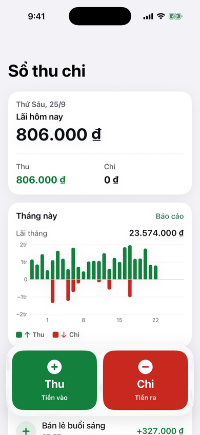 | 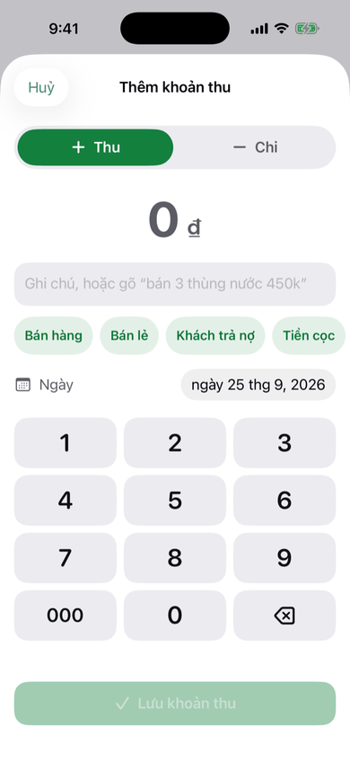 | 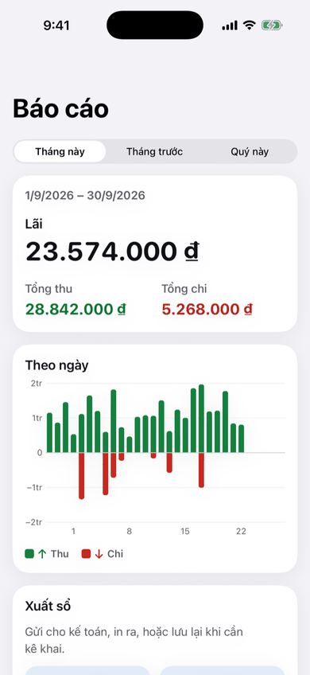 | 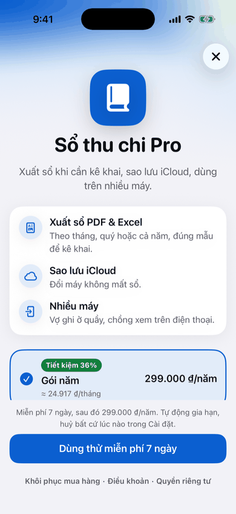 |

| Chế độ tối | Chữ cực lớn (AX-L) | Giới thiệu | Cài đặt |
| --- | --- | --- | --- |
| 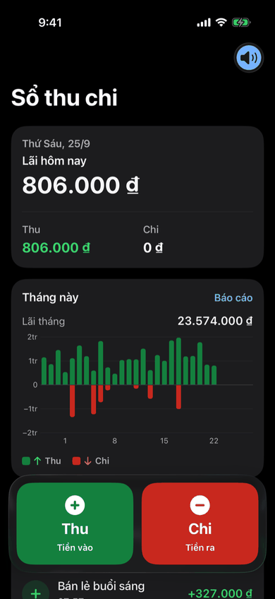 | 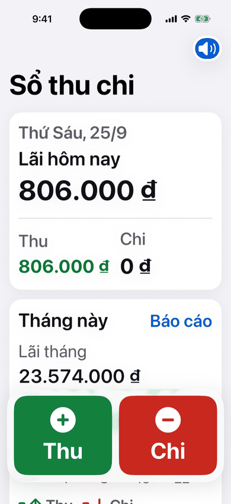 | 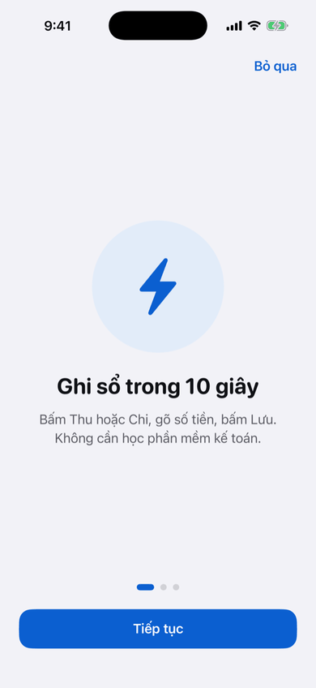 | 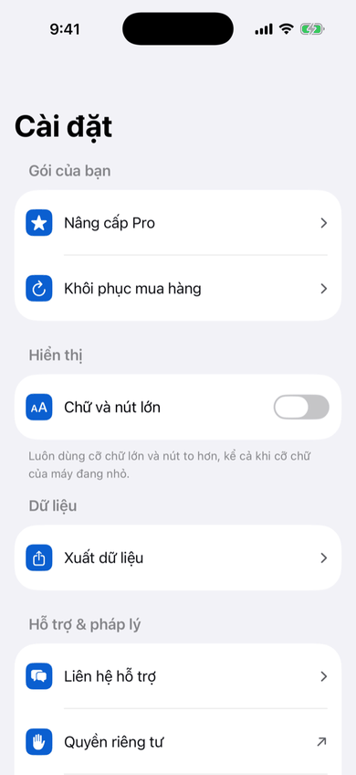 |

| Dọn ảnh: trang chủ | Vuốt giữ/xoá | Xem lại trước khi xoá | Xong |
| --- | --- | --- | --- |
| 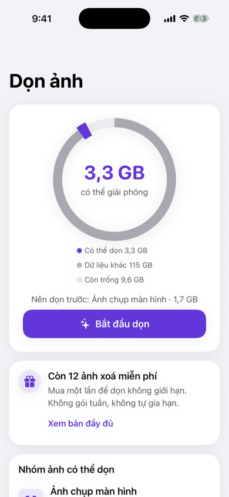 | 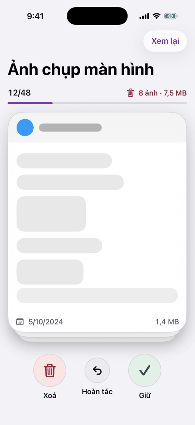 | 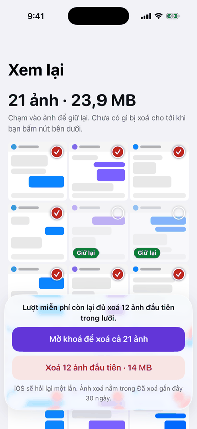 | 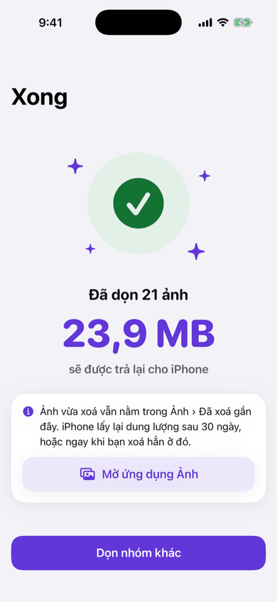 |

| Nhắc thuốc: phía cha mẹ | Phía người con | Cha mẹ, chữ cực lớn (AX-L) | Widget của cha mẹ |
| --- | --- | --- | --- |
| 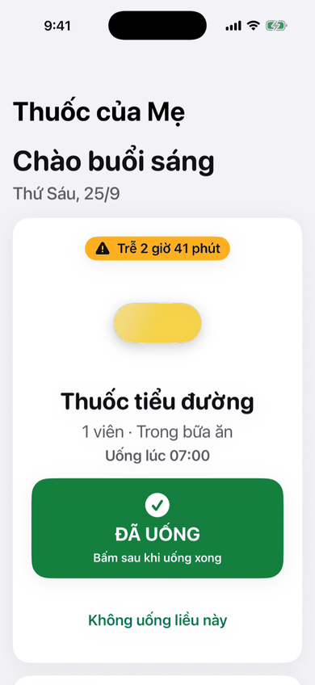 | 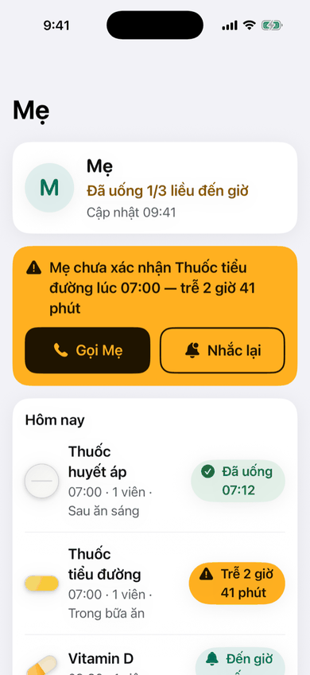 | 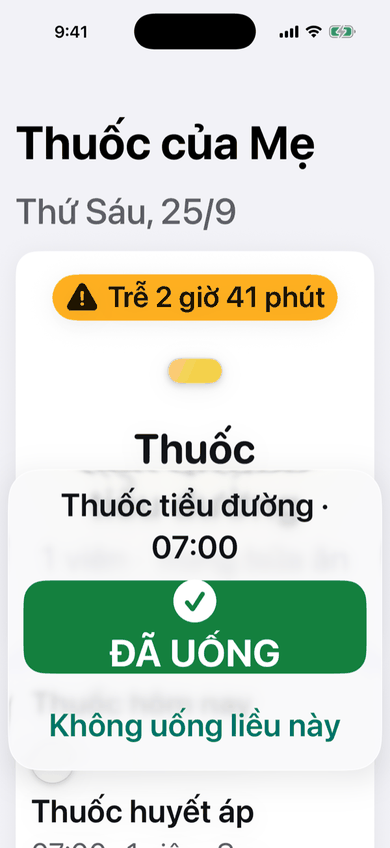 | 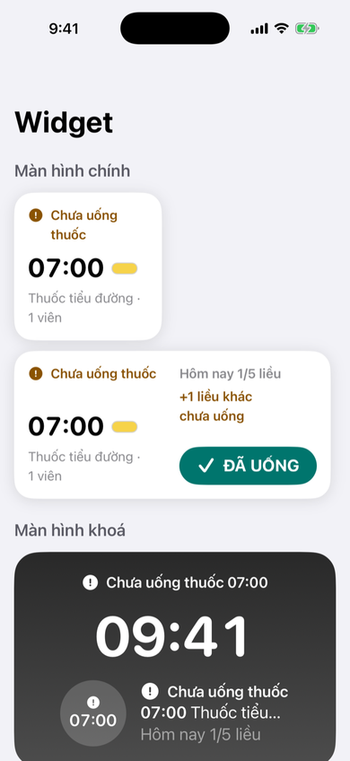 |

Toàn bộ 113 ảnh (thêm chế độ tối, chữ lớn, phần cuối của màn dài, màn màu & thành phần) nằm ở nhánh `ios-previews-main` (của main) và `ios-previews` (của PR mới chụp gần nhất, kèm `CHANGES.md`).

## 5. Lộ trình

1. **Video lớn trên thư viện thật.** Kit đã có nhóm "Video lớn" với dữ liệu mẫu. Còn phần quét bằng PhotoKit: liệt kê video, đo dung lượng trên máy, rồi đưa vào `LibraryFindings`. Trước iOS 27 chỉ đo được bằng cách đọc từng byte, nên cần lưu lại số đo, và kiểm tra video còn trên máy mỗi lần quét.
2. **Sao lưu sổ lên iCloud.** Sổ thu chi nằm trong iCloud của người dùng (CloudKit, cơ sở dữ liệu riêng), để máy mới có lại sổ; luật gộp khi hai máy cùng sửa nằm trong lõi.
3. **Theo dõi cả bố lẫn mẹ.** Người con theo dõi nhiều người thân: màn của người con chọn người, mỗi widget chọn một người (`AppIntentConfiguration`), và câu hỏi Siri có tên người làm tham số ("Hỏi ‹tên app› bố uống thuốc chưa").

Cần thử trên máy thật, vì simulator không chạy được: ngưỡng ảnh mờ (−0,5), việc nhận ra giấy tờ, và giọng đọc số tiền.

Trước khi phát hành sổ thu chi: đối chiếu mẫu sổ theo quy định mới nhất cho hộ kinh doanh. Nếu cần đúng mẫu, thêm một kiểu xuất theo mẫu đó vào `LedgerSpreadsheet` và `LedgerReportPDF`.
